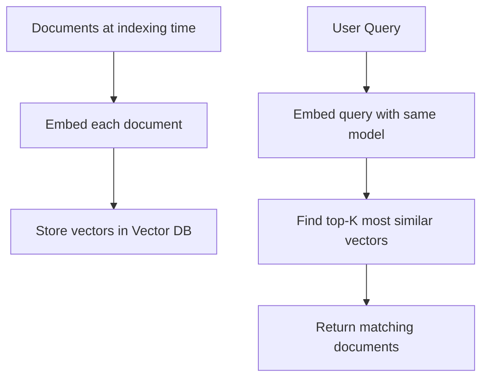
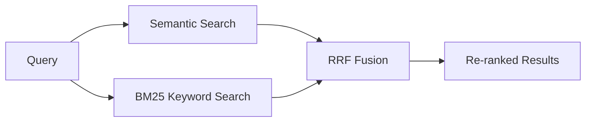

# Semantic Search — Theory

Google search before 2013 was all keyword matching. Search "fix runny nose" and it found pages containing those exact words. A page saying "remedies for nasal congestion" — not found, even though it's exactly what you want.

Then Google introduced semantic search. Now "fix a runny nose" returns "remedies for nasal congestion," "tips for stuffy sinuses," and "how to recover from a cold" — because it understands meaning, not just words. Zero keyword overlap. Perfect result.

👉 This is why we need **Semantic Search** — to find content based on meaning, not just matching words.

---

## 📌 Learning Priority

**Must Learn** — core concepts, needed to understand the rest of this file:
[Keyword vs Semantic Search](#keyword-search-vs-semantic-search) · [How Semantic Search Works](#how-semantic-search-works)

**Should Learn** — important for real projects and interviews:
[Hybrid Search](#hybrid-search-the-best-of-both-worlds) · [Re-ranking](#re-ranking)

**Good to Know** — useful in specific situations, not needed daily:
[Performance Characteristics](#performance-characteristics)

---

## Keyword Search vs Semantic Search

| | Keyword Search | Semantic Search |
|--|----------------|-----------------|
| Method | Match exact words | Compare meaning (embedding vectors) |
| "dog" query finds | Pages with "dog" | Pages about "canine," "puppy," "pets" |
| Handles synonyms | No | Yes |
| Handles paraphrasing | No | Yes |
| Very specific terms / codes | Better | Worse |
| Works on short queries | Great | Good |

---

## How Semantic Search Works



Both documents and queries go through the same embedding model, placing them in the same "meaning space" so query vectors can be compared to document vectors.

**Step 1: Indexing (done once, or when documents change)**
```
Raw documents → clean text → embed with model → store in vector DB
```

**Step 2: Query (done on every user search)**
```
User's question → embed with same model → find top-K similar vectors → return source documents
```

---

## Hybrid Search: The Best of Both Worlds

Pure semantic search misses exact keyword matches. Pure keyword search misses synonyms. Combine them.

**Hybrid search** = semantic score + keyword score, fused via rankings.

**RRF (Reciprocal Rank Fusion):**
```
final_score = 1/(k + semantic_rank) + 1/(k + keyword_rank)
```
Where `k` is typically 60. Documents ranking high in both methods float to the top.



Use hybrid when users sometimes search by exact product codes or IDs (keyword wins) AND sometimes by concept (semantic wins) — which is most real-world search.

---

## Re-ranking

Top-K vector search results are ordered by cosine similarity, which isn't a perfect relevance measure. Re-ranking adds a second, more powerful pass.

A **cross-encoder** re-ranker takes the query and each candidate document together, processes them jointly, and outputs a relevance score — much more accurate than cosine similarity alone.

```
Vector search: top-20 candidates (fast but approximate)
  → Cross-encoder re-ranker: scores all 20 against the query
  → Return top-5 by re-ranker score (accurate but can't scale to millions)
```

This two-stage pipeline gives speed (vector search) AND accuracy (re-ranking) — used in all serious production search systems.

---

## Performance Characteristics

| Approach | Documents | Query Latency | Accuracy |
|----------|-----------|---------------|---------|
| Brute force cosine | < 50K | Slow | Exact |
| HNSW vector DB | Millions | Milliseconds | ~99% |
| Hybrid search (HNSW + BM25) | Millions | Milliseconds | Better |
| Hybrid + re-ranking | Millions (retrieve) | 50–200ms | Best |

---

✅ **What you just learned:** Semantic search converts both queries and documents to embeddings and finds similar content by vector similarity — enabling meaning-based retrieval that keyword search can't match. Hybrid search combines both for production use.

🔨 **Build this now:** Take 10 diverse sentences and build a mini semantic search. Embed them all, then query with a sentence that shares no keywords with the answer but is semantically related.

➡️ **Next step:** Memory Systems → `08_LLM_Applications/07_Memory_Systems/Theory.md`

---

## 🛠️ Practice Project

Apply what you just learned → **[I1: Semantic Search Engine](../../22_Capstone_Projects/06_Semantic_Search_Engine/03_GUIDE.md)**
> This project uses: embedding queries and documents, cosine similarity ranking, returning top-K results


---

## 📝 Practice Questions

- 📝 [Q52 · semantic-search](../../ai_practice_questions_100.md#q52--critical--semantic-search)


---

## 📂 Navigation

**In this folder:**
| File | |
|---|---|
| 📄 **Theory.md** | ← you are here |
| [📄 Cheatsheet.md](./Cheatsheet.md) | Quick reference |
| [📄 Interview_QA.md](./Interview_QA.md) | Interview prep |
| [📄 Code_Example.md](./Code_Example.md) | Python code examples |

⬅️ **Prev:** [05 Vector Databases](../05_Vector_Databases/Theory.md) &nbsp;&nbsp;&nbsp; ➡️ **Next:** [07 Memory Systems](../07_Memory_Systems/Theory.md)
