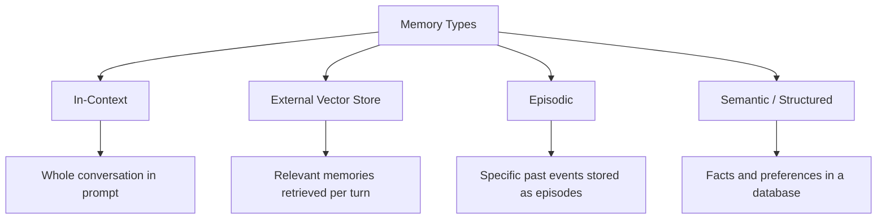
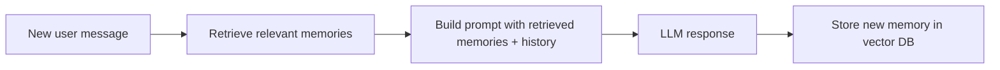

# Memory Systems — Theory

Think about the difference between meeting a stranger at a party vs. talking to a close friend. With a stranger: every conversation starts from zero. With a close friend: they know you, remember your context, and pick up right where you left off.

LLMs, by default, are that stranger. Every new conversation, complete blank slate. Give them memory systems, and they become the close friend.

👉 This is why we need **Memory Systems** — to give AI applications the ability to remember across conversations, sessions, and users.

---

## The Memory Problem

LLMs have a context window that holds the current conversation. When the conversation ends, the context is gone. Start a new conversation — complete blank slate. For a simple chatbot, this is fine. For a personal assistant or customer support agent that needs continuity — it's a dealbreaker.

---

## Four Types of Memory



---

### 1. In-Context Memory (Conversation History)

Append every message to the messages list and send the whole conversation each turn.

```python
messages = [
    {"role": "user", "content": "My name is Alex and I prefer short answers."},
    {"role": "assistant", "content": "Got it, Alex! I'll keep things concise."},
    {"role": "user", "content": "What's the capital of Japan?"},
]
```

Works great until the conversation gets too long and exceeds the context window. Cost grows with every turn (you pay for the whole history each time).

---

### 2. Memory Summarization

When the conversation gets long, summarize earlier parts and keep only the summary in context.

```
[Summary: User is Alex, prefers short answers, works in finance]
[Recent messages: last 5 turns]
[New message: current user input]
```

Compresses history dramatically while preserving key facts.

---

### 3. External Vector Memory

Store memories as embeddings in a vector database. Before each response, retrieve the most relevant memories for the current query.



Use case: a customer service bot that needs to recall past tickets without storing all interactions in the current context.

---

### 4. Semantic/Structured Memory

Store facts, preferences, and user profile in a database. Retrieve specific facts when needed.

```json
{
  "user_id": "alex_123",
  "name": "Alex",
  "preferences": {"answer_length": "short", "tone": "casual"},
  "account": {"plan": "pro", "joined": "2024-01"},
  "recent_topics": ["data visualization", "Python scripting"]
}
```

Fast to retrieve, easy to update. Perfect for structured user profiles.

---

## The MemGPT Concept

MemGPT is an architecture where the LLM manages its own memory with tools to write, read, edit, and delete memories. The model decides what's worth remembering — just like humans. Gives you intelligent, self-curating memory instead of storing everything blindly.

---

## Choosing Your Memory Architecture

| Use Case | Best Memory Type |
|----------|-----------------|
| Simple chatbot session | In-context only |
| Long single session (document analysis) | In-context + summarization |
| Multi-session assistant (remembers past weeks) | Vector store memory |
| User profile / preferences | Structured key-value memory |
| Intelligent agent that manages itself | MemGPT-style self-managed memory |

---

✅ **What you just learned:** LLMs are stateless by default — memory systems give them persistence across turns using in-context history, vector stores for relevant recall, structured databases for facts, and summarization to manage context limits.

🔨 **Build this now:** Build a chatbot that stores everything in a Python list. After 6 turns, summarize the conversation and replace the history with the summary. Observe how it preserves key facts.

➡️ **Next step:** Streaming Responses → `08_LLM_Applications/08_Streaming_Responses/Theory.md`


---

## 📝 Practice Questions

- 📝 [Q53 · memory-systems](../../ai_practice_questions_100.md#q53--design--memory-systems)


---

## 📂 Navigation

**In this folder:**
| File | |
|---|---|
| 📄 **Theory.md** | ← you are here |
| [📄 Cheatsheet.md](./Cheatsheet.md) | Quick reference |
| [📄 Interview_QA.md](./Interview_QA.md) | Interview prep |
| [📄 Comparison.md](./Comparison.md) | Memory types comparison |

⬅️ **Prev:** [06 Semantic Search](../06_Semantic_Search/Theory.md) &nbsp;&nbsp;&nbsp; ➡️ **Next:** [08 Streaming Responses](../08_Streaming_Responses/Theory.md)
