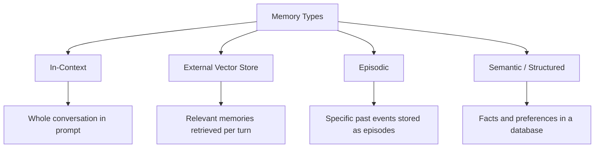
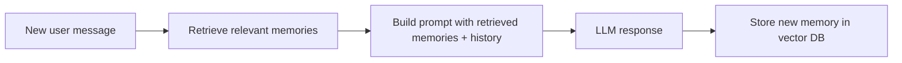

# Memory Systems — Theory

Think about the difference between meeting a stranger at a party vs. talking to a close friend.

With a stranger: every conversation starts from zero. You introduce yourself. You explain your background. You can't reference something you said last week because they don't remember.

With a close friend: they know you. "How's that new job going?" They remember you mentioned your dog's vet appointment. They know you hate small talk and love movies. You can pick up right where you left off.

LLMs, by default, are that stranger. Every new conversation, they have no idea who you are. Give them memory systems, and they become the close friend.

👉 This is why we need **Memory Systems** — to give AI applications the ability to remember across conversations, sessions, and users.

---

## The Memory Problem

LLMs have a context window. That context window holds the current conversation. When the conversation ends, the context is gone.

Start a new conversation? Complete blank slate.

For a simple chatbot, this is fine. For a personal assistant, a customer support agent, or any application that needs continuity — this is a dealbreaker.

---

## Four Types of Memory



---

### 1. In-Context Memory (Conversation History)

The simplest approach. Append every message to the messages list and send the whole conversation to the model each turn.

```python
messages = [
    {"role": "user", "content": "My name is Alex and I prefer short answers."},
    {"role": "assistant", "content": "Got it, Alex! I'll keep things concise."},
    {"role": "user", "content": "What's the capital of Japan?"},  # new message
    # Model now has full context of the conversation above
]
```

**Works great until:** The conversation gets too long and exceeds the context window. Cost grows with every turn (you're paying for the whole history each time).

---

### 2. Memory Summarization

When the conversation gets long, summarize earlier parts and keep only the summary in context.

```
[Summary: User is Alex, prefers short answers, works in finance]
[Recent messages: last 5 turns]
[New message: current user input]
```

This compresses the history dramatically while preserving key facts.

---

### 3. External Vector Memory

Store memories as embeddings in a vector database. Before each response, retrieve the most relevant memories for the current query.



**Use case:** A customer service bot that needs to remember what happened in past tickets — without storing all past interactions in the current context.

---

### 4. Semantic/Structured Memory

Store facts, preferences, and user profile in a database. Retrieve specific facts when needed.

```json
{
  "user_id": "alex_123",
  "name": "Alex",
  "preferences": {"answer_length": "short", "tone": "casual"},
  "account": {"plan": "pro", "joined": "2024-01"},
  "recent_topics": ["data visualization", "Python scripting"]
}
```

Fast to retrieve, easy to update. Doesn't scale to complex memory — but perfect for structured user profiles.

---

## The MemGPT Concept

MemGPT (Memory GPT) is an architecture where the LLM manages its own memory. It has tools to:
- Write important information to memory
- Read from memory when relevant
- Edit or delete old memories

The model decides what's worth remembering and what to forget — just like humans. This gives you intelligent, self-curating memory instead of just storing everything.

---

## Choosing Your Memory Architecture

| Use Case | Best Memory Type |
|----------|-----------------|
| Simple chatbot session | In-context only |
| Long single session (document analysis) | In-context + summarization |
| Multi-session assistant (remembers past weeks) | Vector store memory |
| User profile / preferences | Structured key-value memory |
| Intelligent agent that manages itself | MemGPT-style self-managed memory |

---

✅ **What you just learned:** LLMs are stateless by default — memory systems give them persistence across turns using in-context history, vector stores for relevant recall, structured databases for facts, and summarization to manage context limits.

🔨 **Build this now:** Build a chatbot that stores everything said in a Python list. After 6 turns, summarize the conversation and replace the history with the summary. Observe how it preserves key facts.

➡️ **Next step:** Streaming Responses → `08_LLM_Applications/08_Streaming_Responses/Theory.md`

---

## 📂 Navigation

**In this folder:**
| File | |
|---|---|
| 📄 **Theory.md** | ← you are here |
| [📄 Cheatsheet.md](./Cheatsheet.md) | Quick reference |
| [📄 Interview_QA.md](./Interview_QA.md) | Interview prep |
| [📄 Comparison.md](./Comparison.md) | Memory types comparison |

⬅️ **Prev:** [06 Semantic Search](../06_Semantic_Search/Theory.md) &nbsp;&nbsp;&nbsp; ➡️ **Next:** [08 Streaming Responses](../08_Streaming_Responses/Theory.md)
