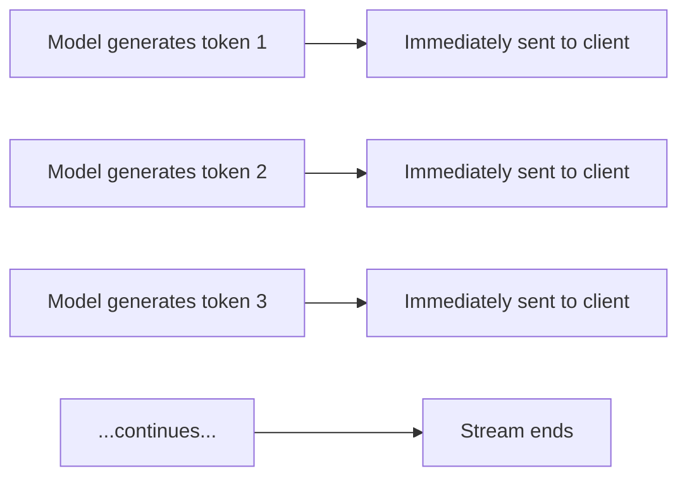
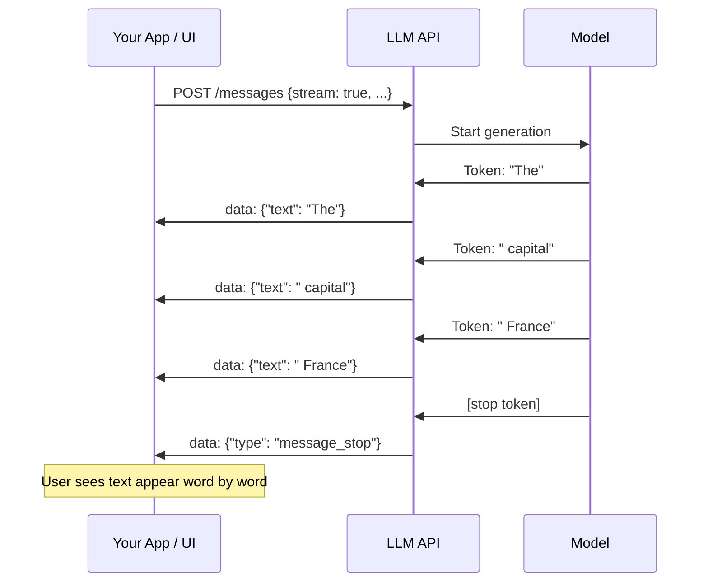

# Streaming Responses — Theory

Imagine YouTube requiring the entire video to finish downloading before it starts playing. You'd wait 5–10 minutes staring at a loading bar, then watch it all at once. Instead, YouTube streams — the first second loads instantly, you start watching, the rest loads in the background.

LLM responses are the same. Without streaming: stare at a blank screen for 8 seconds, then a full 500-word answer appears. With streaming: words appear immediately, one by one, as the model generates them. Total time is the same — perceived wait is dramatically shorter.

👉 This is why we need **Streaming Responses** — to show users immediate progress instead of making them stare at a loading spinner.

---

## How Token Streaming Works

LLMs generate text one token at a time. Without streaming, all tokens are collected and sent back in one response. With streaming, each token is sent to your client as soon as it's generated.



The server uses **Server-Sent Events (SSE)** — a standard HTTP mechanism for pushing data from server to client over a persistent connection.

---

## Server-Sent Events (SSE)

SSE is one-directional real-time data push from server to client over HTTP:

```
HTTP/1.1 200 OK
Content-Type: text/event-stream

data: {"type": "content_block_delta", "delta": {"text": "The"}}
data: {"type": "content_block_delta", "delta": {"text": " capital"}}
data: {"type": "content_block_delta", "delta": {"text": " of"}}
data: {"type": "content_block_delta", "delta": {"text": " France"}}
data: {"type": "message_stop"}
```



---

## UX Impact

| Without streaming | With streaming |
|------------------|----------------|
| 0–8 seconds: blank / spinner | First word appears in ~0.5–1s |
| Full response appears at once | Words trickle in continuously |
| User doesn't know if anything is happening | User sees progress |
| Users abandon if > 3s | Users stay engaged for 15s+ |

For any AI application with a user interface, streaming is almost always worth implementing.

---

## When Streaming Is and Isn't Appropriate

**Use streaming:**
- Chat interfaces (Claude.ai, ChatGPT-style)
- Long-form generation (articles, code, reports)
- Any interactive UI where the user is waiting

**Don't use streaming:**
- Batch processing (background jobs, no user waiting)
- Structured output parsing (need the full JSON before parsing)
- Tool calling (the model needs to finish before you run the tool)
- Short responses (< 2 seconds total — not worth the complexity)

---

## Collecting the Full Response from a Stream

Even when streaming, you sometimes need the complete text (e.g., to pass to another function):

```python
full_text = ""
with client.messages.stream(...) as stream:
    for text in stream.text_stream:
        print(text, end="", flush=True)  # display immediately
        full_text += text                 # accumulate

print(f"\n\nFull response: {full_text}")
```

---

✅ **What you just learned:** Streaming sends LLM output token by token to the client as it's generated — dramatically improving perceived responsiveness. Implemented via SSE, essential for any user-facing chat or generation interface.

🔨 **Build this now:** Call the Anthropic API with streaming enabled. Print each token as it arrives using `end=""` and `flush=True`. Measure how long the first token takes vs. waiting for the full response.

➡️ **Next step:** RAG Systems → `09_RAG_Systems/01_RAG_Fundamentals/Theory.md`

---

## 🛠️ Practice Project

Apply what you just learned → **[B4: LLM Chatbot with Memory](../../20_Projects/00_Beginner_Projects/04_LLM_Chatbot_with_Memory/Project_Guide.md)**
> This project uses: streaming responses to the terminal in real-time so the chatbot feels instant


---

## 📝 Practice Questions

- 📝 [Q54 · streaming-responses](../../ai_practice_questions_100.md#q54--normal--streaming-responses)


---

## 📂 Navigation

**In this folder:**
| File | |
|---|---|
| 📄 **Theory.md** | ← you are here |
| [📄 Cheatsheet.md](./Cheatsheet.md) | Quick reference |
| [📄 Interview_QA.md](./Interview_QA.md) | Interview prep |
| [📄 Code_Example.md](./Code_Example.md) | Python code examples |

⬅️ **Prev:** [07 Memory Systems](../07_Memory_Systems/Theory.md) &nbsp;&nbsp;&nbsp; ➡️ **Next:** [01 RAG Fundamentals](../../09_RAG_Systems/01_RAG_Fundamentals/Theory.md)
