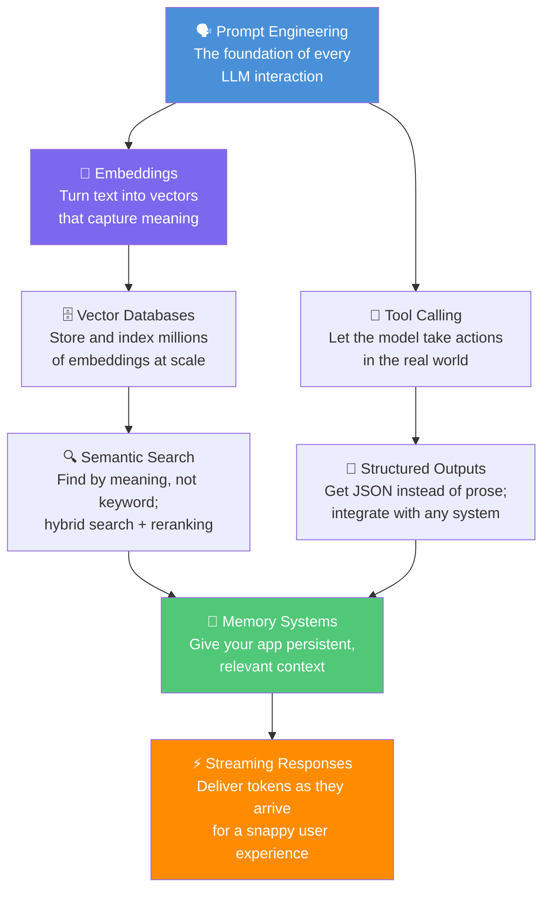

# 🛠️ LLM Applications

⬅️ [07 Large Language Models](../07_Large_Language_Models/Readme.md) &nbsp;|&nbsp; [🏠 Home](../00_Learning_Guide/Readme.md) &nbsp;|&nbsp; [09 RAG Systems ➡️](../09_RAG_Systems/Readme.md)

> The gap between "I called the API" and "I shipped a product" — this section closes it.

**[▶ Start here → Prompt Engineering Theory](./01_Prompt_Engineering/Theory.md)**

---

## At a Glance

| | |
|---|---|
| 📚 Topics | 8 topics |
| ⏱️ Est. Time | 5–6 hours |
| 📋 Prerequisites | [07 Large Language Models](../07_Large_Language_Models/Readme.md) |
| 🔓 Unlocks | [09 RAG Systems](../09_RAG_Systems/Readme.md) |

---

## What's in This Section

---

## Topics

| # | Topic | What You'll Learn | Files |
|---|---|---|---|
| 01 | [Prompt Engineering](./01_Prompt_Engineering/) | Zero-shot, few-shot, chain-of-thought, role prompting, output formatting patterns | [📖 Theory](./01_Prompt_Engineering/Theory.md) · [⚡ Cheatsheet](./01_Prompt_Engineering/Cheatsheet.md) · [🎯 Interview Q&A](./01_Prompt_Engineering/Interview_QA.md) · [💻 Code Example](./01_Prompt_Engineering/Code_Example.md) · [🧩 Prompt Patterns](./01_Prompt_Engineering/Prompt_Patterns.md) · [⚠️ Common Mistakes](./01_Prompt_Engineering/Common_Mistakes.md) |
| 02 | [Tool Calling](./02_Tool_Calling/) | Function schemas, the tool-use loop, parallel calls, error handling | [📖 Theory](./02_Tool_Calling/Theory.md) · [⚡ Cheatsheet](./02_Tool_Calling/Cheatsheet.md) · [🎯 Interview Q&A](./02_Tool_Calling/Interview_QA.md) · [💻 Code Example](./02_Tool_Calling/Code_Example.md) · [🏗️ Architecture Deep Dive](./02_Tool_Calling/Architecture_Deep_Dive.md) |
| 03 | [Structured Outputs](./03_Structured_Outputs/) | JSON mode, Pydantic schemas, reliable parsing, validation | [📖 Theory](./03_Structured_Outputs/Theory.md) · [⚡ Cheatsheet](./03_Structured_Outputs/Cheatsheet.md) · [🎯 Interview Q&A](./03_Structured_Outputs/Interview_QA.md) · [💻 Code Example](./03_Structured_Outputs/Code_Example.md) |
| 04 | [Embeddings](./04_Embeddings/) | Text-to-vector transformation, similarity metrics, choosing embedding models | [📖 Theory](./04_Embeddings/Theory.md) · [⚡ Cheatsheet](./04_Embeddings/Cheatsheet.md) · [🎯 Interview Q&A](./04_Embeddings/Interview_QA.md) · [💻 Code Example](./04_Embeddings/Code_Example.md) |
| 05 | [Vector Databases](./05_Vector_Databases/) | Chroma, Pinecone, Weaviate, HNSW indexing, CRUD operations | [📖 Theory](./05_Vector_Databases/Theory.md) · [⚡ Cheatsheet](./05_Vector_Databases/Cheatsheet.md) · [🎯 Interview Q&A](./05_Vector_Databases/Interview_QA.md) · [💻 Code Example](./05_Vector_Databases/Code_Example.md) · [⚖️ Comparison](./05_Vector_Databases/Comparison.md) |
| 06 | [Semantic Search](./06_Semantic_Search/) | Embedding-based search, BM25 hybrid search, cross-encoder reranking | [📖 Theory](./06_Semantic_Search/Theory.md) · [⚡ Cheatsheet](./06_Semantic_Search/Cheatsheet.md) · [🎯 Interview Q&A](./06_Semantic_Search/Interview_QA.md) · [💻 Code Example](./06_Semantic_Search/Code_Example.md) |
| 07 | [Memory Systems](./07_Memory_Systems/) | In-context, vector, episodic, and summarization-based memory; when to use each | [📖 Theory](./07_Memory_Systems/Theory.md) · [⚡ Cheatsheet](./07_Memory_Systems/Cheatsheet.md) · [🎯 Interview Q&A](./07_Memory_Systems/Interview_QA.md) · [⚖️ Comparison](./07_Memory_Systems/Comparison.md) |
| 08 | [Streaming Responses](./08_Streaming_Responses/) | Server-sent events, token streaming, UX benefits, building live-update UIs | [📖 Theory](./08_Streaming_Responses/Theory.md) · [⚡ Cheatsheet](./08_Streaming_Responses/Cheatsheet.md) · [🎯 Interview Q&A](./08_Streaming_Responses/Interview_QA.md) · [💻 Code Example](./08_Streaming_Responses/Code_Example.md) |

---

## Key Concepts at a Glance

| Concept | Why It Matters in AI |
|---|---|
| Prompts are the interface | How you instruct the model shapes everything downstream; prompt engineering is not a soft skill, it is an engineering discipline |
| Tools turn LLMs into agents | Function calling lets a model reach outside itself to query APIs, read files, run code, and act on the world |
| Embeddings bridge text and databases | Once text is a vector, you can search, cluster, classify, and retrieve it at machine speed |
| Topics 04 + 05 + 06 form a single subsystem | Embeddings feed Vector Databases, which power Semantic Search; study them together |
| Memory is the unsolved problem | Every production LLM app needs a strategy for what to keep in context and what to offload; there is no universal answer |

---

## 📂 Navigation

⬅️ **Prev:** [07 Large Language Models](../07_Large_Language_Models/Readme.md) &nbsp;&nbsp; ➡️ **Next:** [09 RAG Systems](../09_RAG_Systems/Readme.md)
