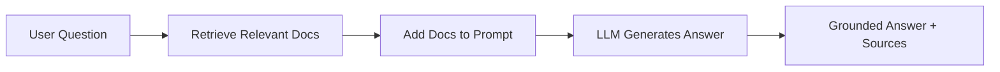
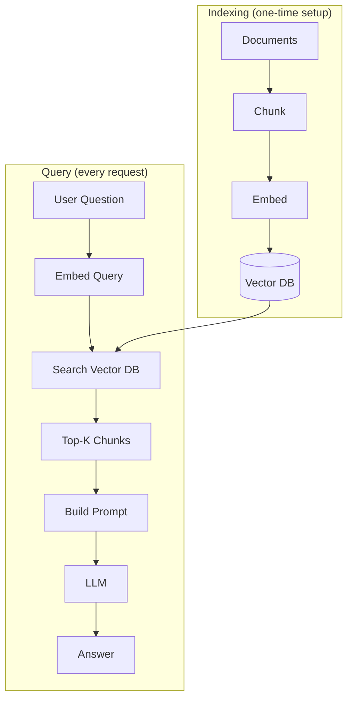

# RAG Fundamentals — Theory

A brilliant analyst has memorized millions of financial reports — but their knowledge cut off two years ago. Ask about last week's market crash and they'll guess, probably wrong. Hand them last week's actual reports and they read the relevant ones, then answer accurately and citably.

That's RAG: Retrieval-Augmented Generation. Retrieval = look up the facts. Generation = use LLM reasoning to answer from those facts.

👉 This is why we need **RAG** — so LLMs can answer questions about any knowledge base, not just what they memorized during training.

---

## What is RAG?

RAG combines two capabilities:
- **Retrieval**: find the relevant information from your documents
- **Generation**: use an LLM to synthesize an answer from that information

---

## Why RAG Beats Pure LLM for Factual Tasks

| Issue | Pure LLM | RAG |
|-------|----------|-----|
| Outdated information | Answers with training data (cutoff) | Reads your current docs |
| Private/proprietary data | Has no access | Reads your files |
| Hallucination | Can confidently fabricate facts | Grounded in retrieved text |
| Source citation | Can't reliably cite sources | Returns source with answer |
| Cost to update | Fine-tuning is expensive | Just add docs to the DB |
| Auditability | Hard to verify | Can trace every answer to a source |

---

## The Basic RAG Pipeline

**Indexing phase** (runs once): load documents → split into chunks → embed each chunk → store in vector database.

**Query phase** (runs on every question): embed the question → find similar chunks → build a prompt with those chunks + the question → generate the answer.

---

## RAG vs Fine-tuning: When to Use Each

| Criterion | RAG | Fine-tuning |
|-----------|-----|-------------|
| **Data changes frequently** | Use RAG — just update the DB | Bad — need to retrain |
| **Need source citations** | Use RAG — return source chunks | Hard to achieve |
| **Private/confidential data** | Use RAG — stays in your DB | Bad — data goes into model |
| **Factual question-answering** | Use RAG | Works but expensive to maintain |
| **Style/tone adaptation** | Hard | Use fine-tuning |
| **Task-specific behavior** | Needs good prompting | Use fine-tuning |
| **Cost** | Low (API + vector DB) | High (GPU training) |
| **Speed to deploy** | Hours | Days to weeks |

**The rule:** RAG for knowledge, fine-tuning for behavior.

---

## What Makes a Good RAG System

1. **Retrieval quality**: does the right chunk get returned? Wrong context → wrong answer.
2. **Chunk quality**: right size, split at sensible boundaries. Too short = not enough context. Too long = diluted embeddings.
3. **Prompt quality**: does the prompt correctly instruct the LLM to answer from context and cite sources?

---

✅ **What you just learned:** RAG = retrieve relevant documents first, then generate an answer grounded in them — giving LLMs accurate, citable, up-to-date answers from any knowledge base without fine-tuning.

🔨 **Build this now:** Find a Wikipedia article. Copy one paragraph into a text file. Write a question whose answer is in that paragraph. Use the paragraph as "retrieved context" in a prompt to Claude. See how it answers accurately from the text.

➡️ **Next step:** Document Ingestion → `09_RAG_Systems/02_Document_Ingestion/Theory.md`

---

## 🛠️ Practice Projects

Apply what you just learned:
- → **[I2: Personal Knowledge Base (RAG)](../../22_Capstone_Projects/07_Personal_Knowledge_Base_RAG/03_GUIDE.md)** — build the full RAG pipeline over your own documents
- → **[A1: Advanced RAG with Reranking](../../22_Capstone_Projects/11_Advanced_RAG_with_Reranking/03_GUIDE.md)** — extend with HyDE, hybrid search, cross-encoder reranking

---

## 📝 Practice Questions

- 📝 [Q55 · rag-fundamentals](../../ai_practice_questions_100.md#q55--normal--rag-fundamentals)

---

## 📂 Navigation

**In this folder:**
| File | |
|---|---|
| 📄 **Theory.md** | ← you are here |
| [📄 Cheatsheet.md](./Cheatsheet.md) | Quick reference |
| [📄 Interview_QA.md](./Interview_QA.md) | Interview prep |
| [📄 When_to_Use_RAG.md](./When_to_Use_RAG.md) | When to use RAG vs fine-tuning |

⬅️ **Prev:** [08 Streaming Responses](../../08_LLM_Applications/08_Streaming_Responses/Theory.md) &nbsp;&nbsp;&nbsp; ➡️ **Next:** [02 Document Ingestion](../02_Document_Ingestion/Theory.md)
