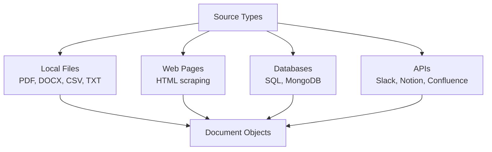

# Document Ingestion — Theory

Setting up a new library takes a week before a single book is on the shelf. Step one: get all the books in the door. Before you can catalog them, shelve them, or let anyone search for them — you need to physically collect them from donations, purchases, and storage.

Document ingestion is that first step for RAG. Before you can chunk, embed, or search your knowledge base — you need to get all your source material loaded and cleaned up. PDFs, web pages, spreadsheets, databases — all become clean, usable text.

👉 This is why we need **Document Ingestion** — RAG can only search what you've loaded. Garbage in, garbage out.

---

## What Document Ingestion Does

Take raw source material in any format:
```
company_policy.pdf
meeting_notes.docx
product_catalog.csv
https://docs.yourproduct.com/
database table: support_tickets
```

And convert everything to a standard structure:
```python
Document(
    page_content="The refund policy states that...",
    metadata={
        "source": "company_policy.pdf",
        "page": 3,
        "date": "2024-01-15"
    }
)
```

Every document becomes a `page_content` string plus `metadata` about where it came from.

---

## The Main Source Types



---

## Key Challenges

### Scanned PDFs
A regular PDF has text embedded. A scanned PDF is just an image of text. Standard PDF loaders return empty strings for scanned PDFs.

Fix: use OCR (Optical Character Recognition) like `pytesseract` or a cloud service like AWS Textract before loading.

### Tables
Tables in PDFs and Word documents lose their structure when extracted as plain text. A 5-column table might become garbled single-line text.

Fix: use specialized loaders (`pdfplumber`, `camelot`) that preserve table structure, or convert tables to markdown format.

### Long Documents with Irrelevant Sections
A 100-page annual report has one relevant section for your question. Headers, footers, legal boilerplate, and table of contents add noise.

Fix: add pre-processing to strip common boilerplate patterns. Store page numbers in metadata to help with context assembly.

---

## LangChain Document Loaders

LangChain provides ready-made loaders for almost every format:

```python
from langchain.document_loaders import PyPDFLoader, CSVLoader, WebBaseLoader

# PDF
pdf_docs = PyPDFLoader("report.pdf").load()

# CSV
csv_docs = CSVLoader("data.csv").load()

# Web page
web_docs = WebBaseLoader("https://example.com/docs").load()
```

Each returns a list of `Document` objects with `page_content` and `metadata`.

---

## Document Metadata

Metadata is as important as the text. It lets you:
- **Filter** searches ("only documents from Q4 2024")
- **Display** sources in answers ("Source: Policy Manual, page 3")
- **Debug** retrieval ("why did this chunk get returned?")

Common metadata fields to store:
```python
metadata = {
    "source": "company_handbook.pdf",
    "page": 5,
    "section": "Benefits",
    "date_created": "2024-01-15",
    "author": "HR Department",
    "document_type": "policy"
}
```

---

✅ **What you just learned:** Document ingestion loads raw source material from any format (PDFs, web pages, databases) into standardized Document objects with text content and metadata — the first step of every RAG pipeline.

🔨 **Build this now:** Use PyPDFLoader to load any PDF. Print the first 3 documents' page_content (first 200 chars each) and metadata. Notice how each page becomes a separate document.

➡️ **Next step:** Chunking Strategies → `09_RAG_Systems/03_Chunking_Strategies/Theory.md`

---

## 📂 Navigation

**In this folder:**
| File | |
|---|---|
| 📄 **Theory.md** | ← you are here |
| [📄 Cheatsheet.md](./Cheatsheet.md) | Quick reference |
| [📄 Interview_QA.md](./Interview_QA.md) | Interview prep |
| [📄 Code_Example.md](./Code_Example.md) | Python code examples |
| [📄 Supported_Formats.md](./Supported_Formats.md) | Supported document formats |

⬅️ **Prev:** [01 RAG Fundamentals](../01_RAG_Fundamentals/Theory.md) &nbsp;&nbsp;&nbsp; ➡️ **Next:** [03 Chunking Strategies](../03_Chunking_Strategies/Theory.md)
