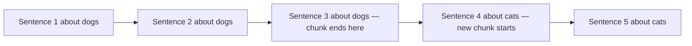

# Chunking Strategies — Theory

You're studying for an exam on a 500-page textbook. You can't memorize the whole thing. Instead, you make flashcards — one concept per card. "What is photosynthesis?" on one card. "What is the Krebs cycle?" on another. When exam time comes, you don't flip through all 500 pages. You find the right flashcard and read just that.

Chunking splits documents into those flashcards. When a user asks a question, you don't retrieve the whole document — you retrieve the 3 most relevant flashcards. And each flashcard needs to be focused enough to match specific questions, but complete enough to make sense on its own.

👉 This is why we need **Chunking Strategies** — the right chunk size and split method determines whether retrieval finds the right information.

---

## Why Chunking Matters

Embedding models convert text to vectors. But a 20-page document embedded as a single vector captures everything and nothing specifically. If you ask "what is the refund policy?" a full-document embedding will be about the entire HR manual, not specifically refunds.

A 300-token chunk about just the refund policy will match that query precisely.

Too small: not enough context, answers lack background.
Too large: diluted embeddings, matches many queries poorly.

The sweet spot: typically 256–512 tokens.

---

## The Main Chunking Strategies

### 1. Fixed-Size Chunking

Split text every N characters or tokens, with optional overlap.

```
Document: "ABCDE FGHIJ KLMNO PQRST..."
Chunk size: 10, overlap: 3

Chunk 1: "ABCDE FGHIJ"
Chunk 2: "GHIJ KLMNO"  (3 char overlap from Chunk 1)
Chunk 3: "LMNO PQRST"
```

Simple and fast. The overlap prevents information from being cut exactly at a chunk boundary.

**Problem:** Splits mid-sentence, mid-paragraph. A concept that spans the boundary gets split.

---

### 2. Recursive Character Text Splitting

The most common approach. Tries to split on natural boundaries (paragraphs → sentences → words) before falling back to character count.

Priority list: `["\n\n", "\n", " ", ""]`

First tries to split on double newlines (paragraphs). If a paragraph is still too long, splits on single newlines. Still too long? Splits on spaces. Last resort: splits on characters.

```python
from langchain.text_splitter import RecursiveCharacterTextSplitter

splitter = RecursiveCharacterTextSplitter(
    chunk_size=500,     # max characters per chunk
    chunk_overlap=50,   # characters shared between adjacent chunks
)
```

**Best for:** Most general-purpose RAG use cases. Start here.

---

### 3. Sentence-Based Chunking

Split at sentence boundaries. Each chunk contains N complete sentences.

```
"Transformers changed NLP. They use self-attention. [SPLIT]
Self-attention lets models weigh each word. The result is better context. [SPLIT]"
```

Chunks are semantically cleaner — no cut mid-sentence. But sentences vary in length, so chunks have variable token counts.

**Best for:** Documents with clear sentence structure (articles, reports).

---

### 4. Semantic Chunking

Group sentences together until the topic changes. Uses embedding similarity to detect topic shifts.



More intelligent — topic boundaries become chunk boundaries. But slower and more complex.

**Best for:** Long documents with clearly distinct sections. News articles, research papers.

---

### 5. Parent-Child Chunking

Store small chunks (for precise retrieval) but return larger parent chunks (for full context).

```
Parent chunk: whole paragraph (1000 tokens)
  ├── Child chunk 1: first 3 sentences (150 tokens)
  ├── Child chunk 2: next 3 sentences (150 tokens)
  └── Child chunk 3: last 3 sentences (150 tokens)
```

Retrieval: search by child chunks (precise match). Return: parent chunk (full context). Best of both worlds — precise retrieval, rich context.

---

## Chunk Overlap

Overlap is how many tokens/characters two adjacent chunks share. It prevents information loss at chunk boundaries.

```
Chunk 1: "...The policy states that refunds are available within 30..."
Chunk 2: "...refunds are available within 30 days of purchase. Exceptions..."
         ← overlap →
```

Without overlap, a question about "30-day refunds" might miss the chunk where that sentence was cut in half.

Typical overlap: 10–20% of chunk size.

---

✅ **What you just learned:** Chunking splits documents into searchable passages — the right strategy (fixed-size, recursive, semantic, parent-child) and chunk size (usually 256–512 tokens with 10–20% overlap) is the most impactful factor in RAG retrieval quality.

🔨 **Build this now:** Use `RecursiveCharacterTextSplitter` on a Wikipedia article. Try chunk sizes of 200 and 800 tokens. Print 3 chunks from each. Notice how different they feel — the small chunks are precise, the large ones have more context.

➡️ **Next step:** Embedding and Indexing → `09_RAG_Systems/04_Embedding_and_Indexing/Theory.md`

---

## 📂 Navigation

**In this folder:**
| File | |
|---|---|
| 📄 **Theory.md** | ← you are here |
| [📄 Cheatsheet.md](./Cheatsheet.md) | Quick reference |
| [📄 Interview_QA.md](./Interview_QA.md) | Interview prep |
| [📄 Code_Example.md](./Code_Example.md) | Python code examples |
| [📄 Comparison.md](./Comparison.md) | Chunking strategies comparison |

⬅️ **Prev:** [02 Document Ingestion](../02_Document_Ingestion/Theory.md) &nbsp;&nbsp;&nbsp; ➡️ **Next:** [04 Embedding and Indexing](../04_Embedding_and_Indexing/Theory.md)
