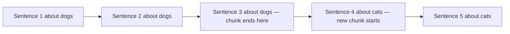
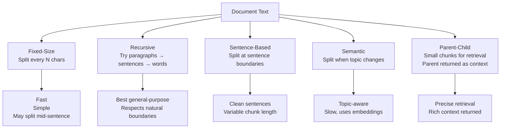

# Chunking Strategies — Theory

You're studying for an exam on a 500-page textbook. You don't memorize the whole thing — you make flashcards, one concept per card. When exam time comes, you flip to the right flashcard, not all 500 pages. Chunking splits documents into those flashcards: focused enough to match specific questions, complete enough to make sense alone.

👉 This is why we need **Chunking Strategies** — the right chunk size and split method determines whether retrieval finds the right information.

---

## 📌 Learning Priority

**Must Learn** — core concepts, needed to understand the rest of this file:
[Why Chunking Matters](#why-chunking-matters) · [Recursive Text Splitting](#2-recursive-character-text-splitting) · [Chunk Overlap](#chunk-overlap)

**Should Learn** — important for real projects and interviews:
[Semantic Chunking](#4-semantic-chunking) · [Parent-Child Chunking](#5-parent-child-chunking)

**Good to Know** — useful in specific situations, not needed daily:
[Strategy Comparison](#chunking-strategy-comparison) · [Fixed-Size Chunking](#1-fixed-size-chunking)

---

## Why Chunking Matters

A 20-page document embedded as a single vector captures everything and nothing specifically. A 300-token chunk about just the refund policy will match "what is the refund policy?" precisely.

- Too small: not enough context, answers lack background
- Too large: diluted embeddings, matches many queries poorly
- Sweet spot: typically **256–512 tokens**

---

## The Main Chunking Strategies

### 1. Fixed-Size Chunking

Split text every N characters or tokens, with optional overlap.

```
Chunk size: 10, overlap: 3
Chunk 1: "ABCDE FGHIJ"
Chunk 2: "GHIJ KLMNO"  (3 char overlap from Chunk 1)
Chunk 3: "LMNO PQRST"
```

Simple and fast. **Problem:** splits mid-sentence; concepts at boundaries get cut.

---

### 2. Recursive Character Text Splitting

The most common approach. Tries natural boundaries (paragraphs → sentences → words) before falling back to character count.

Priority list: `["\n\n", "\n", " ", ""]`

```python
from langchain.text_splitter import RecursiveCharacterTextSplitter

splitter = RecursiveCharacterTextSplitter(
    chunk_size=500,     # max characters per chunk
    chunk_overlap=50,   # characters shared between adjacent chunks
)
```

**Best for:** Most general-purpose RAG use cases. Start here.

---

### 3. Sentence-Based Chunking

Split at sentence boundaries. Each chunk contains N complete sentences. Chunks are semantically cleaner but have variable token counts.

**Best for:** Documents with clear sentence structure (articles, reports).

---

### 4. Semantic Chunking

Group sentences together until the topic changes, using embedding similarity to detect topic shifts.



More intelligent but slower. **Best for:** Long documents with clearly distinct sections.

---

### 5. Parent-Child Chunking

Store small chunks (for precise retrieval) but return larger parent chunks (for full context).

```
Parent chunk: whole paragraph (1000 tokens)
  ├── Child chunk 1: first 3 sentences (150 tokens)
  ├── Child chunk 2: next 3 sentences (150 tokens)
  └── Child chunk 3: last 3 sentences (150 tokens)
```

Search by child chunks (precise match). Return parent chunk (full context). Best of both worlds.

---

## Chunking Strategy Comparison



---

## Chunk Overlap

Overlap prevents information loss at chunk boundaries. Without it, a question about "30-day refunds" might miss the chunk where that sentence was cut in half.

```
Chunk 1: "...The policy states that refunds are available within 30..."
Chunk 2: "...refunds are available within 30 days of purchase. Exceptions..."
         ← overlap →
```

Typical overlap: **10–20% of chunk size**.

---

✅ **What you just learned:** Chunking splits documents into searchable passages — the right strategy (fixed-size, recursive, semantic, parent-child) and chunk size (usually 256–512 tokens with 10–20% overlap) is the most impactful factor in RAG retrieval quality.

🔨 **Build this now:** Use `RecursiveCharacterTextSplitter` on a Wikipedia article. Try chunk sizes of 200 and 800 tokens. Print 3 chunks from each. Notice how different they feel — the small chunks are precise, the large ones have more context.

➡️ **Next step:** Embedding and Indexing → `09_RAG_Systems/04_Embedding_and_Indexing/Theory.md`

---

## 🛠️ Practice Project

Apply what you just learned → **[I2: Personal Knowledge Base (RAG)](../../22_Capstone_Projects/07_Personal_Knowledge_Base_RAG/03_GUIDE.md)**
> This project uses: choosing chunk size and overlap, splitting documents, seeing how chunking affects retrieval quality


---

## 📝 Practice Questions

- 📝 [Q56 · chunking-strategies](../../ai_practice_questions_100.md#q56--thinking--chunking-strategies)


---

## 📂 Navigation

**In this folder:**
| File | |
|---|---|
| 📄 **Theory.md** | ← you are here |
| [📄 Cheatsheet.md](./Cheatsheet.md) | Quick reference |
| [📄 Interview_QA.md](./Interview_QA.md) | Interview prep |
| [📄 Code_Example.md](./Code_Example.md) | Python code examples |
| [📄 Comparison.md](./Comparison.md) | Chunking strategies comparison |

⬅️ **Prev:** [02 Document Ingestion](../02_Document_Ingestion/Theory.md) &nbsp;&nbsp;&nbsp; ➡️ **Next:** [04 Embedding and Indexing](../04_Embedding_and_Indexing/Theory.md)
