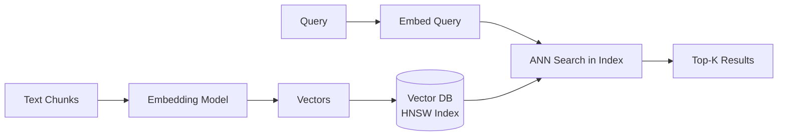

# Embedding and Indexing — Theory

Think about a library cataloging system. Every book that arrives needs a "call number" — a code that tells you exactly where to find it and what it's about. The librarian reads the book, figures out its content, and assigns it a precise address in the library.

Embedding = assigning that content-based "call number" (a vector) to each chunk. Indexing = filing all those call numbers so you can find the closest match in milliseconds instead of checking every single book.

👉 This is why we need **Embedding and Indexing** — it transforms text chunks into searchable mathematical representations that can be compared at scale.

---

## The Two Steps

### Step 1: Embedding

You pass each text chunk through an embedding model. Out comes a vector — a list of ~1536 numbers that encodes the meaning of the text.

```python
chunk = "The refund policy allows returns within 30 days of purchase."
embedding = embed_model.encode(chunk)
# Result: [0.23, -0.45, 0.11, 0.78, ...]  (1536 numbers)
```

Similar chunks produce similar vectors. "30-day return window" and "refunds within a month" will be near each other in vector space.

### Step 2: Indexing

Store each vector alongside its original text and metadata in a vector database. The DB builds an HNSW (Hierarchical Navigable Small World) index on top — this enables finding the nearest neighbors in milliseconds without exhaustive search.



---

## Batch Embedding for Efficiency

Don't embed one chunk at a time. Send them in batches.

```python
# Slow — one API call per chunk
for chunk in chunks:
    vector = embed_model.encode(chunk)  # N API calls

# Fast — batch all at once
vectors = embed_model.encode(chunks)   # 1 API call (or N/batch_size calls)
```

OpenAI's API accepts up to 2048 inputs per call. sentence-transformers handles batches automatically with `batch_size` parameter.

---

## What Gets Stored

In the vector database, each entry stores:
- The vector (the embedding)
- The original chunk text
- The metadata (source, page, date, etc.)

```python
collection.add(
    ids=["chunk_001", "chunk_002"],
    documents=["Refunds allowed within 30 days...", "Late fees apply after..."],
    embeddings=[[0.23, -0.45, ...], [0.11, 0.78, ...]],
    metadatas=[
        {"source": "policy.pdf", "page": 3, "section": "Returns"},
        {"source": "policy.pdf", "page": 4, "section": "Fees"}
    ]
)
```

---

## Index Types

| Index Type | How It Works | Speed | Accuracy | Use Case |
|-----------|-------------|-------|----------|---------|
| **HNSW** | Navigable graph, layer-based search | Very fast | ~99% ANN | Most production use cases |
| **IVF** | Clusters vectors, searches nearest clusters | Fast | ~95% ANN | Very large indexes (100M+) |
| **Flat (brute force)** | Compare all vectors | Slow | 100% exact | Small collections (< 10K) |

ChromaDB, Pinecone, and Weaviate all default to HNSW. It's the right choice for most cases.

---

## Updating and Deleting

Vector databases support upsert (insert or update) and delete:

```python
# Update an existing document (re-embeds the new text)
collection.update(ids=["chunk_001"], documents=["Updated policy: refunds within 45 days..."])

# Delete a document (e.g., policy was rescinded)
collection.delete(ids=["chunk_001"])

# Add new document (new policy added)
collection.add(ids=["chunk_003"], documents=["New 90-day extended return window..."])
```

Keeping your index fresh is critical. Outdated chunks produce outdated answers.

---

✅ **What you just learned:** Embedding converts each text chunk to a meaning-vector. Indexing stores those vectors in a vector database with HNSW for millisecond nearest-neighbor search — transforming your document collection into a searchable semantic index.

🔨 **Build this now:** Take 20 document chunks (can be sentences from any article). Embed them all with sentence-transformers. Store in ChromaDB. Print how many documents are in the collection after indexing.

➡️ **Next step:** Retrieval Pipeline → `09_RAG_Systems/05_Retrieval_Pipeline/Theory.md`

---

## 📂 Navigation

**In this folder:**
| File | |
|---|---|
| 📄 **Theory.md** | ← you are here |
| [📄 Cheatsheet.md](./Cheatsheet.md) | Quick reference |
| [📄 Interview_QA.md](./Interview_QA.md) | Interview prep |
| [📄 Code_Example.md](./Code_Example.md) | Python code examples |

⬅️ **Prev:** [03 Chunking Strategies](../03_Chunking_Strategies/Theory.md) &nbsp;&nbsp;&nbsp; ➡️ **Next:** [05 Retrieval Pipeline](../05_Retrieval_Pipeline/Theory.md)
