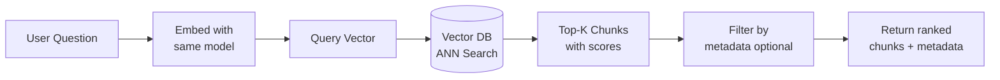

# Retrieval Pipeline — Theory

The search engine moment. A user types a question. Somewhere in your collection of 10,000 documents, there are 3 chunks that directly answer it. The retrieval pipeline's job: find those 3 chunks in milliseconds.

It works like a fingerprint matching system. Every chunk in your database has a "fingerprint" (its embedding). When a question arrives, you create a fingerprint for it using the same method. Then you find the database fingerprints that look most similar to the question's fingerprint.

👉 This is why we need the **Retrieval Pipeline** — converting a user question into the same "language" as indexed documents so we can find the most relevant ones instantly.

---

## The Retrieval Steps



**Step 1: Embed the query**
Pass the user's question through the same embedding model used to index documents. This puts the question in the same vector space as the stored chunks.

**Step 2: ANN search**
The vector DB searches for the K stored vectors most similar to the query vector (using cosine similarity or dot product).

**Step 3: Return results**
Get back the top-K chunks with their text, metadata, and similarity scores.

---

## Cosine Similarity at Retrieval Time

When the user asks "what's the refund timeline?", the query vector is compared to every stored chunk's vector. The chunks with the highest cosine similarity scores are returned.

```python
# Simplified — ChromaDB does this internally
query_vector = embed("what's the refund timeline?")
# Now compare against all 20,000 stored vectors
# Return top-3 by cosine similarity
```

In ChromaDB: `distances` are cosine distances (0 = identical, 2 = opposite). Convert to similarity with `1 - distance`.

---

## Top-K: How Many to Retrieve?

K is a hyperparameter. Typical values: 3–10.

- Too few (K=1–2): might miss the right chunk
- Too many (K=10–20): returns irrelevant chunks that confuse the LLM, increases token cost

Start with K=3–5. If your RAG answers are missing information, increase K. If answers are vague or conflated, decrease K.

---

## Metadata Filtering

Combine semantic search with exact attribute filters. This is essential for scoping retrieval:

```python
# Retrieve from legal documents only
results = collection.query(
    query_texts=["termination conditions"],
    n_results=5,
    where={"document_type": "contract", "year": {"$gte": 2023}}
)
```

This runs the vector search AND the filter simultaneously. Documents that don't match the metadata filter are excluded before similarity ranking.

---

## What the Results Look Like

```python
results = collection.query(...)

# results["documents"][0]  = list of text chunks
# results["metadatas"][0]  = list of metadata dicts
# results["distances"][0]  = list of cosine distances (lower = more similar)
# results["ids"][0]        = list of chunk IDs

for doc, meta, dist in zip(
    results["documents"][0],
    results["metadatas"][0],
    results["distances"][0]
):
    similarity = 1 - dist
    print(f"[{similarity:.3f}] {meta['source']}, p.{meta.get('page', '?')}")
    print(f"  {doc[:100]}")
```

---

## The Retrieval Quality Problem

Retrieval quality is the #1 factor in RAG accuracy. If the right chunk isn't retrieved, the LLM can't answer correctly.

Common retrieval failures:
- Query asks about "30-day refund" but the chunk says "one month return window" — semantics missed
- The relevant information spans two chunks — neither chunk alone answers completely
- The chunk is retrieved but it's from the wrong product version

Fixes: hybrid search (semantic + keyword), better chunking, re-ranking (see Advanced RAG section).

---

✅ **What you just learned:** The retrieval pipeline embeds the user's query with the same model used at indexing time, runs an ANN search in the vector database, and returns the top-K most semantically similar chunks with their metadata and scores.

🔨 **Build this now:** Use the ChromaDB collection from the previous section. Write a `retrieve(query, top_k=3)` function. Test it with 5 different questions and print the similarity scores and chunk text for each.

➡️ **Next step:** Context Assembly → `09_RAG_Systems/06_Context_Assembly/Theory.md`

---

## 📂 Navigation

**In this folder:**
| File | |
|---|---|
| 📄 **Theory.md** | ← you are here |
| [📄 Cheatsheet.md](./Cheatsheet.md) | Quick reference |
| [📄 Interview_QA.md](./Interview_QA.md) | Interview prep |
| [📄 Code_Example.md](./Code_Example.md) | Python code examples |

⬅️ **Prev:** [04 Embedding and Indexing](../04_Embedding_and_Indexing/Theory.md) &nbsp;&nbsp;&nbsp; ➡️ **Next:** [06 Context Assembly](../06_Context_Assembly/Theory.md)
