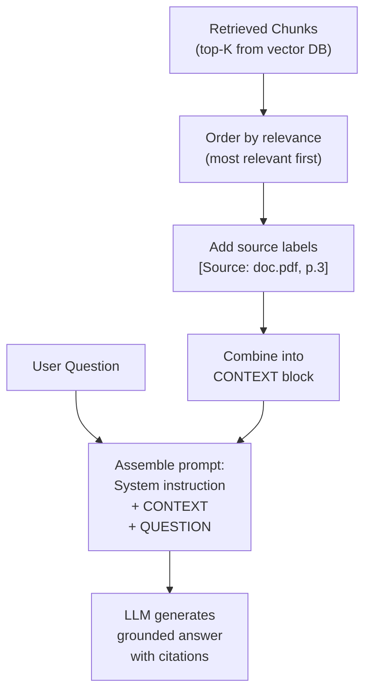
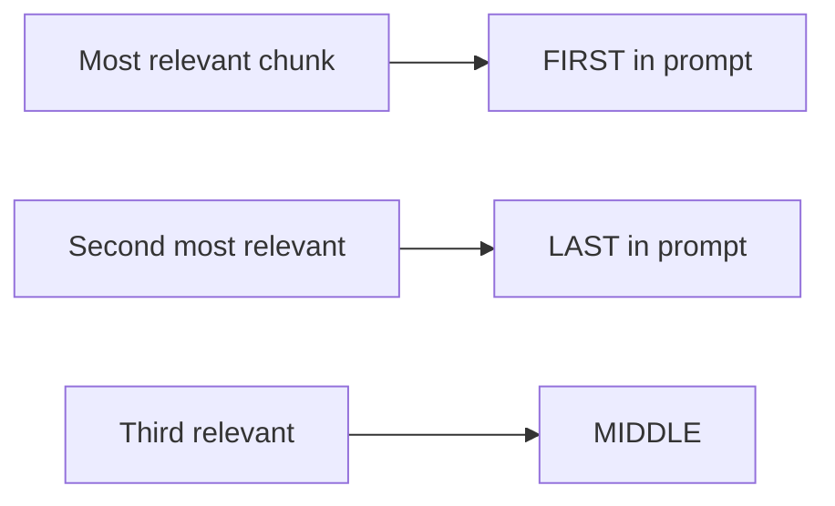

# Context Assembly — Theory

A lawyer preparing a court brief doesn't dump 3,000 pages of discovery on the judge's desk. They carefully select the most relevant excerpts, label each one, and present them with the precise question the judge needs to answer.

Context assembly is this lawyerly work: you've retrieved the chunks — now arrange them into a prompt that gives the LLM exactly what it needs to answer accurately.

👉 This is why we need **Context Assembly** — the way you format retrieved chunks into a prompt determines whether the LLM uses them properly and cites them correctly.



---

## 📌 Learning Priority

**Must Learn** — core concepts, needed to understand the rest of this file:
[Basic Template](#the-basic-template) · [Including Source Metadata](#including-source-metadata) · [Chunk Ordering](#chunk-ordering)

**Should Learn** — important for real projects and interviews:
[Context Window Limits](#context-window-limits) · [Complete Assembly Function](#the-complete-assembly-function)

**Good to Know** — useful in specific situations, not needed daily:
[Handling No Good Match](#handling-no-good-match)

---

## The Basic Template

```
You are a helpful assistant. Answer the user's question based ONLY on the provided context.
If the answer isn't in the context, say "I don't know based on the provided information."

CONTEXT:
[retrieved chunk 1]

[retrieved chunk 2]

[retrieved chunk 3]

QUESTION: {user_question}

ANSWER:
```

Context comes before the question so the model reads it as background. The explicit "ONLY based on context" instruction prevents the model from answering from training memory.

---

## Including Source Metadata

```
CONTEXT:

[Source: Company Policy Manual, Page 3, Section: Returns]
All product returns must be initiated within 30 days of purchase.

[Source: Company Policy Manual, Page 4, Section: Returns]
Refunds are processed within 5-7 business days after receipt.

QUESTION: When will I receive my refund?
ANSWER: (cite the specific source)
```

Ask the model to cite: "Include source citations in your answer using [Source: X] format."

---

## Context Window Limits

Guidelines:
- Keep to top 3–5 chunks per query
- Keep chunk size at 400–600 tokens
- Estimate: `total_tokens ≈ system_prompt + (chunks × avg_chunk_tokens) + question + max_answer`

If hitting limits: retrieve fewer chunks, use smaller chunks, or use a model with a larger context window.

---

## Chunk Ordering

LLMs pay more attention to the beginning and end of context (the "lost in the middle" effect).



Put the most relevant chunk first. Don't bury important chunks in the middle.

---

## Handling No Good Match

```python
if max_similarity < 0.6:
    context = "No relevant information found in the knowledge base."
else:
    context = format_chunks(chunks)
```

Instruct the model: "If the context says 'No relevant information found', tell the user you don't have information on that topic."

---

## The Complete Assembly Function

```python
def assemble_prompt(question: str, chunks: list[dict]) -> str:
    if not chunks:
        context = "No relevant information found."
    else:
        context = "\n\n".join([
            f"[Source: {c['metadata']['source']}, Section: {c['metadata']['section']}]\n{c['text']}"
            for c in chunks
        ])

    return f"""You are a helpful assistant. Answer based ONLY on the context below.
If the answer isn't in the context, say you don't have that information.

CONTEXT:
{context}

QUESTION: {question}

ANSWER (cite your sources):"""
```

---

✅ **What you just learned:** Context assembly formats retrieved chunks into a structured prompt with source citations, explicit grounding instructions, and thoughtful chunk ordering — turning raw retrieval results into a prompt the LLM can reliably answer from.

🔨 **Build this now:** Write an `assemble_prompt()` function that takes a question and 3 retrieved chunks. Include source metadata for each chunk. Test it by printing the complete prompt before sending to the LLM.

➡️ **Next step:** Advanced RAG Techniques → `09_RAG_Systems/07_Advanced_RAG_Techniques/Theory.md`

---

## 🛠️ Practice Project

Apply what you just learned → **[I2: Personal Knowledge Base (RAG)](../../22_Capstone_Projects/07_Personal_Knowledge_Base_RAG/03_GUIDE.md)**
> This project uses: building the final prompt with retrieved context, adding citations, managing context window size

---

## 📂 Navigation

**In this folder:**
| File | |
|---|---|
| 📄 **Theory.md** | ← you are here |
| [📄 Cheatsheet.md](./Cheatsheet.md) | Quick reference |
| [📄 Interview_QA.md](./Interview_QA.md) | Interview prep |
| [📄 Code_Example.md](./Code_Example.md) | Python code examples |

⬅️ **Prev:** [05 Retrieval Pipeline](../05_Retrieval_Pipeline/Theory.md) &nbsp;&nbsp;&nbsp; ➡️ **Next:** [07 Advanced RAG Techniques](../07_Advanced_RAG_Techniques/Theory.md)
