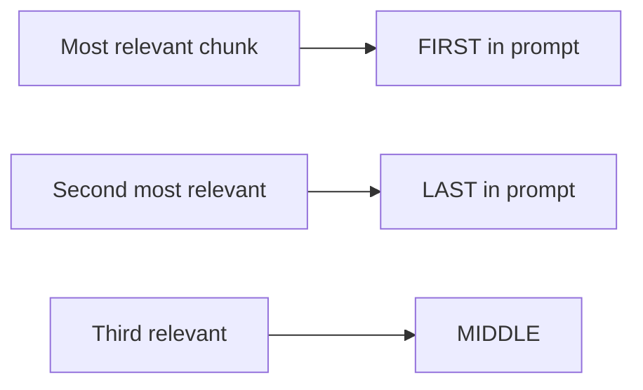

# Context Assembly — Theory

A lawyer preparing a court brief doesn't dump their entire case file on the judge's desk. They don't hand over 3,000 pages of discovery. They carefully select the most relevant excerpts, organize them clearly, label each one, and present them with the precise question the judge needs to answer.

Context assembly is this lawyerly work for your RAG system. You've retrieved the relevant chunks — now you need to arrange them into a prompt that gives the LLM exactly what it needs to answer accurately and nothing more.

👉 This is why we need **Context Assembly** — the way you format retrieved chunks into a prompt determines whether the LLM uses them properly and cites them correctly.

---

## The Basic Template

The simplest effective RAG prompt:

```
You are a helpful assistant. Answer the user's question based ONLY on the provided context.
If the answer isn't in the context, say "I don't know based on the provided information."

CONTEXT:
[retrieved chunk 1]

[retrieved chunk 2]

[retrieved chunk 3]

QUESTION: {user_question}

ANSWER:
```

The structure matters: context comes before the question so the model reads it as background. The explicit "ONLY based on context" instruction prevents the model from answering from its training memory.

---

## Including Source Metadata

Tell the LLM which source each chunk came from. This enables citation in the response.

```
CONTEXT:

[Source: Company Policy Manual, Page 3, Section: Returns]
All product returns must be initiated within 30 days of purchase.

[Source: Company Policy Manual, Page 4, Section: Returns]
Refunds are processed within 5-7 business days after receipt.

QUESTION: When will I receive my refund?
ANSWER: (cite the specific source)
```

Ask the model to cite: "Include source citations in your answer using [Source: X] format."

---

## Context Window Limits

A 100K context window seems generous until you have 50 retrieved chunks of 500 tokens each = 25,000 tokens just for context. Plus the question, system prompt, and expected answer.

Guidelines:
- Keep to top 3–5 chunks per query
- Keep chunk size at 400–600 tokens
- Estimate: `total_tokens ≈ system_prompt + (chunks × avg_chunk_tokens) + question + max_answer`

If you're hitting limits: retrieve fewer chunks, use smaller chunks, or use a model with a larger context window.

---

## Chunk Ordering

The order of chunks in the prompt matters. LLMs pay more attention to the beginning and end of context (the "lost in the middle" effect).



Put the most relevant chunk first. If you have an important chunk, don't bury it in the middle.

---

## Handling No Good Match

Sometimes retrieval finds nothing relevant. Tell the LLM this explicitly:

```python
if max_similarity < 0.6:
    # No good match found
    context = "No relevant information found in the knowledge base."
else:
    context = format_chunks(chunks)
```

Instruct the model: "If the context says 'No relevant information found', tell the user you don't have information on that topic."

---

## The Complete Assembly Function

```python
def assemble_prompt(question: str, chunks: list[dict]) -> str:
    if not chunks:
        context = "No relevant information found."
    else:
        context = "\n\n".join([
            f"[Source: {c['metadata']['source']}, Section: {c['metadata']['section']}]\n{c['text']}"
            for c in chunks
        ])

    return f"""You are a helpful assistant. Answer based ONLY on the context below.
If the answer isn't in the context, say you don't have that information.

CONTEXT:
{context}

QUESTION: {question}

ANSWER (cite your sources):"""
```

---

✅ **What you just learned:** Context assembly formats retrieved chunks into a structured prompt with source citations, explicit grounding instructions, and thoughtful chunk ordering — turning raw retrieval results into a prompt the LLM can reliably answer from.

🔨 **Build this now:** Write an `assemble_prompt()` function that takes a question and 3 retrieved chunks. Include source metadata for each chunk. Test it by printing the complete prompt before sending to the LLM.

➡️ **Next step:** Advanced RAG Techniques → `09_RAG_Systems/07_Advanced_RAG_Techniques/Theory.md`

---

## 📂 Navigation

**In this folder:**
| File | |
|---|---|
| 📄 **Theory.md** | ← you are here |
| [📄 Cheatsheet.md](./Cheatsheet.md) | Quick reference |
| [📄 Interview_QA.md](./Interview_QA.md) | Interview prep |
| [📄 Code_Example.md](./Code_Example.md) | Python code examples |

⬅️ **Prev:** [05 Retrieval Pipeline](../05_Retrieval_Pipeline/Theory.md) &nbsp;&nbsp;&nbsp; ➡️ **Next:** [07 Advanced RAG Techniques](../07_Advanced_RAG_Techniques/Theory.md)
