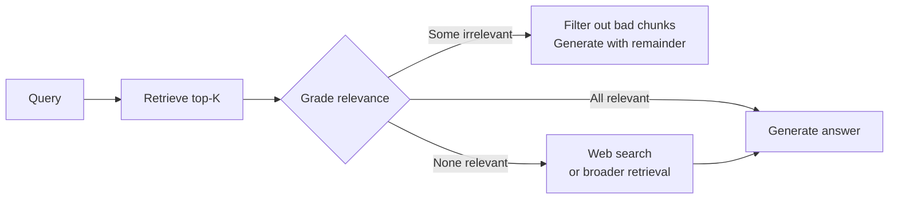

# Advanced RAG Techniques — Interview Q&A

## Beginner

**Q1: What problem does hybrid search solve that pure semantic search cannot?**

Pure semantic search finds chunks that are conceptually similar to the query but can miss exact keyword matches. If a user asks about "error code API-2847" and the document contains that exact string, the semantic embedding may not rank it first — because the embedding captures meaning, not exact character sequences.

BM25 (keyword search) works the opposite way: it's excellent at exact term matching, but terrible at semantic understanding. A user asking "how do I get my money back?" will not match a document that says "refund policy" because the words are different.

Hybrid search combines both:
- Semantic search finds "refund policy" when the user says "get my money back"
- BM25 finds "API-2847" when the user types that exact code

The combination handles both natural language questions and specific term lookups — which is exactly what production knowledge bases require.

---

**Q2: What is the difference between a bi-encoder and a cross-encoder?**

A **bi-encoder** (used in standard retrieval) encodes the query and each document independently into separate vectors. At search time, you compare the query vector to stored document vectors using cosine similarity. This is fast — the document vectors are pre-computed and stored.

A **cross-encoder** (used in reranking) takes the query and a document together as a single input and outputs a relevance score. The model sees both at the same time, so it can detect subtle interactions between query and document that a bi-encoder misses.

The trade-off:
- Bi-encoder: can search millions of documents in milliseconds (vectors are pre-computed)
- Cross-encoder: much more accurate, but must process each (query, document) pair fresh — too slow for first-pass retrieval over large collections

That's why the pattern is: bi-encoder retrieves top-20 candidates fast, cross-encoder reranks those 20 accurately, you keep the top 3.

---

**Q3: What is HyDE and when would you use it?**

HyDE stands for Hypothetical Document Embeddings. Instead of embedding the user's question directly for retrieval, you ask an LLM to generate a hypothetical answer document first, then embed that document and use it for the search.

The intuition: a short question ("What is the return window for electronics?") produces an embedding in a different region of vector space than the detailed policy document that answers it ("Electronics purchased online can be returned within 30 days..."). A hypothetical answer document, written in the same style as real policy documents, will have an embedding much closer to the real answer chunks.

When to use HyDE:
- The knowledge base contains detailed factual documents (policies, manuals, reports)
- User questions are short, abstract, or conceptual
- Standard retrieval is finding semantically similar questions rather than matching answers

When NOT to use HyDE:
- Real-time applications where an extra LLM call adds too much latency
- Simple factual queries where the question vocabulary matches document vocabulary
- When the LLM might hallucinate irrelevant content in the hypothetical document

---

## Intermediate

**Q4: Explain Reciprocal Rank Fusion (RRF) and why it works better than score averaging.**

RRF is the standard way to combine ranked result lists from different search methods. For each result, you compute a score based on its rank position across all lists:

```
RRF_score = sum(1 / (k + rank_i))  for each list i
```

where k=60 is a constant and rank_i is the position (1-indexed) of the result in list i. A result not appearing in a list contributes 0.

Why RRF works better than averaging raw scores:
- Semantic similarity scores (0–1) and BM25 scores (unbounded floats) are on completely different scales. Averaging them is like averaging temperatures in Celsius and Fahrenheit.
- RRF only cares about rank position, not the raw score magnitude. Rank 1 contributes `1/61 ≈ 0.016` regardless of whether the original score was 0.95 or 150.
- k=60 smooths out the difference between being rank 1 vs rank 5 in one list — it rewards consistently ranking well across lists rather than being #1 in just one.

The result: a chunk that ranks #2 in semantic search and #3 in keyword search beats a chunk that ranks #1 in semantic search but #20 in keyword search. The consistent multi-method evidence wins.

---

**Q5: How do you implement multi-query retrieval and handle duplicate results?**

Multi-query retrieval generates N variations of the original question, runs retrieval for each, and merges the results into a single deduplicated candidate set.

```python
def multi_query_retrieve(question: str, llm, collection, n_variants: int = 3, top_k: int = 5):
    # Step 1: generate variants
    prompt = f"""Generate {n_variants} different phrasings of this question for document search.
Return only the questions, one per line, no numbering.

Original question: {question}"""
    response = llm.complete(prompt)
    variants = response.text.strip().split("\n")

    # Step 2: retrieve for each variant + original
    all_chunks = {}  # keyed by chunk ID for deduplication
    for q in [question] + variants:
        for chunk in retrieve(q, top_k=top_k):
            chunk_id = chunk["id"]
            if chunk_id not in all_chunks or chunk["similarity"] > all_chunks[chunk_id]["similarity"]:
                all_chunks[chunk_id] = chunk  # keep highest similarity score

    # Step 3: sort merged results by similarity and return top candidates
    return sorted(all_chunks.values(), key=lambda c: c["similarity"], reverse=True)[:top_k * 2]
```

Key decisions:
- **Deduplication by ID**: the same chunk might appear in multiple variant searches — keep it once with the best score.
- **How many variants**: 3 is usually enough. More variants add latency without proportional quality gain.
- **When to apply reranking**: after multi-query merge, the candidate set is large — this is an ideal place to apply a cross-encoder reranker to pick the true top-3.

---

**Q6: What is the "retrieve-then-rerank" pipeline and what are the tradeoffs?**

The retrieve-then-rerank pipeline has two stages:

**Stage 1 — Fast retrieval**: Use ANN vector search to fetch the top-N candidates (N=20–50). This is cheap and fast — milliseconds even for large collections. The bi-encoder embeddings are pre-computed, so retrieval is just a vector comparison.

**Stage 2 — Accurate reranking**: Pass each (query, candidate) pair to a cross-encoder. The cross-encoder sees both together and outputs a precise relevance score. Sort by this score and keep top-K (K=3–5).

Tradeoffs:

| Factor | Retrieve only | Retrieve + Rerank |
|---|---|---|
| Latency | ~50ms | +100–500ms |
| Accuracy | Good | Significantly better |
| Cost | Low | +model inference cost |
| Complexity | Simple | Extra component to maintain |

The key insight: reranking is effective because it fixes the main weakness of bi-encoders — they embed query and document in isolation, missing cross-document interactions. The cross-encoder sees both and can detect nuanced relevance differences that bi-encoder cosine similarity misses.

When to add it: when your evaluation metrics show correct answers are in your top-10 retrieved chunks but not always in the top-3 that get passed to the LLM. Reranking moves the right chunk to the top.

---

## Advanced

**Q7: How would you design a query transformation pipeline that decides which transformation strategy to apply based on the query type?**

Different queries benefit from different transformations. A routing layer selects the appropriate strategy:

```python
def classify_query(question: str) -> str:
    """Returns: 'simple', 'vague', 'multi_aspect', 'exact_lookup'"""
    # Rule-based heuristics
    if len(question.split()) <= 3:
        return "vague"                    # "return policy?"
    if re.search(r'[A-Z]{2,}-\d+|v\d+\.\d+', question):
        return "exact_lookup"             # "error API-2847" or "v2.3.1 changelog"
    if question.count("?") > 1 or " and " in question.lower():
        return "multi_aspect"             # "How do I return AND get a refund?"
    return "simple"

def retrieve_smart(question: str):
    strategy = classify_query(question)

    if strategy == "vague":
        expanded = query_rewrite(question)        # LLM expands the question
        return retrieve(expanded, top_k=10)
    elif strategy == "exact_lookup":
        semantic = retrieve(question, top_k=5)
        keyword = bm25_search(question, top_k=5) # keyword search for exact terms
        return rrf_merge(semantic, keyword)
    elif strategy == "multi_aspect":
        return multi_query_retrieve(question)
    else:
        return retrieve(question, top_k=5)        # simple: just retrieve
```

This avoids the cost of running all transformations on every query. Vague queries get rewriting. Exact lookups get keyword search. Multi-part questions get multi-query. Simple questions go straight to retrieval.

In practice: start with the "simple" path for everything, then add routing only after you've measured what types of queries are failing.

---

**Q8: How does contextual compression improve RAG quality after retrieval?**

Retrieved chunks often contain a lot of text that's irrelevant to the specific question. A 400-token chunk about the returns policy might have 3 relevant sentences buried in general text. When 3 chunks like this are passed to the LLM, the 400-token answer might only contain 30 tokens of actual relevance per chunk.

Contextual compression: before passing chunks to the LLM, use a fast model to extract only the sentences from each chunk that are relevant to the question.

```python
def compress_chunk(question: str, chunk_text: str) -> str:
    prompt = f"""Extract only the sentences from the following text that are directly relevant
to answering the question. If nothing is relevant, return 'NOT RELEVANT'.

Question: {question}
Text: {chunk_text}

Relevant sentences:"""
    return llm_call(prompt)
```

Benefits:
- Fits more truly relevant information in the context window
- Reduces distraction — LLM isn't confused by loosely related text in the same chunk
- Can act as an implicit relevance filter (chunks with no relevant sentences are dropped)

Cost: adds one LLM call per retrieved chunk. For 5 chunks, that's 5 extra calls. Use a fast, cheap model (not Claude Opus) for this step. The quality gain is typically significant enough to justify the cost in production systems.

---

**Q9: What is the "corrective RAG" pattern and how does it prevent hallucination from bad retrievals?**

Corrective RAG (CRAG) adds a verification step after retrieval but before generation. A grader evaluates whether the retrieved documents actually contain the information needed to answer the question.



Implementation:
```python
def graded_retrieve(question: str, top_k: int = 5) -> list[dict]:
    chunks = retrieve(question, top_k=top_k)

    graded = []
    for chunk in chunks:
        grade_prompt = f"""Does this document contain information relevant to answering the question?
Answer YES or NO only.

Question: {question}
Document: {chunk['text'][:500]}"""
        grade = llm_call(grade_prompt).strip().upper()
        if grade == "YES":
            graded.append(chunk)

    if not graded:
        # Fall back: try web search or broader query
        return fallback_retrieve(question)

    return graded
```

The grader catches the case where high cosine-similarity chunks are topically related but don't actually answer the specific question. This prevents the LLM from generating a plausible-sounding but incorrect answer from weakly relevant context.

Cost: 1 LLM call per retrieved chunk for grading. This is expensive at scale. In practice: use grading only when reliability is critical, or use a very small fast model for grading (e.g., a fine-tuned classification model rather than a full LLM).

---

## 📂 Navigation

**In this folder:**
| File | |
|---|---|
| [📄 Theory.md](./Theory.md) | Core concepts |
| [📄 Cheatsheet.md](./Cheatsheet.md) | Quick reference |
| 📄 **Interview_QA.md** | ← you are here |
| [📄 Hybrid_Search.md](./Hybrid_Search.md) | Hybrid search techniques |
| [📄 Query_Transformation.md](./Query_Transformation.md) | Query transformation strategies |
| [📄 Reranking.md](./Reranking.md) | Reranking approaches |

⬅️ **Prev:** [06 Context Assembly](../06_Context_Assembly/Theory.md) &nbsp;&nbsp;&nbsp; ➡️ **Next:** [08 RAG Evaluation](../08_RAG_Evaluation/Theory.md)
