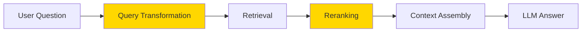
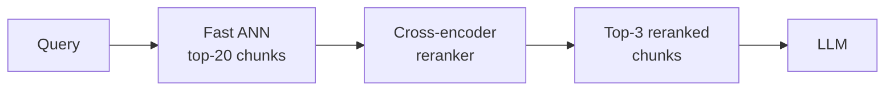

# Advanced RAG Techniques — Theory

You build a RAG system. It works pretty well. But sometimes it gives wrong answers. You look at the logs and discover: the right chunk was in the database, but the retrieval step didn't find it. Or the user's question was vague, so the embedding matched a chunk that sort of answered it — but not the right one.

Basic RAG retrieves the top-K chunks and passes them in. Advanced RAG asks: what if the initial retrieval missed something? What if we can improve the question before searching? What if we can verify the ranking after searching?

👉 This is why we need **Advanced RAG Techniques** — because basic retrieval fails in predictable ways, and there are specific tools to fix each failure mode.

---

## The Three Levers

Advanced RAG improves the system at three points:



1. **Before retrieval** — Query Transformation: rewrite, expand, or decompose the question to make retrieval more effective.
2. **During retrieval** — Hybrid Search: combine semantic vectors with keyword search to catch what each method misses.
3. **After retrieval** — Reranking: use a slower, more accurate model to re-order the retrieved chunks before passing them to the LLM.

---

## Hybrid Search

Pure semantic search misses exact keyword matches. Pure keyword search misses paraphrasing. Hybrid uses both.

| Search type | Finds | Misses |
|---|---|---|
| Semantic (vector) | "refund timeline" when document says "return window" | Exact product codes, names, IDs |
| Keyword (BM25) | "API-2847" exact match | Paraphrased questions |
| Hybrid | Both of the above | Less than either alone |

The scores from each method are fused using **Reciprocal Rank Fusion (RRF)**:

```python
# Each list returns ranked results. RRF combines them.
score = sum(1 / (k + rank) for rank in ranks)
# k=60 is standard. rank=1 (top result) → 1/61 ≈ 0.016
```

A chunk ranked #1 in semantic search and #1 in keyword search gets the highest combined score. A chunk that appears in only one list still gets some credit.

---

## Reranking

First-pass retrieval uses fast approximate search (ANN). Reranking uses a slower, more accurate model to re-score the top results.



**Bi-encoder** (what you use for retrieval): embeds query and document separately. Fast, but loses the direct comparison between them.

**Cross-encoder** (what you use for reranking): takes (query, document) as a pair. Sees both simultaneously. More accurate, but too slow to run against 10,000 chunks.

The pattern: retrieve 20 candidates fast, rerank to top 3 accurately. You get both speed and accuracy.

Popular reranking models: `cross-encoder/ms-marco-MiniLM-L-6-v2` (fast), `cohere-rerank-3`, `bge-reranker-large` (high accuracy).

---

## Query Transformation

A user types a short, vague question. The embedding of that question doesn't match the detailed document that answers it. Query transformation fixes this before retrieval runs.

Three main techniques:

**1. Query expansion / rewriting** — use an LLM to rewrite the question into a more detailed, retrieval-friendly form:
```
User: "return policy?"
Rewritten: "What is the product return policy, including the time window for returns and the refund process?"
```

**2. Multi-query** — generate N variations of the question, retrieve for each, merge and deduplicate results:
```
Original: "How do I get a refund?"
Variant 1: "What is the refund process?"
Variant 2: "How long does a refund take?"
Variant 3: "What steps do I follow to return a product for a refund?"
→ retrieve for all 3, merge, deduplicate → better coverage
```

**3. HyDE (Hypothetical Document Embeddings)** — ask the LLM to write a *hypothetical* document that would answer the question, then embed that document for retrieval:
```
Question: "What is the return window for electronics?"
→ LLM generates: "Electronics can be returned within 30 days of purchase..."
→ Embed the hypothetical doc and search
→ The hypothetical doc's embedding is closer to actual policy chunks than the short question
```

---

## When to Use Each Technique

| Technique | Use when... |
|---|---|
| Hybrid search | Queries mix natural language and specific terms (names, codes, dates) |
| Reranking | You can afford +100–300ms latency; quality matters more than speed |
| Query rewriting | Users ask short/vague questions; your knowledge base is detailed |
| Multi-query | Single questions can have multiple valid search angles |
| HyDE | Queries are abstract questions; documents are factual statements |

---

✅ **What you just learned:** Advanced RAG improves on basic RAG at three points — query transformation rewrites the question before retrieval, hybrid search combines semantic + keyword retrieval, and reranking uses a more accurate model to re-order results before passing them to the LLM.

🔨 **Build this now:** Take your basic RAG pipeline. Add a reranker using `sentence-transformers` with `cross-encoder/ms-marco-MiniLM-L-6-v2`. Retrieve top-10 with ANN, rerank, keep top-3. Measure whether answer quality improves on your test questions.

➡️ **Next step:** RAG Evaluation → `09_RAG_Systems/08_RAG_Evaluation/Theory.md`

---

## 📂 Navigation

**In this folder:**
| File | |
|---|---|
| 📄 **Theory.md** | ← you are here |
| [📄 Cheatsheet.md](./Cheatsheet.md) | Quick reference |
| [📄 Interview_QA.md](./Interview_QA.md) | Interview prep |
| [📄 Hybrid_Search.md](./Hybrid_Search.md) | Hybrid search techniques |
| [📄 Query_Transformation.md](./Query_Transformation.md) | Query transformation strategies |
| [📄 Reranking.md](./Reranking.md) | Reranking approaches |

⬅️ **Prev:** [06 Context Assembly](../06_Context_Assembly/Theory.md) &nbsp;&nbsp;&nbsp; ➡️ **Next:** [08 RAG Evaluation](../08_RAG_Evaluation/Theory.md)
