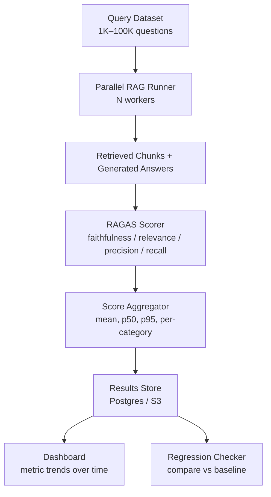
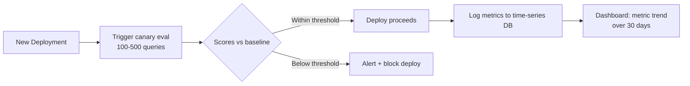
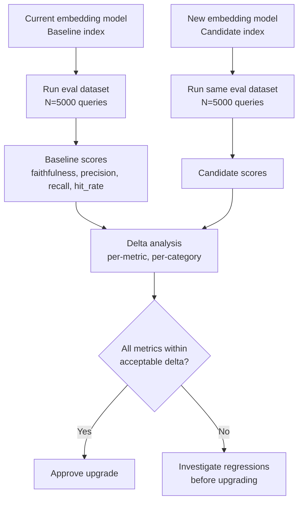
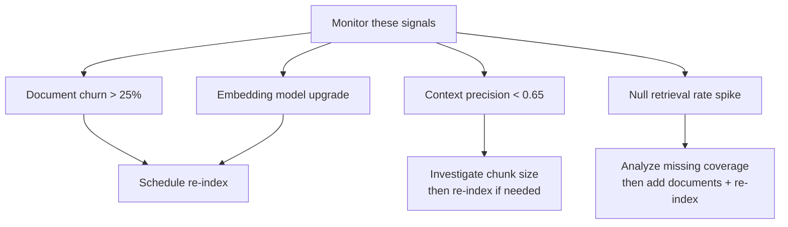

# RAG Evaluation at Scale

Think about how a car manufacturer tests safety. They don't test one car and ship the whole fleet. They run crash tests on thousands of configurations — different speeds, angles, passengers weights. They automate the testing rig so it runs overnight while engineers sleep. They build dashboards that flag regressions the moment a new component underperforms.

RAG evaluation at scale is the same discipline applied to AI systems. Single-query testing tells you the system works once. Batch evaluation at 10,000 queries tells you how it behaves across your entire problem space — and whether a change you made last Tuesday broke something you didn't expect.

👉 This is why **evaluation at scale** exists — to replace "it seems to be working" with a number that holds up under production conditions.

---

## ## Why Scale Changes Everything

Running RAGAS on 10 manually written questions is a sanity check. Running it on 50,000 synthetically generated queries covering the full distribution of your user base is quality assurance.

The problems that only appear at scale:

- **Tail queries** — the weird phrasings, the edge cases, the compound questions. Your 20-question test set never surfaces these.
- **Systematic retrieval gaps** — a whole topic area where your embeddings consistently miss. Not obvious from spot-checking.
- **Latent hallucinations** — faithfulness failures that look fine in isolation but form a pattern: the model always confabulates numbers, or always hallucinates when asked about a specific date range.
- **Regression detection** — you swap the embedding model from `text-embedding-ada-002` to `text-embedding-3-large`. Did quality go up across the board, or did it improve on some query types and regress on others?

Single-query evaluation catches none of this. Scale does.

---

## ## Batch Evaluation Pipeline Design

Think of it like an assembly line. Raw materials (questions) go in one end. A series of stations process, score, and aggregate them. Finished products (metrics) come out the other end.



**Key design decisions:**

**Parallelism** — Each query is independent. Run them in parallel. For 10K queries, 50 workers cuts wall-clock time from hours to minutes.

**Batching LLM judge calls** — RAGAS uses an LLM to score faithfulness and answer relevancy. Batch these calls (use the Anthropic Batches API or OpenAI batch endpoint) to reduce cost by 50% and increase throughput.

**Checkpointing** — If a 50K-query job fails at row 40K, you don't want to restart from zero. Write results to a store incrementally. Resume from the last checkpoint.

**Stratified sampling** — Before running the full 100K, run a stratified sample of 1K across all query categories to catch obvious failures cheaply.

---

## ## Automated Dataset Generation

Manual test sets are gold but expensive. You can create 10,000 synthetic (question, ground-truth answer) pairs from your own documents using LLMs — this is called **LLM-as-judge dataset generation**.

The pattern: give an LLM a chunk of your documents, ask it to generate questions that can be answered from that chunk, then generate reference answers.

```python
import anthropic
import json
from typing import List, Dict

client = anthropic.Anthropic()

def generate_eval_pairs(chunk_text: str, n_questions: int = 3) -> List[Dict]:
    """Generate synthetic eval pairs from a document chunk."""
    prompt = f"""You are building an evaluation dataset for a RAG system.

Read the following document excerpt and generate {n_questions} question-answer pairs.

Rules:
- Questions must be answerable ONLY from the provided text
- Answers must be factually grounded in the text — no inference beyond what's written
- Include a mix of: factual recall, comparison, and "why/how" questions
- Vary question difficulty: 1 easy, 1 medium, 1 hard

Document excerpt:
{chunk_text}

Return JSON only:
{{
  "pairs": [
    {{"question": "...", "answer": "...", "difficulty": "easy|medium|hard"}},
    ...
  ]
}}"""

    response = client.messages.create(
        model="claude-sonnet-4-6",
        max_tokens=1024,
        messages=[{"role": "user", "content": prompt}]
    )

    try:
        data = json.loads(response.content[0].text)
        return data["pairs"]
    except json.JSONDecodeError:
        return []


def build_eval_dataset(chunks: List[str], target_size: int = 1000) -> List[Dict]:
    """Build a full evaluation dataset from document chunks."""
    pairs = []
    questions_per_chunk = max(1, target_size // len(chunks))

    for chunk in chunks:
        new_pairs = generate_eval_pairs(chunk, n_questions=questions_per_chunk)
        for pair in new_pairs:
            pair["source_chunk"] = chunk[:200]  # store truncated source
        pairs.extend(new_pairs)

        if len(pairs) >= target_size:
            break

    return pairs[:target_size]
```

**Filtering the synthetic dataset** — Not all generated pairs are good. Filter out:
- Questions answerable without any context (too easy, tests general knowledge not retrieval)
- Questions where the model fabricated facts not in the chunk
- Near-duplicate questions (cosine similarity > 0.95 between question embeddings)

A 30–40% filter rate is normal. Budget for it.

---

## ## Continuous Monitoring: Detecting Degradation Over Time

A RAG system is not a static artifact. Your documents change. Your embedding model gets updated. Your prompts get tweaked. Any of these can silently degrade quality.

**Continuous monitoring** runs a fixed "canary" eval set on every deployment and tracks metric trends over time.



**What to monitor continuously:**

| Signal | Degradation Indicator |
|--------|----------------------|
| Faithfulness | Drop > 0.05 from baseline |
| Answer Relevancy | Drop > 0.05 from baseline |
| Context Precision | Drop > 0.08 (retrieval is getting noisier) |
| Hit Rate @ 3 | Drop > 0.05 (embedding drift or document changes) |
| p95 latency | Spike > 20% (infrastructure issue) |
| Null retrieval rate | Increase (empty results for valid queries) |

Track these metrics on a rolling 7-day and 30-day window. A sudden drop on a given day points to a deployment. A slow drift over weeks points to document drift or embedding model drift.

---

## ## Regression Testing: Embedding Model Upgrade Impact

You want to upgrade from `text-embedding-ada-002` to `text-embedding-3-large`. Before re-indexing 10 million documents and shipping to production, you need to know the quality impact.

**The regression testing workflow:**



```python
def compare_eval_runs(baseline_results: list, candidate_results: list) -> dict:
    """Compare two eval runs and return per-metric deltas."""
    metrics = ["faithfulness", "answer_relevancy", "context_precision", "context_recall"]
    deltas = {}

    for metric in metrics:
        baseline_scores = [r[metric] for r in baseline_results if metric in r]
        candidate_scores = [r[metric] for r in candidate_results if metric in r]

        baseline_mean = sum(baseline_scores) / len(baseline_scores)
        candidate_mean = sum(candidate_scores) / len(candidate_scores)
        delta = candidate_mean - baseline_mean

        deltas[metric] = {
            "baseline": round(baseline_mean, 4),
            "candidate": round(candidate_mean, 4),
            "delta": round(delta, 4),
            "direction": "improvement" if delta > 0 else "regression",
            "significant": abs(delta) > 0.03  # threshold for flagging
        }

    return deltas
```

Look for **per-category regressions** even when the aggregate improves. A new embedding model might be better on average but worse for technical queries — which is exactly your use case.

---

## ## Cost-Quality Tradeoffs: When Is "Good Enough" Good Enough?

Every evaluation run costs money. LLM judge calls are the dominant cost. A 10K query eval using Claude to score faithfulness and answer relevancy runs approximately:

- 10K × average_tokens_per_scoring_call × price_per_token
- At `claude-haiku-4-5` prices, a 10K eval costs ~$2–5
- At `claude-sonnet-4-6` prices, the same eval costs ~$15–30

**Three cost levers:**

**1. Model routing for judgment** — Use a cheap model (Haiku) for initial filtering, a stronger model only for borderline cases. If Haiku gives a score between 0.4 and 0.7, escalate to Sonnet. Outside that range, accept the cheap judgment.

**2. Stratified sampling** — Don't evaluate every query. Sample 20% of the full set, stratified by query category. Good enough to detect regressions at 1/5 the cost.

**3. Tiered eval frequency** — Run the cheap 100-query canary on every commit. Run the medium 2K eval on every deployment. Run the full 50K eval monthly or before major infrastructure changes.

**When is "good enough" actually good enough?**

The threshold depends on what breaks when quality drops:

| System Type | Faithfulness Floor | Why |
|---|---|---|
| Medical information | > 0.95 | Hallucinated advice is a liability |
| Customer support FAQ | > 0.80 | Wrong answers damage trust |
| Internal knowledge base | > 0.75 | Users can verify |
| Exploratory research | > 0.65 | Used for orientation, not final decisions |

Don't chase 0.99 faithfulness if your use case tolerates 0.80. The cost and complexity of getting to 0.99 is enormous — spend that engineering effort elsewhere.

---

## ## Re-indexing Triggers

Re-indexing a large corpus is expensive. You need principled triggers, not reactions to vibes.

**Trigger 1: Document drift**

Documents accumulate. Old documents become stale. After 30% of your document set has been updated or replaced, hit rate degrades measurably. Monitor document change rate and trigger re-indexing at 25–30% churn.

**Trigger 2: Embedding model change**

Any time you switch embedding models, full re-indexing is mandatory. You cannot mix embeddings from different models in the same index — the vector spaces are incompatible.

Build a blue-green indexing strategy: build the new index in parallel, run eval comparison, then switch traffic.

**Trigger 3: Chunk size tuning**

If context precision is degrading (retrieval is returning chunks that contain the answer buried in noise), smaller chunks might help. Changing chunk size requires full re-indexing. Validate on eval before re-indexing production.

**Trigger 4: Semantic drift in queries**

Your users' questions evolve. If you add a new product, new question categories emerge that your existing chunks don't cover well. Monitor the null-retrieval rate (queries returning zero relevant chunks) and new question categories from logs.



---

## ## Python: Batch RAGAS Evaluation Pipeline

```python
import asyncio
from dataclasses import dataclass
from typing import List, Optional
import json
import time

import anthropic

# ── Data model ────────────────────────────────────────────────────────────────

@dataclass
class EvalSample:
    question: str
    ground_truth: str
    retrieved_chunks: List[str]
    generated_answer: str
    sample_id: Optional[str] = None

@dataclass
class EvalResult:
    sample_id: str
    faithfulness: float
    answer_relevancy: float
    context_precision: float
    context_recall: float
    latency_ms: float

# ── Scoring functions (LLM-as-judge) ─────────────────────────────────────────

client = anthropic.Anthropic()

def score_faithfulness(sample: EvalSample) -> float:
    context = "\n\n---\n\n".join(sample.retrieved_chunks)
    prompt = f"""Score the faithfulness of this answer (0.0–1.0).

Faithfulness = every claim in the answer is supported by the context. Score 1.0 if all claims
are grounded. Deduct for each unsupported or contradicted claim.

Question: {sample.question}
Context: {context}
Answer: {sample.generated_answer}

Return JSON: {{"score": 0.0, "unsupported_claims": ["..."]}}"""

    resp = client.messages.create(
        model="claude-haiku-4-5",
        max_tokens=256,
        messages=[{"role": "user", "content": prompt}]
    )
    try:
        return json.loads(resp.content[0].text)["score"]
    except Exception:
        return 0.0


def score_answer_relevancy(sample: EvalSample) -> float:
    prompt = f"""Score how well this answer addresses the question (0.0–1.0).

1.0 = directly and completely answers the question.
0.0 = does not address the question at all.

Question: {sample.question}
Answer: {sample.generated_answer}

Return JSON: {{"score": 0.0, "reason": "..."}}"""

    resp = client.messages.create(
        model="claude-haiku-4-5",
        max_tokens=256,
        messages=[{"role": "user", "content": prompt}]
    )
    try:
        return json.loads(resp.content[0].text)["score"]
    except Exception:
        return 0.0


def score_context_precision(sample: EvalSample) -> float:
    """Fraction of retrieved chunks that are actually relevant."""
    if not sample.retrieved_chunks:
        return 0.0

    relevant = 0
    for chunk in sample.retrieved_chunks:
        prompt = f"""Is this chunk relevant to answering the question? Answer yes or no only.

Question: {sample.question}
Chunk: {chunk}"""
        resp = client.messages.create(
            model="claude-haiku-4-5",
            max_tokens=10,
            messages=[{"role": "user", "content": prompt}]
        )
        if "yes" in resp.content[0].text.lower():
            relevant += 1

    return relevant / len(sample.retrieved_chunks)


def score_context_recall(sample: EvalSample) -> float:
    """Does the context contain everything needed to answer correctly?"""
    context = "\n\n".join(sample.retrieved_chunks)
    prompt = f"""Does the provided context contain all information needed to produce this ground-truth answer?

Score 1.0 if the context fully supports the answer.
Score 0.0 if critical information is missing from the context.

Question: {sample.question}
Ground-truth answer: {sample.ground_truth}
Context: {context}

Return JSON: {{"score": 0.0, "missing_info": "what's missing, if anything"}}"""

    resp = client.messages.create(
        model="claude-haiku-4-5",
        max_tokens=256,
        messages=[{"role": "user", "content": prompt}]
    )
    try:
        return json.loads(resp.content[0].text)["score"]
    except Exception:
        return 0.0


# ── Batch runner ──────────────────────────────────────────────────────────────

def evaluate_sample(sample: EvalSample) -> EvalResult:
    start = time.time()
    faithfulness = score_faithfulness(sample)
    answer_relevancy = score_answer_relevancy(sample)
    context_precision = score_context_precision(sample)
    context_recall = score_context_recall(sample)
    latency_ms = (time.time() - start) * 1000

    return EvalResult(
        sample_id=sample.sample_id or "unknown",
        faithfulness=faithfulness,
        answer_relevancy=answer_relevancy,
        context_precision=context_precision,
        context_recall=context_recall,
        latency_ms=latency_ms,
    )


def run_batch_eval(
    samples: List[EvalSample],
    checkpoint_path: str = "eval_checkpoint.jsonl",
    max_workers: int = 10,
) -> List[EvalResult]:
    """Run evaluation on a batch of samples with checkpointing."""
    from concurrent.futures import ThreadPoolExecutor, as_completed

    # Load completed IDs from checkpoint
    completed_ids = set()
    results = []
    try:
        with open(checkpoint_path) as f:
            for line in f:
                r = json.loads(line)
                completed_ids.add(r["sample_id"])
                results.append(EvalResult(**r))
        print(f"Resuming from checkpoint: {len(completed_ids)} already done")
    except FileNotFoundError:
        pass

    pending = [s for s in samples if s.sample_id not in completed_ids]
    print(f"Evaluating {len(pending)} remaining samples with {max_workers} workers")

    with open(checkpoint_path, "a") as checkpoint_file:
        with ThreadPoolExecutor(max_workers=max_workers) as executor:
            futures = {executor.submit(evaluate_sample, s): s for s in pending}

            for i, future in enumerate(as_completed(futures)):
                result = future.result()
                results.append(result)
                # Write checkpoint
                checkpoint_file.write(json.dumps(result.__dict__) + "\n")
                checkpoint_file.flush()

                if (i + 1) % 100 == 0:
                    print(f"Progress: {i + 1}/{len(pending)}")

    return results


def aggregate_results(results: List[EvalResult]) -> dict:
    """Compute aggregate statistics from a batch eval run."""
    if not results:
        return {}

    metrics = ["faithfulness", "answer_relevancy", "context_precision", "context_recall"]
    aggregated = {}

    for metric in metrics:
        scores = [getattr(r, metric) for r in results]
        sorted_scores = sorted(scores)
        n = len(sorted_scores)
        aggregated[metric] = {
            "mean": round(sum(scores) / n, 4),
            "p50": round(sorted_scores[n // 2], 4),
            "p10": round(sorted_scores[n // 10], 4),  # worst 10%
            "p90": round(sorted_scores[int(n * 0.9)], 4),  # best 90%
            "below_0_7": round(sum(1 for s in scores if s < 0.7) / n, 4),
        }

    return aggregated
```

---

## ## Dashboard Metrics to Track in Production

These are the metrics worth wiring into a Grafana or Datadog dashboard:

| Metric | Refresh Cadence | Alert Threshold |
|--------|----------------|-----------------|
| Mean faithfulness (rolling 24h) | Hourly | < 0.78 |
| Mean answer relevancy (rolling 24h) | Hourly | < 0.75 |
| Context precision (weekly canary) | Per deploy | < 0.65 |
| Context recall (weekly canary) | Per deploy | < 0.70 |
| Hit rate @ 3 (canary) | Per deploy | < 0.72 |
| Null retrieval rate | Hourly | > 5% |
| p95 generation latency | Real-time | > 8s |
| Judge model error rate | Hourly | > 2% |
| Eval cost per 1K queries | Daily | Budget alert |

**Trend charts matter more than point-in-time values.** A faithfulness of 0.82 is fine. Faithfulness at 0.82 that was 0.89 three weeks ago is a problem. Build 30-day trend lines for every metric.

---

✅ **What you just learned:** Evaluation at scale means running 1K–100K queries through a batch pipeline with parallel workers, LLM-as-judge scoring, and checkpointing. Synthetic dataset generation using LLMs makes scale achievable. Continuous monitoring on a canary eval set catches regressions before users do. Re-indexing is triggered by document churn, embedding model changes, or measured metric drops — not instinct.

🔨 **Build this now:** Take your existing RAG system and run the batch pipeline above on a 100-question synthetic dataset generated from your documents. Compare faithfulness scores before and after changing one parameter (chunk size, top-K, or embedding model). That's a regression test.

➡️ **Next step:** Build a full RAG App → `09_RAG_Systems/09_Build_a_RAG_App/Project_Guide.md`

---

## 📂 Navigation

**In this folder:**
| File | |
|---|---|
| [📄 Theory.md](./Theory.md) | Core concepts: RAGAS metrics, test set creation |
| 📄 **Evaluation_at_Scale.md** | ← you are here |
| [📄 Cheatsheet.md](./Cheatsheet.md) | Quick reference |
| [📄 Interview_QA.md](./Interview_QA.md) | Interview prep |
| [📄 Code_Example.md](./Code_Example.md) | Python code examples |
| [📄 Metrics_Guide.md](./Metrics_Guide.md) | RAG evaluation metrics guide |

⬅️ **Prev:** [07 Advanced RAG Techniques](../07_Advanced_RAG_Techniques/Theory.md) &nbsp;&nbsp;&nbsp; ➡️ **Next:** [09 Build a RAG App](../09_Build_a_RAG_App/Project_Guide.md)
