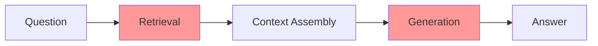
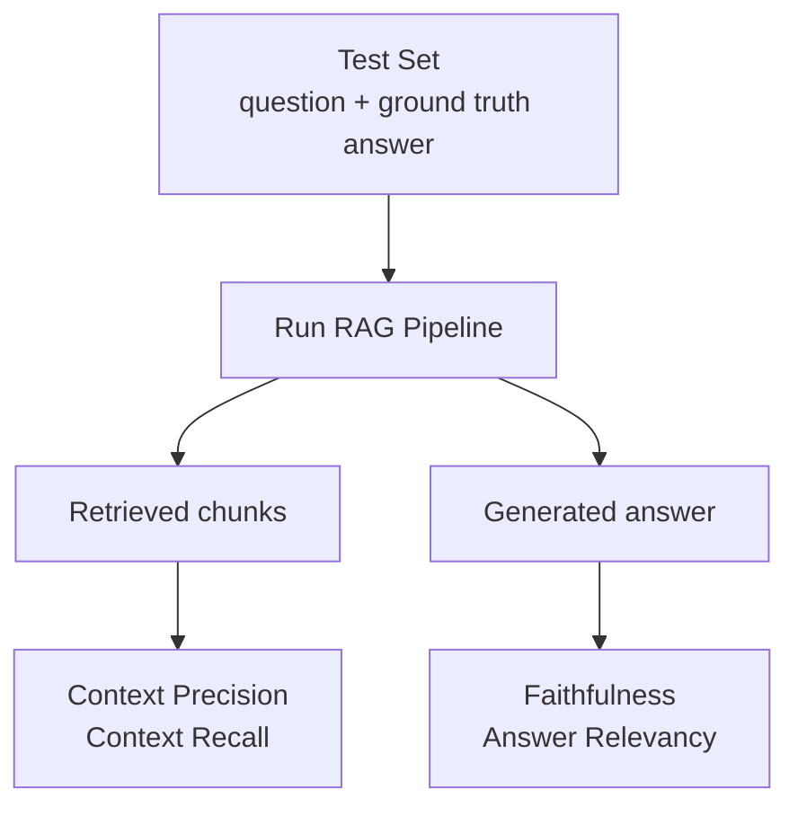

# RAG Evaluation — Theory

You shipped a RAG system. Your manager asks: "Is it working?" You say "It seems pretty good." Without measuring, you don't know if the system is 60% accurate or 90% accurate. You can't tell if your changes are improvements.

👉 This is why we need **RAG Evaluation** — to turn "it seems pretty good" into concrete scores you can track, compare, and improve.

---

## 📌 Learning Priority

**Must Learn** — core concepts, needed to understand the rest of this file:
[What Can Go Wrong](#what-can-go-wrong-in-a-rag-pipeline) · [Four Core RAGAS Metrics](#the-four-core-ragas-metrics) · [Retrieval-Only Metrics](#retrieval-only-metrics)

**Should Learn** — important for real projects and interviews:
[LLM-as-Judge Evaluation](#llm-as-judge-evaluation) · [How to Create a Test Set](#how-to-create-a-test-set)

**Good to Know** — useful in specific situations, not needed daily:
[Benchmark Targets](#benchmark-targets)

---

## What Can Go Wrong in a RAG Pipeline

RAG has two separate stages, each of which can fail independently:



**Retrieval failures:**
- The right chunk wasn't in the top-K results (low recall)
- Wrong chunks were retrieved (low precision)

**Generation failures:**
- The LLM made up facts not in the retrieved chunks (hallucination)
- The LLM ignored relevant information in the chunks
- The answer didn't address the actual question

A system with perfect retrieval but bad generation will fail. A system with great generation but missing key chunks will also fail.

---

## The Four Core RAGAS Metrics

RAGAS is the standard evaluation framework for RAG systems:

**1. Faithfulness** — Does the answer stick to the retrieved context? Checks: each claim in the answer → can it be traced to the context? Score: 0–1 (1 = every claim is grounded).

**2. Answer Relevancy** — Does the answer address the question? Checks: does the answer actually answer what was asked? Score: 0–1 (1 = directly answers).

**3. Context Precision** — Were the right chunks retrieved? Checks: how many of the retrieved chunks contain relevant information? Score: 0–1 (1 = every retrieved chunk was relevant).

**4. Context Recall** — Did retrieval find everything it needed? Checks: does the retrieved context contain all information needed for the correct answer? Score: 0–1 (1 = all necessary information was retrieved).

---

## The Evaluation Triangle



For each question in the test set, run the full RAG pipeline and score on all four metrics, then average across all questions.

---

## How to Create a Test Set

**1. Manual** — domain experts write questions and answers. Highest quality, expensive, slow.

**2. LLM-generated** — use an LLM to generate question/answer pairs from your documents:
```python
prompt = f"""Read this document excerpt and generate 3 question-answer pairs.
Each pair should test factual recall. Format: Q: / A: on separate lines.

Document: {chunk_text}"""
```

**3. Production logs** — collect real user questions from a deployed system. Manually label the correct answers. Most representative of actual usage.

Start with 20–50 high-quality manually written examples. Use LLM-generated pairs to scale to 200+.

---

## Retrieval-Only Metrics

- **Hit rate @ K**: what fraction of questions had the correct chunk in the top-K results?
- **MRR (Mean Reciprocal Rank)**: average of `1/rank` for the correct chunk across all questions

```python
def mrr(retrieved_ids: list[str], expected_id: str) -> float:
    if expected_id in retrieved_ids:
        return 1 / (retrieved_ids.index(expected_id) + 1)
    return 0.0

mrr_score = sum(mrr(r, e) for r, e in test_cases) / len(test_cases)
```

MRR > 0.8 means the correct chunk is typically in the top 1–2 results. Below 0.5 means retrieval is broken and must be fixed before improving generation.

---

## LLM-as-Judge Evaluation

For faithfulness and answer relevancy, use an LLM to judge quality — the standard approach in RAGAS:

```python
faithfulness_judge_prompt = """You are evaluating an AI assistant's answer.

Question: {question}
Context provided: {context}
Answer given: {answer}

Does the answer contain ONLY information that can be found in the context?
Are there any claims in the answer that are NOT supported by the context?

Score from 0 to 1, where 1 means every claim in the answer is grounded in the context.
Return: {{"score": 0.0-1.0, "reason": "brief explanation"}}"""
```

This scales to large test sets without needing human reviewers for every example.

---

## Benchmark Targets

| Metric | Needs work | Acceptable | Good |
|---|---|---|---|
| Faithfulness | < 0.7 | 0.7–0.85 | > 0.85 |
| Answer Relevancy | < 0.7 | 0.7–0.85 | > 0.85 |
| Context Precision | < 0.6 | 0.6–0.8 | > 0.8 |
| Context Recall | < 0.7 | 0.7–0.85 | > 0.85 |
| Hit Rate @ 3 | < 0.7 | 0.7–0.85 | > 0.85 |

Set your own targets based on use case — a medical information system needs higher faithfulness thresholds than a general FAQ bot.

---

✅ **What you just learned:** RAG evaluation measures retrieval quality (context precision/recall, hit rate) and generation quality (faithfulness, answer relevancy) separately using a test set of (question, expected answer) pairs. RAGAS is the standard framework; LLM-as-judge scales evaluation without human reviewers for every test case.

🔨 **Build this now:** Create a test set of 20 questions with expected answers for your RAG system. Compute hit rate @ 3 (does the correct chunk appear in the top-3 results?). If it's below 0.75, your retrieval needs work before improving generation.

➡️ **Next step:** Build a RAG App → `09_RAG_Systems/09_Build_a_RAG_App/Project_Guide.md`

---

## 🛠️ Practice Projects

Apply what you just learned:
- → **[I5: Production RAG System](../../22_Capstone_Projects/10_Production_RAG_System/03_GUIDE.md)** — RAGAS evaluation on your RAG pipeline
- → **[A1: Advanced RAG with Reranking](../../22_Capstone_Projects/11_Advanced_RAG_with_Reranking/03_GUIDE.md)** — full RAGAS suite: faithfulness, answer relevance, context recall

---

## 📂 Navigation

**In this folder:**
| File | |
|---|---|
| 📄 **Theory.md** | ← you are here |
| [📄 Cheatsheet.md](./Cheatsheet.md) | Quick reference |
| [📄 Interview_QA.md](./Interview_QA.md) | Interview prep |
| [📄 Code_Example.md](./Code_Example.md) | Python code examples |
| [📄 Metrics_Guide.md](./Metrics_Guide.md) | RAG evaluation metrics guide |

⬅️ **Prev:** [07 Advanced RAG Techniques](../07_Advanced_RAG_Techniques/Theory.md) &nbsp;&nbsp;&nbsp; ➡️ **Next:** [09 Build a RAG App](../09_Build_a_RAG_App/Project_Guide.md)
