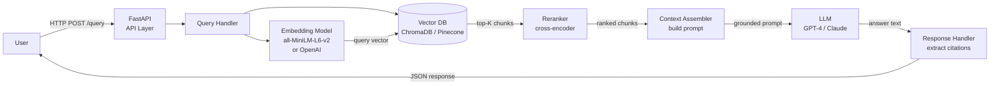
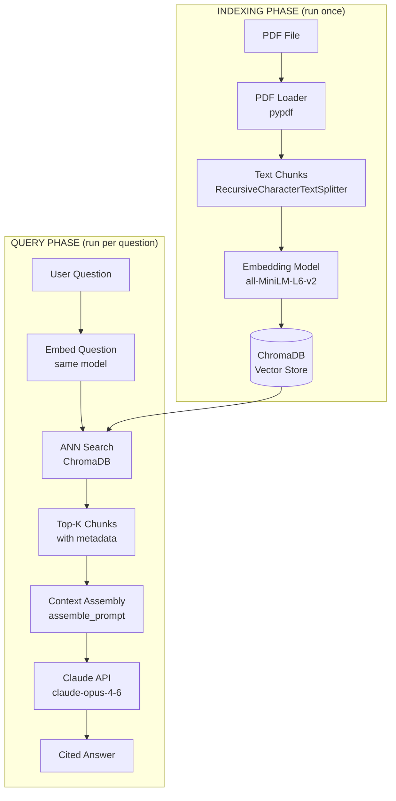
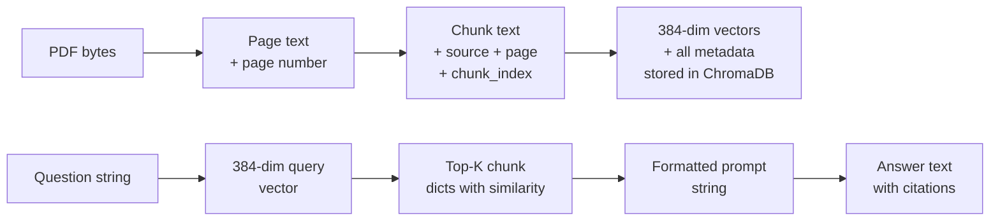

# Build a RAG App — Architecture Blueprint

Complete system design for the PDF Q&A RAG application. Data flows, component responsibilities, and design decisions explained.

---

## Full System Architecture (Request Flow)



---

## High-Level Architecture



---

## Component Table

| Component | Responsibility | Tech Choice | Why |
|---|---|---|---|
| API Layer | Accept requests, route to handlers, return JSON responses | FastAPI | Async-native, automatic OpenAPI docs, type validation via Pydantic |
| Document Loader | Extract raw text + metadata from PDF pages | pypdf | Pure Python, no system dependencies, preserves page numbers |
| Text Chunker | Split documents into overlapping fixed-size chunks | Custom (or LangChain `RecursiveCharacterTextSplitter`) | Overlap preserves cross-boundary context; recursive splitter respects sentence boundaries |
| Embedding Model | Convert text to dense vector representations | `all-MiniLM-L6-v2` (local) or OpenAI `text-embedding-3-small` | Local model is free + fast; OpenAI gives higher quality for production |
| Vector Store | Store vectors + metadata; fast approximate nearest-neighbor search | ChromaDB (dev) or Pinecone (prod) | Chroma runs locally with zero config; Pinecone scales to billions of vectors in cloud |
| Reranker | Re-score retrieved chunks for relevance; promote best chunks to top | Cross-encoder (`cross-encoder/ms-marco-MiniLM-L-6-v2`) | Bi-encoder retrieval is fast but imprecise; cross-encoder is slower but much more accurate |
| Context Assembler | Format retrieved chunks + source labels into a prompt | Custom Python | Simple string formatting; includes page citations for grounding |
| LLM | Generate a natural language answer grounded in retrieved context | GPT-4o (OpenAI) or Claude claude-opus-4-6 (Anthropic) | Both support long contexts and follow grounding instructions reliably |
| Response Handler | Parse LLM output, extract citations, return structured response | Custom Python | Extracts `[Context N]` references from answer text |

---

## Tech Stack

```
fastapi>=0.111.0          # API framework
uvicorn>=0.29.0           # ASGI server for FastAPI
langchain>=0.2.0          # OR: llama-index>=0.10.0 (orchestration layer)
openai>=1.0.0             # OpenAI embeddings + GPT-4 (optional — swap for anthropic)
anthropic>=0.26.0         # Claude LLM (optional — swap for openai)
chromadb>=0.4.0           # Vector store (dev)
pinecone-client>=3.0.0    # Vector store (prod, optional)
sentence-transformers>=2.2.0  # Local embedding + reranking models
pypdf>=3.0.0              # PDF text extraction
pydantic>=2.0.0           # Request/response validation
```

**LangChain vs LlamaIndex**: Both are orchestration libraries that wire together loaders, splitters, embedders, and retrievers. LangChain has broader ecosystem coverage; LlamaIndex is more opinionated about RAG and easier to set up for pure retrieval use cases. Either works. The component code in this project uses direct library calls (no framework) so you can see exactly what each step does.

---

## Component Responsibilities

### PDF Loader

**Input**: path to a PDF file
**Output**: list of `Document` objects with text + metadata

```python
from pypdf import PdfReader

def load_pdf(path: str) -> list[dict]:
    reader = PdfReader(path)
    documents = []
    for page_num, page in enumerate(reader.pages, 1):
        text = page.extract_text()
        if text and text.strip():
            documents.append({
                "text": text.strip(),
                "metadata": {
                    "source": path,
                    "page": page_num,
                    "total_pages": len(reader.pages)
                }
            })
    return documents
```

**Design decisions:**
- Extract per page to preserve page metadata for citations
- Skip empty pages (common in PDFs with images)
- Store `source` and `page` as metadata — required for citation output

---

### Text Chunker

**Input**: list of Documents
**Output**: list of smaller chunk Documents

```python
def chunk_documents(documents: list[dict],
                    chunk_size: int = 500,
                    overlap: int = 50) -> list[dict]:
    chunks = []
    for doc in documents:
        text = doc["text"]
        start = 0
        chunk_index = 0
        while start < len(text):
            end = start + chunk_size
            chunk_text = text[start:end].strip()
            if chunk_text:
                chunks.append({
                    "text": chunk_text,
                    "metadata": {**doc["metadata"], "chunk_index": chunk_index}
                })
                chunk_index += 1
            start = end - overlap  # overlap ensures context continuity
    return chunks
```

**Design decisions:**
- Overlap of 50 characters prevents sentences from being cut across chunk boundaries
- Inherit all parent document metadata (source, page)
- Add `chunk_index` to distinguish multiple chunks from the same page

---

### Indexer

**Input**: list of chunk Documents
**Output**: ChromaDB collection with vectors + metadata

```python
import hashlib
import chromadb
from chromadb.utils import embedding_functions

def build_index(chunks: list[dict], collection_name: str, index_path: str):
    embedding_fn = embedding_functions.SentenceTransformerEmbeddingFunction(
        model_name="all-MiniLM-L6-v2"
    )
    client = chromadb.PersistentClient(path=index_path)
    collection = client.get_or_create_collection(
        name=collection_name,
        embedding_function=embedding_fn
    )

    ids = []
    texts = []
    metadatas = []

    for chunk in chunks:
        # Deterministic ID: same chunk always gets same ID
        chunk_id = hashlib.md5(
            f"{chunk['metadata']['source']}:p{chunk['metadata']['page']}:{chunk['text'][:50]}".encode()
        ).hexdigest()[:16]
        ids.append(chunk_id)
        texts.append(chunk["text"])
        metadatas.append(chunk["metadata"])

    collection.upsert(ids=ids, documents=texts, metadatas=metadatas)
    return collection
```

**Design decisions:**
- `upsert` (not `add`) makes the indexer idempotent — safe to re-run
- Deterministic IDs based on content hash — same chunk always gets the same ID
- `PersistentClient` persists the index to disk — survives restarts

---

### Retriever

**Input**: user question, top-K, optional minimum similarity
**Output**: list of ranked chunk dicts with text, metadata, similarity score

```python
def retrieve(question: str, collection, top_k: int = 3, min_sim: float = 0.5) -> list[dict]:
    results = collection.query(
        query_texts=[question],
        n_results=top_k
    )

    chunks = []
    for text, metadata, distance, chunk_id in zip(
        results["documents"][0],
        results["metadatas"][0],
        results["distances"][0],
        results["ids"][0]
    ):
        similarity = 1 - distance
        if similarity >= min_sim:
            chunks.append({
                "id": chunk_id,
                "text": text,
                "metadata": metadata,
                "similarity": round(similarity, 4)
            })

    return chunks
```

**Design decisions:**
- Similarity threshold filters out weakly relevant chunks
- Returns full metadata — source, page number, chunk index all available for citation
- Chunks already ranked by similarity (ChromaDB returns them sorted)

---

### Context Assembler

**Input**: question + retrieved chunks
**Output**: formatted prompt string ready for LLM

```python
def assemble_prompt(question: str, chunks: list[dict]) -> str:
    if not chunks:
        context = "No relevant information found in the document."
    else:
        context_parts = []
        for i, chunk in enumerate(chunks, 1):
            page = chunk["metadata"].get("page", "?")
            source = chunk["metadata"].get("source", "document")
            context_parts.append(
                f"[Context {i} | Source: {source}, p.{page}]\n{chunk['text']}"
            )
        context = "\n\n".join(context_parts)

    return f"""You are a helpful assistant. Answer questions based ONLY on the provided context.
If the answer isn't in the context, say "I don't have that information in this document."
Include [Context X] citations in your answer.

CONTEXT:
{context}

QUESTION: {question}

ANSWER:"""
```

**Design decisions:**
- Source + page metadata in every context label → citations reference specific pages
- Grounding instruction prevents hallucination from training memory
- Explicit "if not in context" instruction handles out-of-scope questions gracefully

---

### Generator

**Input**: assembled prompt
**Output**: answer text from Claude

```python
import anthropic

def generate_answer(prompt: str, model: str = "claude-opus-4-6") -> str:
    client = anthropic.Anthropic()
    response = client.messages.create(
        model=model,
        max_tokens=512,
        temperature=0,  # deterministic for factual Q&A
        messages=[{"role": "user", "content": prompt}]
    )
    return response.content[0].text
```

**Design decisions:**
- `temperature=0` for deterministic, consistent factual answers
- `max_tokens=512` is enough for most Q&A answers; increase for summaries

---

## Data Flow Diagram



Every stage adds information — it never loses the trail back to the original source. The final answer can always be traced to a specific page in the source PDF.

---

## Dependency Versions

```
anthropic>=0.26.0
chromadb>=0.4.0
sentence-transformers>=2.2.0
pypdf>=3.0.0
```

---

## 📂 Navigation

**In this folder:**
| File | |
|---|---|
| 📄 **Architecture_Blueprint.md** | ← you are here |
| [📄 Project_Guide.md](./Project_Guide.md) | Project guide |
| [📄 Step_by_Step.md](./Step_by_Step.md) | Step-by-step instructions |
| [📄 Troubleshooting.md](./Troubleshooting.md) | Troubleshooting guide |

⬅️ **Prev:** [08 RAG Evaluation](../08_RAG_Evaluation/Theory.md) &nbsp;&nbsp;&nbsp; ➡️ **Next:** [01 Agent Fundamentals](../../10_AI_Agents/01_Agent_Fundamentals/Theory.md)
