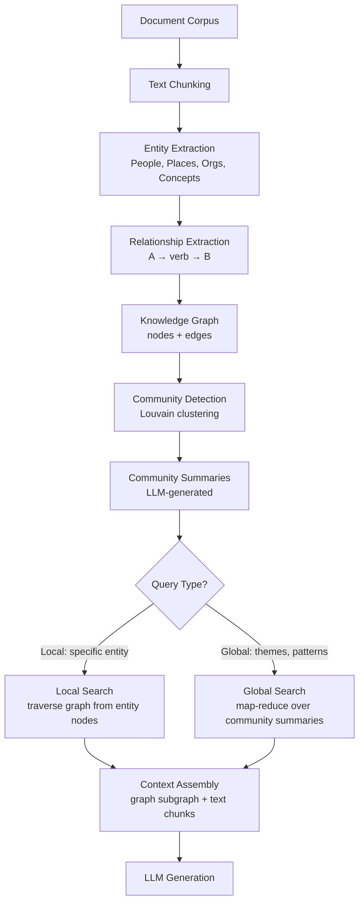
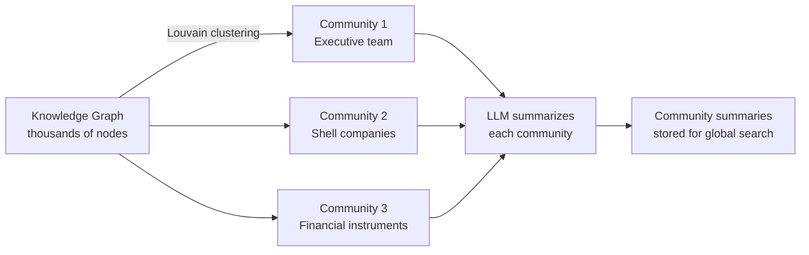

# GraphRAG — Knowledge Graph-Enhanced Retrieval

## The Story 📖

A legal analyst asks an AI: "What are all the connections between the CEO, the shell companies, and the offshore accounts mentioned in this 10,000-page investigation report?"

Standard RAG retrieves the top-5 most semantically similar chunks to this query. Maybe it finds one paragraph about the CEO and another about the offshore accounts. But the question is about **relationships across many documents** — who connected to whom, through what entity, using what mechanism.

Standard vector retrieval doesn't answer this. It retrieves isolated text fragments. It cannot traverse the web of relationships that connects entities across thousands of documents.

Now imagine the same investigation but first we extract all named entities (people, companies, accounts, transactions) and all relationships between them into a **knowledge graph**. Now the query becomes a graph traversal: follow all edges connected to "CEO" node, find paths leading to "offshore account" nodes through intermediate entities. The answer synthesizes dozens of relationship hops across the entire document corpus.

👉 This is why we need **GraphRAG** — to answer questions that require understanding relationships and connections across a document corpus, not just semantic similarity to isolated passages.

---

## What is GraphRAG?

**GraphRAG** (Knowledge Graph-based Retrieval-Augmented Generation) is an extension of standard RAG that first constructs a **knowledge graph** from the document corpus, then retrieves information by traversing graph structure rather than (or in addition to) vector similarity search.

The key insight: many real questions are not about "which passage is most similar to my query" but about "what are the relationships, patterns, and connections across my data."

Standard RAG answers: "What did document X say about topic Y?"
GraphRAG additionally answers: "How are entity A and entity B related? What does the whole corpus collectively imply about topic Y?"

Microsoft Research open-sourced GraphRAG in 2024, showing it significantly outperforms standard RAG on "global" questions that require synthesizing information across many documents.

---

## Why It Exists — The Problem It Solves

**1. Standard RAG has no memory of relationships**
A vector database stores isolated text chunks. It has no representation of the fact that Person A works for Company B which is owned by Entity C. Each chunk is an island.

**2. Multi-hop queries fail with vector search**
"Who funded the lab that created the protein that this drug targets?" requires following a chain of relationships across multiple documents. Vector similarity to any individual chunk doesn't answer this.

**3. Global questions require corpus-level understanding**
"What are the main themes across this entire report?" requires synthesizing many fragments — not finding the single most relevant chunk.

👉 Without GraphRAG: multi-hop relational queries get partial, disconnected answers. With GraphRAG: the system traverses entity relationships and synthesizes information from across the corpus.

---

## How It Works — Step by Step



### Step 1: Entity and Relationship Extraction

The first stage uses an LLM to extract structured information from each text chunk:

```python
# Simplified entity extraction prompt
EXTRACT_PROMPT = """
From the text below, extract:
1. ENTITIES: (name, type, description) for each entity
2. RELATIONSHIPS: (source_entity, target_entity, relationship_description, strength 1-10)

Text: {chunk_text}

Output as JSON.
"""
```

This produces a raw list of (entity, relationship) tuples from every chunk in the corpus.

### Step 2: Build the Knowledge Graph

Entities become **nodes**. Relationships become **edges** (directed, weighted).

```python
import networkx as nx

G = nx.DiGraph()

# Add entities as nodes
for entity in entities:
    G.add_node(entity["name"],
               entity_type=entity["type"],
               description=entity["description"])

# Add relationships as edges
for rel in relationships:
    G.add_edge(rel["source"], rel["target"],
               description=rel["description"],
               weight=rel["strength"])
```

### Step 3: Community Detection

With thousands of entities, you need structure. GraphRAG uses the **Louvain algorithm** to cluster tightly connected nodes into communities — groups of entities that are densely interconnected.



```python
import community as community_louvain

# Convert DiGraph to undirected for community detection
G_undirected = G.to_undirected()
partition = community_louvain.best_partition(G_undirected)

# Group nodes by community
communities = {}
for node, community_id in partition.items():
    communities.setdefault(community_id, []).append(node)
```

### Step 4: LLM-Generated Community Summaries

For each community, GraphRAG generates a summary using an LLM:

```python
COMMUNITY_SUMMARY_PROMPT = """
Below is a set of entities and their relationships within a community.

Entities: {entities}
Relationships: {relationships}

Write a comprehensive summary of what this community represents,
the key entities, and the most important relationships.
"""
# These summaries are stored and used for global queries
```

### Step 5: Two Query Modes

**Local search** — questions about specific entities:
1. Find entity node(s) matching the query
2. Extract the local subgraph (N-hop neighborhood)
3. Assemble context from graph structure + original text chunks
4. Generate answer

**Global search** — questions about the whole corpus:
1. Take all community summaries
2. **Map phase**: ask LLM to extract partial answers from each summary
3. **Reduce phase**: combine all partial answers into a final synthesis
4. Return synthesized answer

This map-reduce pattern is what enables global questions — no single retrieval step could answer "what are the main themes of this 10,000-page report."

---

## Using Microsoft's GraphRAG Library

```bash
pip install graphrag
```

```python
# Initialize a GraphRAG project
import asyncio
from graphrag.query.cli import run_local_search, run_global_search

# After indexing (graphrag index --root ./my_project):
# Query with local search (entity-specific)
result = await run_local_search(
    config_dir="./my_project",
    data_dir="./my_project/output",
    root_dir="./my_project",
    community_level=2,
    query="What is the relationship between Acme Corp and the CEO?"
)
print(result.response)

# Query with global search (corpus-wide themes)
result = await run_global_search(
    config_dir="./my_project",
    data_dir="./my_project/output",
    root_dir="./my_project",
    community_level=1,
    query="What are the main themes in this investigation report?"
)
print(result.response)
```

**Project structure:**
```
my_project/
├── .env              ← API keys
├── settings.yaml     ← GraphRAG configuration
└── input/
    └── *.txt         ← your documents
```

---

## GraphRAG vs Standard RAG

| Dimension | Standard RAG | GraphRAG |
|---|---|---|
| **Data structure** | Vector index (flat) | Knowledge graph + vector index |
| **Best for** | Factual lookups, specific passages | Relational, multi-hop, thematic queries |
| **Setup cost** | Low (minutes) | High (hours for indexing, API cost for extraction) |
| **Query latency** | Fast (ANN search) | Slower (graph traversal + map-reduce) |
| **Indexing cost** | Low (embeddings only) | High (LLM calls per chunk for extraction) |
| **Query types** | "What does doc X say about Y?" | "How are A and B connected? What themes exist?" |

**When to use GraphRAG:**
- Document sets with dense entity relationships (legal, medical, financial investigations)
- Questions requiring multi-hop reasoning across documents
- Need for global thematic synthesis across a large corpus
- Knowledge base navigation (who knows whom, what leads where)

**When to stick with standard RAG:**
- Simple factual Q&A over documents
- Speed and cost are critical
- Documents are not entity-relationship heavy

---

## The Math / Technical Side (Simplified)

**Louvain community detection** maximizes **modularity** Q:
`Q = (1/2m) Σᵢⱼ [Aᵢⱼ - kᵢkⱼ/2m] δ(cᵢ, cⱼ)`

Where:
- `Aᵢⱼ` = edge weight between nodes i and j
- `kᵢ, kⱼ` = sum of weights of edges incident on i, j
- `m` = total edge weight
- `δ(cᵢ, cⱼ)` = 1 if i and j are in the same community

Higher modularity = denser intra-community connections relative to a random graph.

---

## Where You'll See This in Real AI Systems

- **Microsoft Copilot for M365**: uses GraphRAG concepts to understand organizational relationships in enterprise documents
- **Legal tech**: contract analysis platforms mapping clause relationships across thousands of agreements
- **Financial intelligence**: connecting entities across filings, news, and transaction records to detect fraud networks
- **Healthcare research**: mapping drug-gene-disease relationships across scientific literature
- **Enterprise knowledge bases**: understanding how internal processes, teams, and systems relate across documentation

---

## Common Mistakes to Avoid ⚠️

- **Using GraphRAG for simple Q&A**: the indexing cost (LLM calls per chunk) is significant. For straightforward lookups, standard RAG is faster and cheaper.
- **Under-sizing the LLM for extraction**: entity/relationship extraction quality directly determines graph quality. Use a capable model (GPT-4 class) for the extraction step.
- **Ignoring community level**: Microsoft GraphRAG uses multi-level communities (coarser = broader themes, finer = specific clusters). The right level depends on query type.
- **Not validating the graph**: check entity counts, community sizes, and edge distributions before querying. Extraction errors compound — an LLM that confuses entities creates garbage graph structure.

## Connection to Other Concepts 🔗

- Relates to **RAG Fundamentals** (`09_RAG_Systems/01_RAG_Fundamentals`) — GraphRAG extends the standard RAG pipeline
- Relates to **Advanced RAG Techniques** (`09_RAG_Systems/07_Advanced_RAG_Techniques`) — alongside HyDE, RAPTOR as advanced retrieval methods
- Relates to **Vector Databases** (`08_LLM_Applications/05_Vector_Databases`) — GraphRAG often combines graph traversal with vector search for hybrid retrieval

---

✅ **What you just learned:** GraphRAG extracts entities and relationships from documents into a knowledge graph, detects communities of related entities, generates community summaries for global queries, and answers both local (entity-specific) and global (corpus-wide) questions that standard vector retrieval cannot handle.

🔨 **Build this now:** Install `graphrag`, create a small project with 5–10 text files, run the indexing pipeline, and compare local vs global search results on questions that require multi-hop reasoning.

➡️ **Next step:** [CAG — Cache-Augmented Generation](../11_CAG_Cache_Augmented_Generation/Theory.md)

---

## 📂 Navigation

**In this folder:**
| File | |
|---|---|
| 📄 **Theory.md** | ← you are here |
| [📄 Cheatsheet.md](./Cheatsheet.md) | Quick reference |
| [📄 Interview_QA.md](./Interview_QA.md) | Interview prep |

⬅️ **Prev:** [Build a RAG App](../09_Build_a_RAG_App/Theory.md) &nbsp;&nbsp;&nbsp; ➡️ **Next:** [CAG — Cache-Augmented Generation](../11_CAG_Cache_Augmented_Generation/Theory.md)
