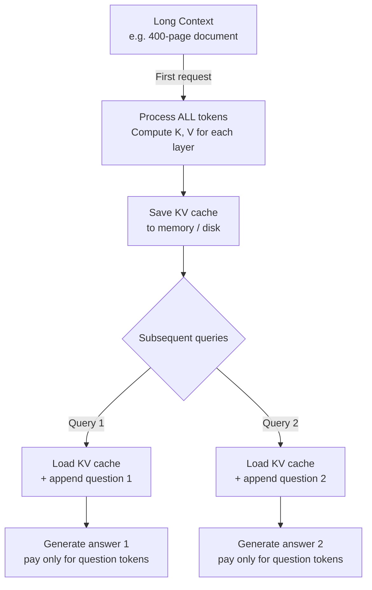

# CAG — Cache-Augmented Generation

## The Story 📖

You have a 400-page legal contract. Every time a lawyer asks a question about it — "Does clause 14 allow early termination?" "What are the liability caps?" "Is there a non-compete?" — your RAG system goes through the same ritual: chunk the document, embed the query, retrieve 5 chunks, inject into the prompt, generate an answer.

That retrieval step is doing real work: embedding the query, running a vector database search, scoring chunks. And sometimes it fails — returning the wrong clause, missing the relevant section, or splitting a critical paragraph across chunk boundaries. The RAG pipeline adds latency, complexity, and a new failure mode.

Now imagine the contract is 400 pages, but the model you're using has a 1-million-token context window. The entire contract is only ~300,000 tokens. You could just... put the whole thing in the context. No chunking. No retrieval. No vector database. The model sees everything at once and answers directly.

But that would cost a fortune in tokens on every query. Enter **KV cache**: the model can process that 400-page document once, save the internal state (key-value pairs computed for each token), and reuse that saved state for every subsequent query — paying only for the new question tokens each time.

👉 This is why we need **CAG (Cache-Augmented Generation)** — to preload an entire knowledge source into the model's context once, cache the computation, and answer multiple queries rapidly without any retrieval infrastructure.

---

## What is CAG?

**CAG (Cache-Augmented Generation)** is an approach where a document or knowledge base is loaded entirely into the model's context window (rather than retrieved in chunks), and the KV (key-value) cache from processing that context is saved and reused across multiple queries.

CAG eliminates the retrieval step entirely for knowledge sources that fit in the model's context window. Instead of:

`Query → Embed → Search vector DB → Retrieve chunks → Inject context → Generate`

CAG does:

`(Once) Load full document → Compute KV cache → Save`
`(Per query) Load KV cache + append question → Generate`

This is enabled by two trends that converged in 2024:
1. **Extremely long context windows**: Claude (200K), Gemini (1M), GPT-4 (128K), and long-context open-source models
2. **Prompt caching APIs**: Anthropic, OpenAI, and Google now offer APIs that cache the KV state of a long prefix and charge reduced rates for reusing it

---

## Why It Exists — The Problem It Solves

**1. RAG has retrieval failure modes**
Chunking splits related information across boundaries. Vector similarity misses exact matches. Re-ranking adds latency. Queries that need multiple passages are hard to retrieve comprehensively. With CAG, the model sees the full document — no retrieval failure.

**2. Retrieval adds latency and infrastructure**
A RAG pipeline requires maintaining a vector database, running embedding models, and handling retrieval logic. CAG removes all of that infrastructure for documents that fit in context.

**3. Short documents make RAG overkill**
A 50-page technical specification doesn't need a vector database. A single-company FAQ doesn't need chunking. CAG handles these elegantly.

👉 Without CAG: you build retrieval infrastructure even for documents that could simply fit in context. With CAG: static knowledge bases get loaded once, cached, and queried rapidly with minimal infrastructure.

---

## How It Works — Step by Step

### Step 1: Understand the KV Cache

When a transformer processes a sequence of tokens, each attention layer computes **Key** and **Value** matrices for every token. These are the KV cache. On subsequent generations with the same prefix, recomputing these matrices is wasteful — they're identical. Caching them and reusing them is the core optimization.



### Step 2: Prompt Caching with Anthropic API

Anthropic's Claude supports prompt caching natively. You mark a cache breakpoint in your prompt and Claude caches everything up to that point:

```python
import anthropic

client = anthropic.Anthropic()

# Load your document once
with open("contract.txt") as f:
    document_text = f.read()

# First call: pays full price for document tokens, saves cache
response = client.messages.create(
    model="claude-opus-4-6",
    max_tokens=1024,
    system="You are a legal analyst. Answer questions based only on the provided contract.",
    messages=[
        {
            "role": "user",
            "content": [
                {
                    "type": "text",
                    "text": document_text,
                    "cache_control": {"type": "ephemeral"},  # ← mark this as cacheable
                },
                {
                    "type": "text",
                    "text": "Does clause 14 allow early termination?"
                }
            ]
        }
    ]
)

# Inspect cache usage
print(response.usage.cache_creation_input_tokens)   # tokens written to cache
print(response.usage.cache_read_input_tokens)        # tokens read from cache
print(response.usage.input_tokens)                   # uncached tokens
```

**Subsequent calls pay 90% less** on the cached tokens:
```python
# Second query: cache hit — only pays for question tokens at full price
# Document tokens are 10% of normal cost
response2 = client.messages.create(
    model="claude-opus-4-6",
    max_tokens=1024,
    system="You are a legal analyst. Answer questions based only on the provided contract.",
    messages=[
        {
            "role": "user",
            "content": [
                {
                    "type": "text",
                    "text": document_text,
                    "cache_control": {"type": "ephemeral"},  # same breakpoint = cache hit
                },
                {
                    "type": "text",
                    "text": "What are the liability caps in this contract?"  # new question
                }
            ]
        }
    ]
)
# response2.usage.cache_read_input_tokens will be large (document was cached)
# response2.usage.input_tokens will be small (only question tokens are new)
```

### Step 3: OpenAI Prompt Caching

OpenAI automatically caches prompt prefixes (no explicit opt-in needed as of late 2024):

```python
from openai import OpenAI

client = OpenAI()

# The API automatically caches the first 1024+ tokens when reused
response = client.chat.completions.create(
    model="gpt-4o",
    messages=[
        {
            "role": "system",
            "content": "You are a helpful assistant. Here is the full manual: " + document_text
        },
        {"role": "user", "content": "How do I configure the timeout?"}
    ]
)

# Check if cache was used
usage = response.usage
print(f"Cached tokens: {usage.prompt_tokens_details.cached_tokens}")
print(f"Uncached tokens: {usage.prompt_tokens - usage.prompt_tokens_details.cached_tokens}")
```

### Step 4: Building a CAG System

```python
import anthropic
from pathlib import Path

class CAGSystem:
    """Cache-Augmented Generation — preload documents, answer questions cheaply."""

    def __init__(self, document_path: str, model: str = "claude-sonnet-4-6"):
        self.client = anthropic.Anthropic()
        self.model = model
        self.document_text = Path(document_path).read_text()
        self.system_prompt = "Answer questions based only on the provided document. Be precise and cite relevant sections."

    def ask(self, question: str) -> dict:
        """Ask a question. First call builds cache; subsequent calls reuse it."""
        response = self.client.messages.create(
            model=self.model,
            max_tokens=2048,
            system=self.system_prompt,
            messages=[{
                "role": "user",
                "content": [
                    {
                        "type": "text",
                        "text": self.document_text,
                        "cache_control": {"type": "ephemeral"},
                    },
                    {"type": "text", "text": question}
                ]
            }]
        )
        return {
            "answer": response.content[0].text,
            "cache_hit": response.usage.cache_read_input_tokens > 0,
            "cost_ratio": self._estimate_savings(response.usage),
        }

    def _estimate_savings(self, usage):
        cached = usage.cache_read_input_tokens
        uncached = usage.input_tokens
        if cached + uncached == 0:
            return 0
        # Cached tokens cost 10% vs uncached — calculate effective savings
        effective_tokens = uncached + (cached * 0.1)
        full_price_tokens = uncached + cached
        return 1 - (effective_tokens / full_price_tokens)

# Usage
cag = CAGSystem("legal_contract.txt")
print(cag.ask("What is the governing law?"))
print(cag.ask("What are the payment terms?"))  # cache hit — 90% cheaper on doc tokens
```

---

## CAG vs RAG Comparison

| Dimension | RAG | CAG |
|---|---|---|
| **Infrastructure** | Vector DB, embedding model, retrieval pipeline | Just the LLM API |
| **Best for** | Large knowledge bases (>1M tokens) | Focused knowledge sources that fit in context |
| **Retrieval** | Approximate (top-k chunks) | Exact (full document in context) |
| **Latency** | Retrieval + generation | Generation only (after cache warm-up) |
| **Failure mode** | Wrong chunks retrieved | No retrieval failure |
| **Cost (per query)** | Embedding + retrieval + generation tokens | Cached prefix (10% cost) + question tokens |
| **Context needed** | Only retrieved chunks | Full document |
| **Staleness** | Update index when document changes | Re-prime cache when document changes |

**The sweet spot for CAG:**
- Document size: 10K–500K tokens (fits in context)
- Query frequency: many queries against the same document
- Accuracy requirement: high (RAG chunk-miss is unacceptable)
- Infrastructure preference: minimal (no vector DB)

---

## The Math / Technical Side (Simplified)

**Token cost comparison** (Anthropic pricing example):

- Normal input tokens: $3 per million
- Cache write tokens: $3.75 per million (25% premium — paid once per cache)
- Cache read tokens: $0.30 per million (90% discount — paid on every cache hit)

**Break-even point**: if you query the same cached document N times:
`Total cost with cache = cache_write × D + cache_read × D × (N-1) + question × Q × N`
`Total cost without cache = input × D × N + question × Q × N`

Where D = document tokens, Q = question tokens

**Break-even** when:
`N > (cache_write / (input - cache_read)) ≈ (3.75 / (3 - 0.30)) ≈ 1.39`

So after just **2 queries**, caching a document is cheaper than re-processing it each time.

---

## Where You'll See This in Real AI Systems

- **Legal document analysis**: law firms loading entire contracts for all-day Q&A sessions without paying full document cost on every question
- **Technical documentation assistants**: engineering teams loading a product's full API reference and answering developer questions from it
- **Customer support**: loading the complete product manual once per session, then answering all customer questions against it
- **Code review tools**: loading an entire codebase (small-to-medium repos) and answering architectural questions without retrieval infrastructure
- **Research assistants**: loading an entire scientific paper or book chapter for deep Q&A sessions

---

## Common Mistakes to Avoid ⚠️

- **Using CAG for documents that are too large**: context windows have hard limits — a 10-million-token book cannot be cached even in Gemini 1M. Know your document size vs model context limit.
- **Not marking the cache breakpoint correctly**: with Anthropic's API, the `cache_control` block must be in the exact same position across calls for the cache to hit. Varying system prompts or injecting dynamic content before the document breaks the cache.
- **Forgetting cache expiration**: Anthropic's ephemeral cache expires after 5 minutes of inactivity. For long sessions, design your system to handle cache misses gracefully.
- **Using CAG for frequently-updated knowledge**: if the document changes every few minutes, the cache is constantly invalidated. RAG with live indexing is better for dynamic knowledge.
- **Confusing KV cache with semantic cache**: KV cache (what CAG uses) is a computational optimization that caches transformer internal state. Semantic cache is a separate concept that caches LLM responses to similar queries.

## Connection to Other Concepts 🔗

- Relates to **RAG Fundamentals** (`09_RAG_Systems/01_RAG_Fundamentals`) — CAG is an alternative to the retrieval step
- Relates to **Prompt Caching** (`08_LLM_Applications` / `03_Claude_API_and_SDK/09_Prompt_Caching`) — the API mechanism that enables CAG
- Relates to **Context Windows** (`07_Large_Language_Models/07_Context_Windows_and_Tokens`) — large context windows are what make CAG feasible
- Relates to **Cost Optimization** (`12_Production_AI/03_Cost_Optimization`) — CAG is a major cost reduction strategy for document-heavy workloads

---

✅ **What you just learned:** CAG preloads an entire document into the model's context, caches the KV computation of that context using prompt caching APIs, and reuses that cache for multiple queries — eliminating retrieval infrastructure and achieving 90% cost reduction on document tokens after the first query.

🔨 **Build this now:** Load a 50-page PDF (convert to text), send it to Claude with `cache_control: ephemeral`, ask 5 different questions about it, and compare `cache_read_input_tokens` vs `input_tokens` across calls to confirm cache hits.

➡️ **Next step:** [AI Agents](../../10_AI_Agents/01_Agent_Fundamentals/Theory.md)

---

## 📂 Navigation

**In this folder:**
| File | |
|---|---|
| 📄 **Theory.md** | ← you are here |
| [📄 Cheatsheet.md](./Cheatsheet.md) | Quick reference |
| [📄 Interview_QA.md](./Interview_QA.md) | Interview prep |

⬅️ **Prev:** [GraphRAG](../10_GraphRAG/Theory.md) &nbsp;&nbsp;&nbsp; ➡️ **Next:** [AI Agents — Fundamentals](../../10_AI_Agents/01_Agent_Fundamentals/Theory.md)
