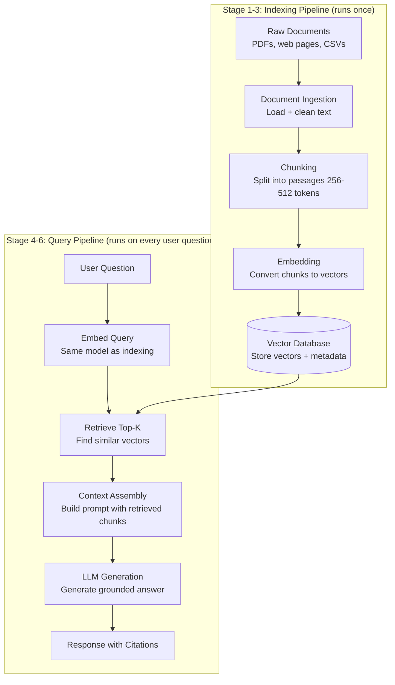

# RAG Full Pipeline Overview

A single-page view of the entire RAG system — from raw documents to the user's answer.

---

## The Complete Pipeline

---

## Stage 1: Document Ingestion

**What it does:** Loads raw documents from any source and extracts clean text.

Sources: PDFs, Word documents, web pages, databases, APIs, CSV files, markdown files.

Key challenges: scanned PDFs (need OCR), tables (hard to extract cleanly), images (need vision models or skip), encoding issues in older files.

Output: a list of Document objects, each with raw text and metadata (source, title, page number, date).

See: [02_Document_Ingestion](./02_Document_Ingestion/)

---

## Stage 2: Chunking

**What it does:** Splits long documents into smaller, searchable passages.

Why: embedding models have context limits. A 50-page PDF embedded as one vector captures everything and nothing specifically. Split into 400-token chunks, each chunk has a focused topic — much better for retrieval.

Key choices: chunk size, overlap between chunks, where to split (fixed size, sentences, semantic boundaries).

Output: a list of text chunks, each small enough to embed precisely.

See: [03_Chunking_Strategies](./03_Chunking_Strategies/)

---

## Stage 3: Embedding and Indexing

**What it does:** Converts each text chunk to a vector and stores it in a vector database.

The embedding model (e.g., text-embedding-3-small) converts text to a list of ~1536 numbers that encode the chunk's meaning. The vector database (e.g., ChromaDB, Pinecone) stores these vectors with fast approximate nearest neighbor indexing.

Output: a fully indexed collection in your vector DB, ready for sub-millisecond similarity search.

See: [04_Embedding_and_Indexing](./04_Embedding_and_Indexing/)

---

## Stage 4: Retrieval

**What it does:** Converts the user's question to a vector and finds the top-K most similar chunks.

The same embedding model that indexed documents now embeds the user's query. The vector DB finds the stored chunks whose vectors are most similar (cosine similarity). Returns top-3 to top-10 chunks.

Output: a ranked list of text chunks most relevant to the user's question.

See: [05_Retrieval_Pipeline](./05_Retrieval_Pipeline/)

---

## Stage 5: Context Assembly

**What it does:** Combines the retrieved chunks with the user's question into a single prompt.

The retrieved chunks become "context" that the LLM reads before answering. The prompt template structures this clearly: "Based on the following context, answer the question. Context: [chunks]. Question: [user question]."

Key choices: how to order chunks, whether to include source metadata, how to handle context window limits.

Output: a complete prompt ready to send to the LLM.

See: [06_Context_Assembly](./06_Context_Assembly/)

---

## Stage 6: Generation

**What it does:** The LLM reads the context and generates a grounded answer.

The model uses the retrieved chunks as its primary information source, not its own training. This grounds the answer in your documents — reducing hallucination and enabling source citation.

Output: a final answer with optional citations pointing to the source chunks.

---

## Where Each Topic Fits

| Stage | Folder | Key concept |
|-------|--------|-------------|
| Foundations | [01_RAG_Fundamentals](./01_RAG_Fundamentals/) | What RAG is and when to use it |
| Stage 1 | [02_Document_Ingestion](./02_Document_Ingestion/) | Load and clean raw documents |
| Stage 2 | [03_Chunking_Strategies](./03_Chunking_Strategies/) | Split documents into searchable passages |
| Stage 3 | [04_Embedding_and_Indexing](./04_Embedding_and_Indexing/) | Convert to vectors, store in vector DB |
| Stage 4 | [05_Retrieval_Pipeline](./05_Retrieval_Pipeline/) | Embed query, find top-K chunks |
| Stage 5 | [06_Context_Assembly](./06_Context_Assembly/) | Build the final prompt |
| Optimization | [07_Advanced_RAG_Techniques](./07_Advanced_RAG_Techniques/) | Hybrid search, reranking, query transformation |
| Quality | [08_RAG_Evaluation](./08_RAG_Evaluation/) | Measure faithfulness and relevancy |
| Project | [09_Build_a_RAG_App](./09_Build_a_RAG_App/) | End-to-end PDF Q&A application |
