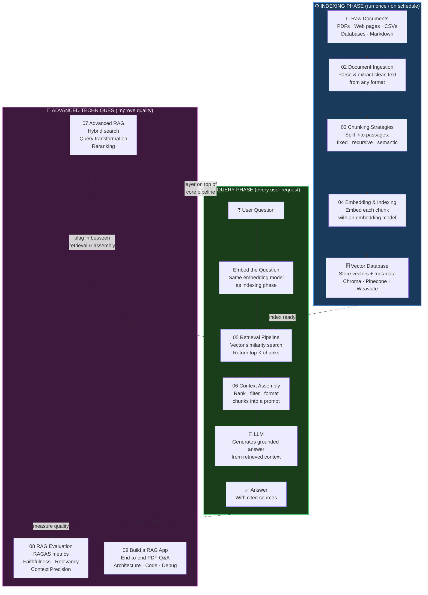

# 📚 RAG Systems

⬅️ [08 LLM Applications](../08_LLM_Applications/Readme.md) &nbsp;|&nbsp; [🏠 Home](../00_Learning_Guide/Readme.md) &nbsp;|&nbsp; [10 AI Agents ➡️](../10_AI_Agents/Readme.md)

> Retrieval-Augmented Generation is how you give an LLM access to any knowledge base — your docs, your database, your company's entire history — without retraining.

**[▶ Start here → RAG Fundamentals Theory](./01_RAG_Fundamentals/Theory.md)**

---

## At a Glance

| | |
|---|---|
| 📚 Topics | 9 topics + build project |
| ⏱️ Est. Time | 10–12 hours |
| 📋 Prerequisites | [08 LLM Applications](../08_LLM_Applications/Readme.md) |
| 🔓 Unlocks | [10 AI Agents](../10_AI_Agents/Readme.md) |

---

## What's in This Section

RAG has two distinct phases. Read the diagram top-to-bottom: **Indexing** happens once (or on a schedule); **Query** happens on every user request.

> For a single-page view of the complete system, see [Full_Pipeline_Overview.md](./Full_Pipeline_Overview.md).

---

## Topics

| # | Topic | What You'll Learn | Files |
|---|---|---|---|
| 01 | [RAG Fundamentals](./01_RAG_Fundamentals/) | What RAG is, why it beats fine-tuning for knowledge tasks, RAG vs long context | [📖 Theory](./01_RAG_Fundamentals/Theory.md) · [⚡ Cheatsheet](./01_RAG_Fundamentals/Cheatsheet.md) · [🎯 Interview Q&A](./01_RAG_Fundamentals/Interview_QA.md) · [🗺️ When to Use RAG](./01_RAG_Fundamentals/When_to_Use_RAG.md) |
| 02 | [Document Ingestion](./02_Document_Ingestion/) | Loading PDFs, web pages, CSVs, and databases; cleaning and normalising raw text | [📖 Theory](./02_Document_Ingestion/Theory.md) · [⚡ Cheatsheet](./02_Document_Ingestion/Cheatsheet.md) · [🎯 Interview Q&A](./02_Document_Ingestion/Interview_QA.md) · [💻 Code Example](./02_Document_Ingestion/Code_Example.md) · [📋 Supported Formats](./02_Document_Ingestion/Supported_Formats.md) |
| 03 | [Chunking Strategies](./03_Chunking_Strategies/) | Fixed-size, recursive, and semantic chunking; chunk size trade-offs, overlap | [📖 Theory](./03_Chunking_Strategies/Theory.md) · [⚡ Cheatsheet](./03_Chunking_Strategies/Cheatsheet.md) · [🎯 Interview Q&A](./03_Chunking_Strategies/Interview_QA.md) · [💻 Code Example](./03_Chunking_Strategies/Code_Example.md) · [⚖️ Comparison](./03_Chunking_Strategies/Comparison.md) |
| 04 | [Embedding & Indexing](./04_Embedding_and_Indexing/) | Embedding chunks with a model, HNSW indexing, storing metadata, updating the index | [📖 Theory](./04_Embedding_and_Indexing/Theory.md) · [⚡ Cheatsheet](./04_Embedding_and_Indexing/Cheatsheet.md) · [🎯 Interview Q&A](./04_Embedding_and_Indexing/Interview_QA.md) · [💻 Code Example](./04_Embedding_and_Indexing/Code_Example.md) |
| 05 | [Retrieval Pipeline](./05_Retrieval_Pipeline/) | Embedding queries, cosine similarity, top-K retrieval, metadata filtering | [📖 Theory](./05_Retrieval_Pipeline/Theory.md) · [⚡ Cheatsheet](./05_Retrieval_Pipeline/Cheatsheet.md) · [🎯 Interview Q&A](./05_Retrieval_Pipeline/Interview_QA.md) · [💻 Code Example](./05_Retrieval_Pipeline/Code_Example.md) |
| 06 | [Context Assembly](./06_Context_Assembly/) | Ranking chunks, deduplication, building the final prompt with injected context | [📖 Theory](./06_Context_Assembly/Theory.md) · [⚡ Cheatsheet](./06_Context_Assembly/Cheatsheet.md) · [🎯 Interview Q&A](./06_Context_Assembly/Interview_QA.md) · [💻 Code Example](./06_Context_Assembly/Code_Example.md) |
| 07 | [Advanced RAG Techniques](./07_Advanced_RAG_Techniques/) | Hybrid search (BM25 + vector), query expansion & transformation, cross-encoder reranking | [📖 Theory](./07_Advanced_RAG_Techniques/Theory.md) · [⚡ Cheatsheet](./07_Advanced_RAG_Techniques/Cheatsheet.md) · [🎯 Interview Q&A](./07_Advanced_RAG_Techniques/Interview_QA.md) · [🔍 Hybrid Search](./07_Advanced_RAG_Techniques/Hybrid_Search.md) · [🔄 Query Transformation](./07_Advanced_RAG_Techniques/Query_Transformation.md) · [🏆 Reranking](./07_Advanced_RAG_Techniques/Reranking.md) |
| 08 | [RAG Evaluation](./08_RAG_Evaluation/) | RAGAS framework, faithfulness, answer relevancy, context precision & recall | [📖 Theory](./08_RAG_Evaluation/Theory.md) · [⚡ Cheatsheet](./08_RAG_Evaluation/Cheatsheet.md) · [🎯 Interview Q&A](./08_RAG_Evaluation/Interview_QA.md) · [💻 Code Example](./08_RAG_Evaluation/Code_Example.md) · [📊 Metrics Guide](./08_RAG_Evaluation/Metrics_Guide.md) |
| 09 | [Build a RAG App](./09_Build_a_RAG_App/) | End-to-end PDF Q&A project — architecture, step-by-step build, debugging | [🗺️ Project Guide](./09_Build_a_RAG_App/Project_Guide.md) · [🪜 Step by Step](./09_Build_a_RAG_App/Step_by_Step.md) · [🏗️ Architecture Blueprint](./09_Build_a_RAG_App/Architecture_Blueprint.md) · [🐛 Troubleshooting](./09_Build_a_RAG_App/Troubleshooting.md) |

---

## Key Concepts at a Glance

| Concept | Why It Matters in AI |
|---|---|
| RAG separates knowledge from intelligence | The LLM provides reasoning; your vector database provides facts; neither needs to do the other's job |
| Chunking is the most underrated decision | Chunk too large and retrieval is imprecise; too small and you lose context; there is no universal correct answer |
| The embedding model must stay consistent | Indexing and querying must use the same model; swapping models requires re-embedding the entire corpus |
| Naive RAG breaks on hard questions | Hybrid search, query transformation, and reranking (topic 07) are not optional luxuries; they separate demos from production systems |
| You cannot improve what you do not measure | Always wire in RAGAS or equivalent evaluation (topic 08) before shipping; faithfulness and relevancy scores will surprise you |

---

## 📂 Navigation

⬅️ **Prev:** [08 LLM Applications](../08_LLM_Applications/Readme.md) &nbsp;&nbsp; ➡️ **Next:** [10 AI Agents](../10_AI_Agents/Readme.md)
