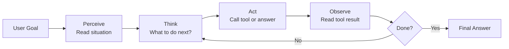

# AI Agent Mental Model

A visual mental model for understanding how AI agents work.

---

## The Employee Analogy

The best way to understand an AI agent is to think of a smart new employee on their first week.

They have:
- A **brain** — they can reason, make decisions, learn from feedback
- A **phone and computer** — tools they use to get things done
- A **notebook** — they write things down so they don't forget
- A **work cycle** — they come in, check what needs doing, work on it, and keep going until it's done

An AI agent is exactly this.

| Employee | AI Agent |
|---|---|
| Brain (reasoning) | LLM (language model) |
| Phone, computer, apps | Tools (search, code, APIs) |
| Notebook, notes app | Memory (context window, vector store) |
| Daily work cycle | Agent loop (perceive → think → act → observe) |
| Job description | System prompt |
| Manager's request | User's goal |
| Work report | Final answer |

---

## The Agent Loop — Visualized



The employee never just sits at their desk waiting. They keep cycling through this loop until the task is complete.

---

## The Four Components — Expanded

### LLM = The Brain

The LLM reads everything in context and decides what to do next.

It answers questions like:
- "Do I have enough information to answer, or do I need to search?"
- "Which tool is best for this?"
- "Is the task complete, or should I do another step?"

Without the LLM, you don't have an agent. You have a script.

### Tools = The Phone and Computer

Tools are functions the agent can call. They connect the agent to the real world.

Common tools:
- `search_web` — find current information
- `run_code` — execute Python and see the output
- `read_file` — open a document
- `call_api` — interact with external services
- `query_database` — look up structured data

The agent sees what tools are available and their descriptions. It picks the right one for the job.

### Memory = The Notebook

**Short-term memory (in-context):**
Everything in the current conversation. The agent can see this directly. Limited by the context window size.

**Long-term memory (external store):**
A vector database that stores past information. The agent retrieves relevant pieces using semantic search. Persists across sessions.

**Entity memory:**
Specific facts about people, places, or things tracked explicitly. "The user's name is Alex. Alex prefers morning flights."

### The Loop = The Work Cycle

The loop is the difference between a chatbot and an agent.

A chatbot: one question → one answer → stop.

An agent: one goal → many cycles → final answer when done.

The loop runs until either the task is complete or a max iteration limit is hit.

---

## What the Agent "Sees" Each Loop

On each iteration, the LLM receives (roughly):

```
System: You are a helpful agent. You have access to these tools: [tool descriptions]

Previous steps:
- Thought: I need to search for current prices
- Action: search_web("laptop prices 2024")
- Observation: [search results here]
- Thought: I found some prices but need to compare more options

Current situation:
[user goal + everything that happened so far]

What do you do next?
```

The agent reads all of this and decides the next action.

---

## The Key Insight

The intelligence doesn't come from any single component. It comes from the **combination**:

- LLM without tools = knows things but can't act
- Tools without LLM = can act but can't decide
- Memory without loop = knows things but forgets the goal
- Loop without LLM = just runs the same steps blindly

Put them together and you get a system that can **understand** a goal, **decide** how to pursue it, **act** in the world, and **learn from feedback** — all autonomously.

That's an AI agent.

---

## Common Misconceptions

| Misconception | Reality |
|---|---|
| "Agents are just better chatbots" | Agents are fundamentally different — they act, not just answer |
| "Agents always get the right answer" | Agents make mistakes, especially on long multi-step tasks |
| "More tools = better agent" | More tools = more confusion. Start with 2-3 focused tools |
| "The loop runs forever" | Always set a max iteration limit |
| "Agents replace humans" | Today they augment humans — they need oversight for important tasks |

---

## 📂 Navigation

**In this folder:**
| File | |
|---|---|
| [📄 Theory.md](./Theory.md) | Core concepts |
| [📄 Cheatsheet.md](./Cheatsheet.md) | Quick reference |
| [📄 Interview_QA.md](./Interview_QA.md) | Interview prep |
| 📄 **Mental_Model.md** | ← you are here |

⬅️ **Prev:** [09 Build a RAG App](../../09_RAG_Systems/09_Build_a_RAG_App/Project_Guide.md) &nbsp;&nbsp;&nbsp; ➡️ **Next:** [02 ReAct Pattern](../02_ReAct_Pattern/Theory.md)
