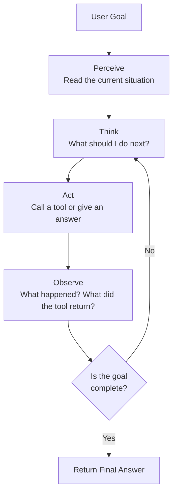

# AI Agents — Theory

You call your personal assistant and say: "Book me a flight to Paris next Friday."

They don't just read you a list of flights. They open a browser, search for flights, check your calendar for conflicts, compare prices, look at your travel preferences, and make the booking. They call you back when it's done.

They thought. They planned. They acted. They used tools. They reported back.

👉 This is why we need **AI Agents** — an LLM that doesn't just answer questions but actually does things in the world.

---

## What Is an AI Agent?

A chatbot answers a question and stops.

An agent gets a goal and keeps working until it's done.

The difference is the **loop**. An agent doesn't just run once — it perceives the situation, thinks about what to do, takes an action, observes the result, and goes again.

Four things make an agent:

1. **LLM** — the brain. Reads input, reasons about it, decides what to do.
2. **Tools** — the hands. Functions the agent can call: search, code execution, APIs, databases.
3. **Memory** — the notebook. Keeps track of what happened so far.
4. **The Loop** — the work cycle. Keeps going until the goal is reached.

---

## The Agent Loop

Every agent runs the same basic loop:

Let's break down each step:

**Perceive** — The agent reads the current state. The user's request. Previous messages. Tool results. Everything in context.

**Think** — The agent reasons. "What do I know? What do I need to find out? What tool should I use?"

**Act** — The agent does something. Either calls a tool (like a web search) or produces a final answer.

**Observe** — The agent reads the tool's output. "The search returned these results. Now I know X."

**Repeat** — If the goal isn't done, go back to thinking. If it is, give the final answer.

---

## Agent vs Chatbot — The Real Difference

| | Chatbot | Agent |
|---|---|---|
| **Goal** | Answer a question | Complete a task |
| **How many steps?** | One | Many |
| **Uses tools?** | No | Yes |
| **Makes decisions?** | No | Yes |
| **Can change course?** | No | Yes |
| **Example** | "What's the capital of France?" | "Book me a Paris trip" |

A chatbot is a straight line. An agent is a loop.

---

## The Four Parts Up Close

### The LLM (Brain)

The language model is what makes everything intelligent. It reads the situation and decides what to do next. It knows what tools it has. It chooses when to use them. It knows when the task is done.

Without the LLM, you just have a script. The LLM is what makes the agent able to handle new situations.

### Tools (Hands)

Tools are functions the agent can call. Each tool has:
- A **name** ("search_web")
- A **description** ("Search the internet for current information")
- **Parameters** ("query: the search terms")

The LLM reads these descriptions and decides when each tool is useful. You give the agent a toolbox. It decides which tool to pick up.

### Memory (Notebook)

Memory is how the agent keeps track of what happened. Without memory, every loop would start from scratch.

- **Short-term (in-context)** — the conversation so far, stored in the prompt
- **Long-term (vector store)** — facts saved across conversations, retrieved when needed

### The Loop (Work Cycle)

The loop is the architecture that ties it all together. Without the loop, you just have one LLM call. The loop is what makes an agent an agent.

---

## A Concrete Example

User asks: "What's the latest news about AI and what does it mean for software engineers?"

Here's what an agent actually does:

1. **Think**: I need current news. I'll use the search tool.
2. **Act**: `search_web("latest AI news 2024")`
3. **Observe**: Gets 5 news articles.
4. **Think**: Now I need to understand what this means for software engineers. Let me search more specifically.
5. **Act**: `search_web("AI impact on software engineers jobs 2024")`
6. **Observe**: Gets more relevant results.
7. **Think**: I have enough information. I can now synthesize a good answer.
8. **Act**: Write the final answer using everything gathered.

A chatbot would have guessed. The agent actually looked it up — twice — and gave a better answer.

---

## Why This Matters

Before agents, AI could only work with information inside its training data. It was frozen in time. It couldn't take actions.

Agents change that. An agent with a search tool has up-to-date information. An agent with a code execution tool can actually run code and fix bugs. An agent with API access can book things, send emails, update databases.

The LLM becomes an **autonomous worker**, not just a question-answering machine.

---

✅ **What you just learned:** An AI agent is an LLM combined with tools, memory, and a loop that lets it take multiple actions to complete a goal.

🔨 **Build this now:** Write down the steps a human personal assistant would take to "find me a good Python course under $50." Map each step to the agent loop: which step is "perceive", which is "think", which is "act", which is "observe"?

➡️ **Next step:** ReAct Pattern → `/Users/1065696/Github/AI/10_AI_Agents/02_ReAct_Pattern/Theory.md`

---

## 📂 Navigation

**In this folder:**
| File | |
|---|---|
| 📄 **Theory.md** | ← you are here |
| [📄 Cheatsheet.md](./Cheatsheet.md) | Quick reference |
| [📄 Interview_QA.md](./Interview_QA.md) | Interview prep |
| [📄 Mental_Model.md](./Mental_Model.md) | Agent mental model visual guide |

⬅️ **Prev:** [09 Build a RAG App](../../09_RAG_Systems/09_Build_a_RAG_App/Project_Guide.md) &nbsp;&nbsp;&nbsp; ➡️ **Next:** [02 ReAct Pattern](../02_ReAct_Pattern/Theory.md)
