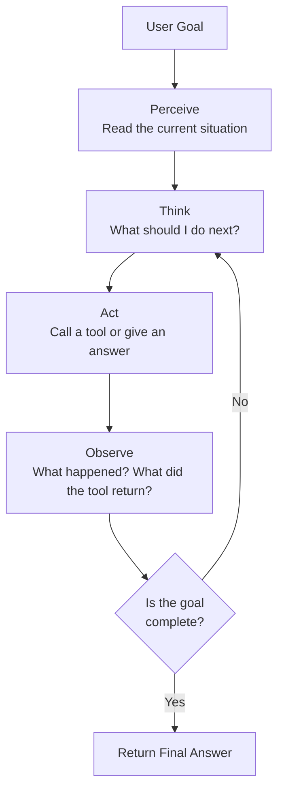

# AI Agents — Theory

You call your personal assistant and say: "Book me a flight to Paris next Friday." They don't just read you a list of flights — they open a browser, search flights, check your calendar, compare prices, and make the booking. They thought, planned, acted, used tools, and reported back.

👉 This is why we need **AI Agents** — an LLM that doesn't just answer questions but actually does things in the world.

---

## What Is an AI Agent?

A chatbot answers a question and stops. An agent gets a goal and keeps working until it's done.

The difference is the **loop**. An agent perceives the situation, thinks about what to do, takes an action, observes the result, and goes again.

Four things make an agent:
1. **LLM** — the brain. Reads input, reasons, decides what to do.
2. **Tools** — the hands. Functions the agent can call: search, code execution, APIs, databases.
3. **Memory** — the notebook. Keeps track of what happened so far.
4. **The Loop** — the work cycle. Keeps going until the goal is reached.

---

## The Agent Loop

- **Perceive** — reads the current state: user request, previous messages, tool results.
- **Think** — reasons about what to do and which tool to use.
- **Act** — calls a tool or produces a final answer.
- **Observe** — reads the tool's output and updates understanding.
- **Repeat** — if the goal isn't done, loops back to thinking.

---

## Agent vs Chatbot

| | Chatbot | Agent |
|---|---|---|
| **Goal** | Answer a question | Complete a task |
| **How many steps?** | One | Many |
| **Uses tools?** | No | Yes |
| **Makes decisions?** | No | Yes |
| **Can change course?** | No | Yes |
| **Example** | "What's the capital of France?" | "Book me a Paris trip" |

A chatbot is a straight line. An agent is a loop.

---

## The Four Parts Up Close

**The LLM (Brain)** — makes everything intelligent. Reads the situation, decides what to do next, knows what tools it has, chooses when to use them, knows when the task is done. Without the LLM, you just have a script.

**Tools (Hands)** — functions the agent can call. Each tool has a name, a description, and parameters. The LLM reads these descriptions and decides when each tool is useful.

**Memory (Notebook)** — how the agent tracks what happened. Without memory, every loop starts from scratch.
- **Short-term (in-context)** — the conversation so far, stored in the prompt
- **Long-term (vector store)** — facts saved across conversations, retrieved when needed

**The Loop (Work Cycle)** — the architecture that ties it all together. Without the loop, you just have one LLM call.

---

## A Concrete Example

User asks: "What's the latest news about AI and what does it mean for software engineers?"

1. **Think**: I need current news. I'll use the search tool.
2. **Act**: `search_web("latest AI news 2024")`
3. **Observe**: Gets 5 news articles.
4. **Think**: Now I need to understand implications for engineers. Search more specifically.
5. **Act**: `search_web("AI impact on software engineers jobs 2024")`
6. **Observe**: Gets more relevant results.
7. **Think**: I have enough information. Synthesize a good answer.
8. **Act**: Write the final answer using everything gathered.

A chatbot would have guessed. The agent looked it up twice and gave a better answer.

---

## Why This Matters

An agent with a search tool has up-to-date information. An agent with a code execution tool can actually run code and fix bugs. An agent with API access can book things, send emails, update databases. The LLM becomes an **autonomous worker**, not just a question-answering machine.

---

✅ **What you just learned:** An AI agent is an LLM combined with tools, memory, and a loop that lets it take multiple actions to complete a goal.

🔨 **Build this now:** Write down the steps a human personal assistant would take to "find me a good Python course under $50." Map each step to the agent loop: which step is "perceive", which is "think", which is "act", which is "observe"?

➡️ **Next step:** ReAct Pattern → `/Users/1065696/Github/AI/10_AI_Agents/02_ReAct_Pattern/Theory.md`

---

## 🛠️ Practice Project

Apply what you just learned → **[I3: Multi-Tool Research Agent](../../22_Capstone_Projects/08_Multi_Tool_Research_Agent/03_GUIDE.md)**
> This project uses: the perceive→reason→act loop, maintaining agent state, deciding when the task is done

---

## 📝 Practice Questions

- 📝 [Q61 · agent-fundamentals](../../ai_practice_questions_100.md#q61--interview--agent-fundamentals)

---

## 📂 Navigation

**In this folder:**
| File | |
|---|---|
| 📄 **Theory.md** | ← you are here |
| [📄 Cheatsheet.md](./Cheatsheet.md) | Quick reference |
| [📄 Interview_QA.md](./Interview_QA.md) | Interview prep |
| [📄 Mental_Model.md](./Mental_Model.md) | Agent mental model visual guide |

⬅️ **Prev:** [09 Build a RAG App](../../09_RAG_Systems/09_Build_a_RAG_App/Project_Guide.md) &nbsp;&nbsp;&nbsp; ➡️ **Next:** [02 ReAct Pattern](../02_ReAct_Pattern/Theory.md)
