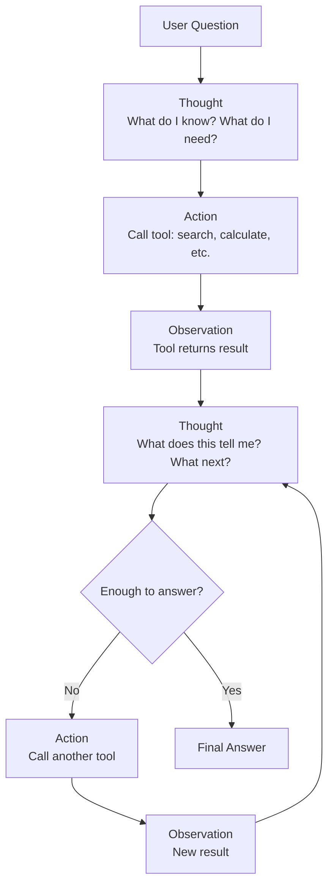

# ReAct Pattern — Theory

A detective walks into a crime scene. They could just guess who did it. But they don't.

They look at the footprints and think: "These belong to someone tall — probably over 6 feet." Then they act: "Let me check the security footage from the corridor." They watch it. They reason again: "The suspect was wearing a red jacket. That matches the witness description." Then they act: "Let me cross-reference with hotel check-in records."

They reason, then act, then reason again based on what they find. Back and forth until the case is solved.

👉 This is why we need **ReAct** — it makes AI agents more reliable by interleaving reasoning and action instead of just guessing.

---

## What Is ReAct?

**ReAct** = **Re**asoning + **Act**ing.

It's a prompting pattern (from a 2022 research paper) that makes the agent explicitly write out its reasoning before each action. Then it acts, reads the result, writes reasoning again, and so on.

The pattern is:
```
Thought: [reasoning about the current situation]
Action: [which tool to call and with what input]
Observation: [what the tool returned]
Thought: [reasoning about the observation]
Action: [next tool call]
Observation: [result]
...
Thought: I now have enough information to answer.
Final Answer: [the answer]
```

That "Thought → Action → Observation" loop is the core of ReAct.

---

## Why Is It More Reliable?

Without ReAct, an agent might just produce an action directly. It might pick the wrong tool or hallucinate results.

With ReAct, the agent must **explain its reasoning first**. This has two benefits:

1. **It catches mistakes early.** Writing out reasoning forces the LLM to be explicit about what it knows and what it needs. That's harder to get wrong than guessing.

2. **The reasoning is visible.** You can read the trace and see exactly why the agent did what it did. This makes debugging much easier.

Think of it like showing your work in a math test. You might get the final answer wrong if you just write the number. But if you show your work, you (and the teacher) can spot exactly where you went off track.

---

## The Thought-Action-Observation Loop



Each iteration: one thought, one action, one observation.

---

## The Prompting Format

Here's how a ReAct prompt looks. The agent is given a question and these instructions:

```
Answer the question by using the available tools.
Use this exact format:

Thought: think about what you need to do
Action: tool_name[input]
Observation: [tool output will appear here]

Repeat until you can answer. Then write:
Final Answer: [your answer]

Available tools:
- search[query]: searches the web
- calculator[expression]: evaluates math expressions
```

The agent fills in the Thoughts and Actions. The system fills in the Observations automatically after each tool call.

---

## A Complete ReAct Trace

**Question:** "What is the age of the current US president, and what is that number squared?"

```
Thought: I need to find the current US president and their age. I'll search for this.
Action: search[current US president age 2024]
Observation: Joe Biden is the 46th president, born November 20, 1942. He is 81 years old.

Thought: The current president is Joe Biden, age 81. Now I need to square 81.
Action: calculator[81 ** 2]
Observation: 6561

Thought: 81 squared is 6561. I have all the information needed.
Final Answer: The current US president is Joe Biden, who is 81 years old. 81 squared is 6,561.
```

Notice: the agent didn't try to recall Biden's age from training data. It searched. It didn't try to calculate in its head. It used the calculator. Each step was grounded in real tool output.

---

## ReAct vs. Pure Generation

| | Pure Generation | ReAct |
|---|---|---|
| **How it works** | LLM answers directly from memory | LLM reasons, then acts, then reasons again |
| **Accuracy** | Can hallucinate facts | Grounds answers in tool results |
| **Transparency** | Black box | Full reasoning trace visible |
| **Debugging** | Hard — why did it answer that? | Easy — read the thought trace |
| **Current info** | No — limited to training data | Yes — search tool gets live data |
| **Best for** | Simple questions from training data | Complex, multi-step, factual tasks |

---

## Why This Matters

ReAct was a significant step because it showed that just adding explicit reasoning to the prompt — literally just writing "Thought:" before each action — dramatically improved agent reliability.

It means you don't need a fancier model to get better results. You need a better prompting strategy.

ReAct is now baked into most agent frameworks (LangChain, LlamaIndex). When you create an agent in those frameworks, it typically uses a ReAct-style prompt under the hood.

---

✅ **What you just learned:** ReAct makes agents more reliable by requiring them to write explicit reasoning (Thought) before each action, then observe the result before reasoning again.

🔨 **Build this now:** Write a ReAct trace by hand. Question: "How many days until Christmas, and what's that number times 24 (hours)?" Write out the full Thought → Action → Observation → Thought → Action → Observation → Final Answer sequence as if you were the agent.

➡️ **Next step:** Tool Use → `/Users/1065696/Github/AI/10_AI_Agents/03_Tool_Use/Theory.md`

---

## 📂 Navigation

**In this folder:**
| File | |
|---|---|
| 📄 **Theory.md** | ← you are here |
| [📄 Cheatsheet.md](./Cheatsheet.md) | Quick reference |
| [📄 Interview_QA.md](./Interview_QA.md) | Interview prep |
| [📄 Code_Example.md](./Code_Example.md) | Python code examples |

⬅️ **Prev:** [01 Agent Fundamentals](../01_Agent_Fundamentals/Theory.md) &nbsp;&nbsp;&nbsp; ➡️ **Next:** [03 Tool Use](../03_Tool_Use/Theory.md)
