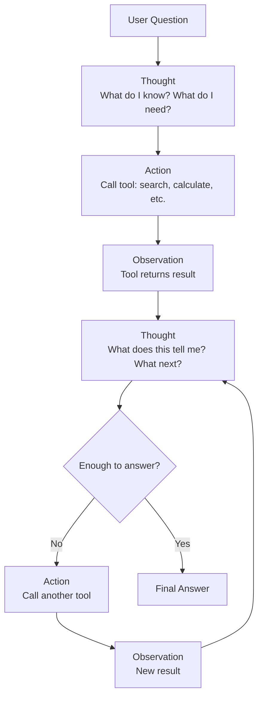

# ReAct Pattern — Theory

A detective doesn't just guess who did it. They look at footprints, think: "someone tall — check security footage." Watch it. Reason: "red jacket — matches witness description." Act: "cross-reference with hotel check-ins." Reason, act, observe results, repeat — until the case is solved.

👉 This is why we need **ReAct** — it makes AI agents more reliable by interleaving reasoning and action instead of just guessing.

---

## What Is ReAct?

**ReAct** = **Re**asoning + **Act**ing. A prompting pattern (from a 2022 research paper) that makes the agent explicitly write out its reasoning before each action, then acts, reads the result, writes reasoning again, and so on.

```
Thought: [reasoning about the current situation]
Action: [which tool to call and with what input]
Observation: [what the tool returned]
Thought: [reasoning about the observation]
Action: [next tool call]
Observation: [result]
...
Thought: I now have enough information to answer.
Final Answer: [the answer]
```

---

## Why It's More Reliable

Without ReAct, an agent might pick the wrong tool or hallucinate results. With ReAct, the agent must **explain its reasoning first**, which:

1. **Catches mistakes early** — writing out reasoning forces the LLM to be explicit about what it knows and needs.
2. **Makes reasoning visible** — you can read the trace and see exactly why the agent did what it did, making debugging easy.

Think of it like showing your work in a math test: you can spot exactly where you went off track.

---

## The Thought-Action-Observation Loop



---

## The Prompting Format

```
Answer the question by using the available tools.
Use this exact format:

Thought: think about what you need to do
Action: tool_name[input]
Observation: [tool output will appear here]

Repeat until you can answer. Then write:
Final Answer: [your answer]

Available tools:
- search[query]: searches the web
- calculator[expression]: evaluates math expressions
```

The agent fills in Thoughts and Actions. The system fills in Observations after each tool call.

---

## A Complete ReAct Trace

**Question:** "What is the age of the current US president, and what is that number squared?"

```
Thought: I need to find the current US president and their age. I'll search for this.
Action: search[current US president age 2024]
Observation: Joe Biden is the 46th president, born November 20, 1942. He is 81 years old.

Thought: The current president is Joe Biden, age 81. Now I need to square 81.
Action: calculator[81 ** 2]
Observation: 6561

Thought: 81 squared is 6561. I have all the information needed.
Final Answer: The current US president is Joe Biden, who is 81 years old. 81 squared is 6,561.
```

The agent didn't recall Biden's age from training data — it searched. It didn't calculate in its head — it used the calculator. Each step is grounded in real tool output.

---

## ReAct vs. Pure Generation

| | Pure Generation | ReAct |
|---|---|---|
| **How it works** | LLM answers directly from memory | LLM reasons, then acts, then reasons again |
| **Accuracy** | Can hallucinate facts | Grounds answers in tool results |
| **Transparency** | Black box | Full reasoning trace visible |
| **Debugging** | Hard | Easy — read the thought trace |
| **Current info** | No — limited to training data | Yes — search tool gets live data |
| **Best for** | Simple questions from training data | Complex, multi-step, factual tasks |

ReAct showed that just adding explicit reasoning to the prompt — literally just writing "Thought:" before each action — dramatically improved agent reliability. You don't need a fancier model; you need a better prompting strategy. ReAct is now baked into most agent frameworks (LangChain, LlamaIndex).

---

✅ **What you just learned:** ReAct makes agents more reliable by requiring them to write explicit reasoning (Thought) before each action, then observe the result before reasoning again.

🔨 **Build this now:** Write a ReAct trace by hand. Question: "How many days until Christmas, and what's that number times 24 (hours)?" Write out the full Thought → Action → Observation → Thought → Action → Observation → Final Answer sequence as if you were the agent.

➡️ **Next step:** Tool Use → `/Users/1065696/Github/AI/10_AI_Agents/03_Tool_Use/Theory.md`

---

## 🛠️ Practice Project

Apply what you just learned → **[I3: Multi-Tool Research Agent](../../22_Capstone_Projects/08_Multi_Tool_Research_Agent/03_GUIDE.md)**
> This project uses: ReAct loop — Thought → Action → Observation → Thought, stopping when the agent reaches a final answer


---

## 📝 Practice Questions

- 📝 [Q62 · react-pattern](../../ai_practice_questions_100.md#q62--thinking--react-pattern)


---

## 📂 Navigation

**In this folder:**
| File | |
|---|---|
| 📄 **Theory.md** | ← you are here |
| [📄 Cheatsheet.md](./Cheatsheet.md) | Quick reference |
| [📄 Interview_QA.md](./Interview_QA.md) | Interview prep |
| [📄 Code_Example.md](./Code_Example.md) | Python code examples |

⬅️ **Prev:** [01 Agent Fundamentals](../01_Agent_Fundamentals/Theory.md) &nbsp;&nbsp;&nbsp; ➡️ **Next:** [03 Tool Use](../03_Tool_Use/Theory.md)
