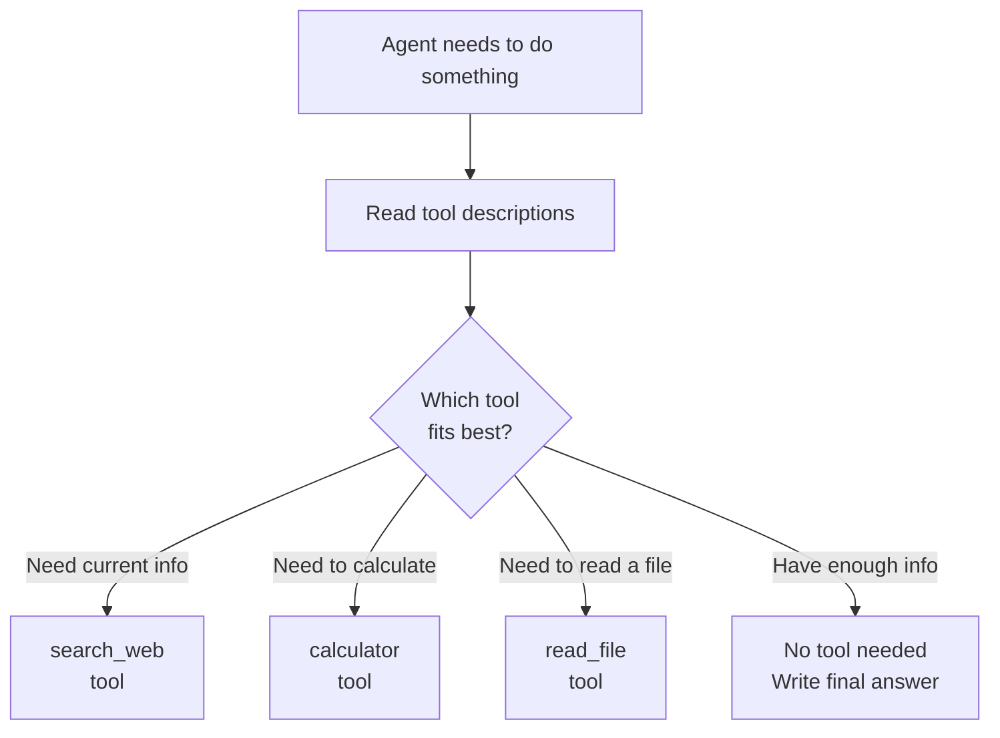
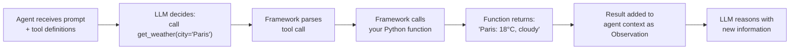

# Tool Use — Theory

Think about a brilliant surgeon. Years of training. Deep knowledge. Exceptional judgment.

Without instruments, they can't do surgery. No scalpel, no incision. No imaging system, no diagnosis. No anesthesia monitor, no safe operation. Their knowledge is useless without the tools to act on it.

Give them a fully equipped operating theater and that brilliance becomes unstoppable.

LLMs are the same. Without tools, they're limited to what they know from training. With tools, they can search the web, run code, query databases, send emails, and interact with any system in the world.

👉 This is why we need **Tool Use** — it's how AI agents go from knowing things to actually doing things.

---

## What Are Tools?

A tool is just a **function the agent can call**.

Every tool has three parts:

1. **Name** — how the agent refers to it: `"search_web"`
2. **Description** — what it does, in plain English: `"Searches the internet for current information"`
3. **Parameters** — what inputs it needs: `{"query": "the search terms to look up"}`

The LLM reads the name and description to decide when to use the tool. It reads the parameters to know what to pass in.

That's it. A tool is a function + a description.

---

## How the Agent Decides Which Tool to Use

The agent has a list of all available tools with their descriptions. When it needs to do something, it looks at this list and picks the tool whose description best matches what it needs.



This is why **tool descriptions matter so much**. The description is the only thing guiding this decision.

---

## Built-in vs Custom Tools

### Built-in Tools (Common Examples)

These come with agent frameworks or are easy to add:

| Tool | What it does |
|---|---|
| Web search | Find current information online |
| Code execution | Run Python and return the output |
| Calculator | Evaluate math expressions |
| File reader | Read text from a file |
| Wikipedia | Look up structured knowledge |
| Weather API | Get current weather data |

### Custom Tools

These are tools you build for your specific use case:

| Tool | What it does |
|---|---|
| `query_my_database` | Look up records in your company's database |
| `get_customer_info` | Pull data from your CRM |
| `send_slack_message` | Post to a Slack channel |
| `create_jira_ticket` | Open a bug report |
| `read_from_s3` | Load a file from cloud storage |

The pattern is always the same: define a Python function → give it a name and description → add it to the agent's toolbox.

---

## Tool Schemas

Modern LLMs (especially with function calling) use a **schema** to understand tools. The schema is a structured definition:

```json
{
  "name": "get_current_weather",
  "description": "Get the current weather for a specific city. Use this when the user asks about weather.",
  "parameters": {
    "type": "object",
    "properties": {
      "city": {
        "type": "string",
        "description": "The city name, e.g. London, Tokyo, New York"
      },
      "units": {
        "type": "string",
        "enum": ["celsius", "fahrenheit"],
        "description": "Temperature units"
      }
    },
    "required": ["city"]
  }
}
```

The LLM reads this and knows: when someone asks about weather, call this function with the city name (required) and optionally the units.

OpenAI, Anthropic, and Google all support this format natively — it's called **function calling** or **tool use** in the API.

---

## The Tool Use Flow

Here's what happens when an agent uses a tool:



The LLM itself doesn't execute the function. It **outputs a structured request** to call the tool. Your framework or code reads that request, actually calls the function, and passes the result back.

---

## Good Tool Design

The difference between a well-designed tool and a bad one is the description.

**Bad description:**
```
name: "data"
description: "gets data"
```

**Good description:**
```
name: "get_product_price"
description: "Retrieves the current price of a product from our inventory system.
              Use this when the user asks about product pricing or cost.
              Returns the price in USD. If the product is not found, returns 'Product not found'."
```

Rules for good tool descriptions:
- Say **when to use it** ("use this when...")
- Say **what it returns** ("returns the price in USD")
- Say **what it doesn't do** to prevent confusion
- Be specific about edge cases ("if not found, returns...")

---

## Giving Agents the Right Toolbox

More tools is not always better. An agent with 20 tools will be confused. Start with 3-5 focused tools.

Good toolbox design:
- Each tool does **one thing well**
- Tools don't overlap in purpose
- Each tool has a clear, specific description
- The set of tools covers what the agent actually needs

---

✅ **What you just learned:** Tools are functions the agent can call to interact with the world — each tool has a name, description, and parameters, and the LLM picks the right tool based on its description.

🔨 **Build this now:** Think of a task you do at work. List 3-4 tools an AI agent would need to do that task. For each tool, write: name, one-sentence description, and what it returns.

➡️ **Next step:** Agent Memory → `/Users/1065696/Github/AI/10_AI_Agents/04_Agent_Memory/Theory.md`

---

## 📂 Navigation

**In this folder:**
| File | |
|---|---|
| 📄 **Theory.md** | ← you are here |
| [📄 Cheatsheet.md](./Cheatsheet.md) | Quick reference |
| [📄 Interview_QA.md](./Interview_QA.md) | Interview prep |
| [📄 Code_Example.md](./Code_Example.md) | Python code examples |
| [📄 Building_Custom_Tools.md](./Building_Custom_Tools.md) | Guide to building custom tools |

⬅️ **Prev:** [02 ReAct Pattern](../02_ReAct_Pattern/Theory.md) &nbsp;&nbsp;&nbsp; ➡️ **Next:** [04 Agent Memory](../04_Agent_Memory/Theory.md)
