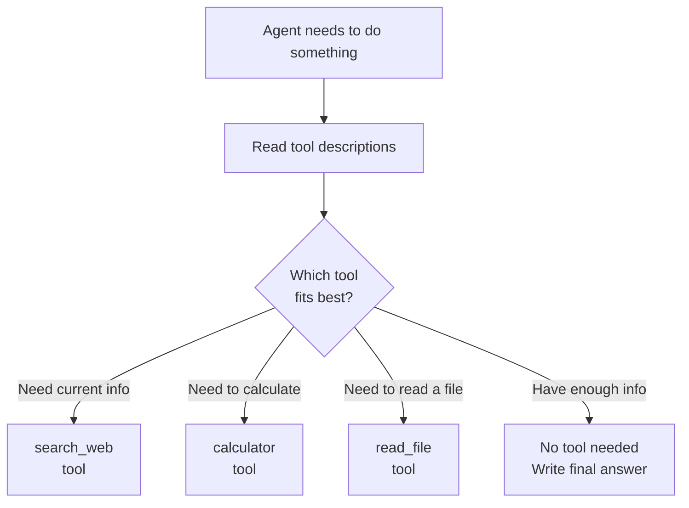
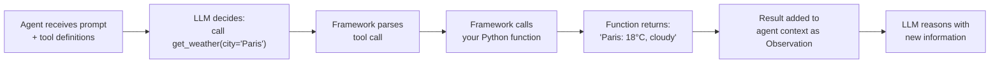

# Tool Use — Theory

A brilliant surgeon without instruments can't do surgery. No scalpel, no incision. No imaging system, no diagnosis. Their knowledge is useless without tools to act on it. Give them a fully equipped operating theater and that brilliance becomes unstoppable.

LLMs are the same. Without tools, they're limited to training knowledge. With tools, they can search the web, run code, query databases, send emails, and interact with any system in the world.

👉 This is why we need **Tool Use** — it's how AI agents go from knowing things to actually doing things.

---

## What Are Tools?

A tool is a **function the agent can call**. Every tool has three parts:

1. **Name** — how the agent refers to it: `"search_web"`
2. **Description** — what it does, in plain English: `"Searches the internet for current information"`
3. **Parameters** — what inputs it needs: `{"query": "the search terms to look up"}`

The LLM reads the name and description to decide when to use the tool, and the parameters to know what to pass in.

---

## How the Agent Decides Which Tool to Use



**Tool descriptions matter** — the description is the only thing guiding this decision.

---

## Built-in vs Custom Tools

**Built-in Tools:**

| Tool | What it does |
|---|---|
| Web search | Find current information online |
| Code execution | Run Python and return the output |
| Calculator | Evaluate math expressions |
| File reader | Read text from a file |
| Wikipedia | Look up structured knowledge |
| Weather API | Get current weather data |

**Custom Tools** — built for your specific use case:

| Tool | What it does |
|---|---|
| `query_my_database` | Look up records in your company's database |
| `get_customer_info` | Pull data from your CRM |
| `send_slack_message` | Post to a Slack channel |
| `create_jira_ticket` | Open a bug report |

Pattern: define a Python function → give it a name and description → add it to the agent's toolbox.

---

## Tool Schemas

Modern LLMs use a **schema** to understand tools:

```json
{
  "name": "get_current_weather",
  "description": "Get the current weather for a specific city. Use this when the user asks about weather.",
  "parameters": {
    "type": "object",
    "properties": {
      "city": {
        "type": "string",
        "description": "The city name, e.g. London, Tokyo, New York"
      },
      "units": {
        "type": "string",
        "enum": ["celsius", "fahrenheit"],
        "description": "Temperature units"
      }
    },
    "required": ["city"]
  }
}
```

OpenAI, Anthropic, and Google all support this format natively — called **function calling** or **tool use** in the API.

---

## The Tool Use Flow



The LLM itself doesn't execute the function — it **outputs a structured request**. Your framework reads that request, calls the function, and passes the result back.

---

## Good Tool Design

**Bad description:**
```
name: "data"
description: "gets data"
```

**Good description:**
```
name: "get_product_price"
description: "Retrieves the current price of a product from our inventory system.
              Use this when the user asks about product pricing or cost.
              Returns the price in USD. If the product is not found, returns 'Product not found'."
```

Rules for good tool descriptions:
- Say **when to use it** ("use this when...")
- Say **what it returns** ("returns the price in USD")
- Include edge cases ("if not found, returns...")

More tools is not always better. An agent with 20 tools will be confused. Start with 3–5 focused tools where each does one thing well and tools don't overlap in purpose.

---

✅ **What you just learned:** Tools are functions the agent can call to interact with the world — each tool has a name, description, and parameters, and the LLM picks the right tool based on its description.

🔨 **Build this now:** Think of a task you do at work. List 3-4 tools an AI agent would need to do that task. For each tool, write: name, one-sentence description, and what it returns.

➡️ **Next step:** Agent Memory → `/Users/1065696/Github/AI/10_AI_Agents/04_Agent_Memory/Theory.md`

---

## 🛠️ Practice Project

Apply what you just learned → **[I3: Multi-Tool Research Agent](../../20_Projects/01_Intermediate_Projects/03_Multi_Tool_Research_Agent/Project_Guide.md)**
> This project uses: defining 3 tools (web_search, calculator, wikipedia), handling tool_use responses, executing tools and returning results


---

## 📝 Practice Questions

- 📝 [Q63 · agent-tool-use](../../ai_practice_questions_100.md#q63--critical--agent-tool-use)


---

## 📂 Navigation

**In this folder:**
| File | |
|---|---|
| 📄 **Theory.md** | ← you are here |
| [📄 Cheatsheet.md](./Cheatsheet.md) | Quick reference |
| [📄 Interview_QA.md](./Interview_QA.md) | Interview prep |
| [📄 Code_Example.md](./Code_Example.md) | Python code examples |
| [📄 Building_Custom_Tools.md](./Building_Custom_Tools.md) | Guide to building custom tools |

⬅️ **Prev:** [02 ReAct Pattern](../02_ReAct_Pattern/Theory.md) &nbsp;&nbsp;&nbsp; ➡️ **Next:** [04 Agent Memory](../04_Agent_Memory/Theory.md)
