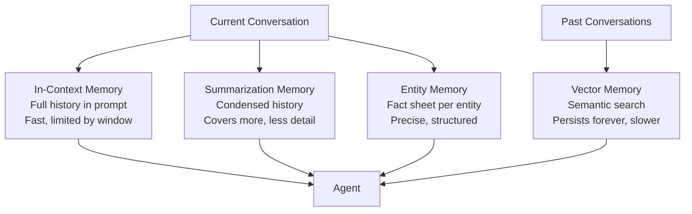

# Agent Memory — Theory

Think about three types of memory you use every day.

**Short-term:** You're in a meeting. Someone says "the budget is $50,000." Five minutes later you reference it — you remember because it just happened.

**Long-term:** You learned to drive years ago. You still remember. That knowledge is stored deep and lasts forever.

**Episodic:** You remember the specific time your car broke down on the highway last winter. It's not just knowledge — it's a memory of a specific event.

Without these, every conversation you have would start from scratch. You'd forget who you were talking to, what was said, and what you learned.

AI agents have all three types of memory. Implemented differently, but the same idea.

👉 This is why we need **Agent Memory** — so agents can remember what happened, what they know, and what to do differently next time.

---

## Why Memory Matters

Without memory, every conversation with an agent would go like this:

```
User: "My name is Sarah. I'm working on a Python project."
Agent: "Hello! How can I help you?"
User: "Can you help me debug it?"
Agent: "Sure! Who are you and what are you working on?"
```

Useless. Every agent needs some form of memory.

---

## The Four Types of Agent Memory

### 1. In-Context Memory (Short-Term)

The simplest form. Everything from the current conversation is kept in the prompt.

The agent "remembers" because the history is literally in its input.

```
User: I want to plan a trip to Japan.
Agent: Great! What dates are you thinking?
User: June 15-30.
Agent: Perfect. [Agent remembers it's Japan, June 15-30 — it's right there in the context]
```

**Limitation:** The context window has a size limit. Long conversations get truncated.

---

### 2. Summarization Memory

Instead of keeping the full conversation, the agent periodically summarizes older parts.

```
[Conversation so far]                   [Stored summary]
User: I'm planning Japan trip           "User is planning a Japan trip
Agent: What dates?                       for June 15-30, budget ~$3000,
User: June 15-30                         interested in Tokyo and Kyoto."
Agent: Budget?
User: About $3000
...50 more messages...
```

This keeps the context window manageable while preserving key facts.

---

### 3. Entity Memory

Tracks specific named things — people, places, topics — and what's been said about them.

The agent maintains a "fact sheet" that gets updated as the conversation progresses.

```
Entities tracked:
- User: name=Sarah, project=Python web app, framework=Django
- Deadline: March 15
- Bug: authentication issue on login page
```

When Sarah says "fix the bug", the agent knows exactly which bug she means.

---

### 4. Vector (Long-Term) Memory

Information stored in a vector database. Can persist across many conversations.

When the agent needs something from memory, it does a **semantic search** — "find memories related to this current topic" — and retrieves the most relevant pieces.

This is like long-term memory: stored outside the current conversation, retrieved on demand.

---

## Memory Types Visualized



---

## When to Use Each

| Memory Type | Best For | Limitation |
|---|---|---|
| In-context | Short conversations, needs full detail | Hits context limit on long chats |
| Summarization | Long conversations where exact wording doesn't matter | Loses detail when summarizing |
| Entity memory | Conversations that track specific things (people, tasks, bugs) | Only captures what you tell it to track |
| Vector memory | Persistent knowledge across many sessions | Slower (requires retrieval step), needs vector DB |

---

## A Practical Example

A customer service agent helping users over many sessions:

- **In-context** — remembers everything said in this support ticket
- **Entity memory** — tracks that this user's account is Premium, their timezone is PST, their recurring issue is with billing
- **Vector memory** — stores summaries of past tickets, so next time the user says "same issue as before", the agent can retrieve context from 3 months ago

Each memory type does a different job. Used together, the agent feels remarkably like talking to a human who actually knows you.

---

✅ **What you just learned:** AI agents use four types of memory — in-context (short-term), summarization (condensed history), entity (fact tracking), and vector (long-term retrieval) — each with different tradeoffs.

🔨 **Build this now:** Think of a multi-session customer support scenario. Write out what each type of memory would store after the first conversation. What would in-context memory have? Entity memory? What would be stored in vector memory for future sessions?

➡️ **Next step:** Planning and Reasoning → `/Users/1065696/Github/AI/10_AI_Agents/05_Planning_and_Reasoning/Theory.md`

---

## 📂 Navigation

**In this folder:**
| File | |
|---|---|
| 📄 **Theory.md** | ← you are here |
| [📄 Cheatsheet.md](./Cheatsheet.md) | Quick reference |
| [📄 Interview_QA.md](./Interview_QA.md) | Interview prep |
| [📄 Code_Example.md](./Code_Example.md) | Python code examples |
| [📄 Comparison.md](./Comparison.md) | Memory types comparison |

⬅️ **Prev:** [03 Tool Use](../03_Tool_Use/Theory.md) &nbsp;&nbsp;&nbsp; ➡️ **Next:** [05 Planning and Reasoning](../05_Planning_and_Reasoning/Theory.md)
