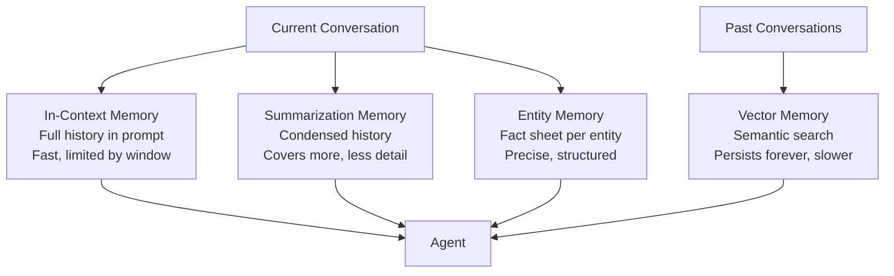

# Agent Memory — Theory

Three types of memory you use every day:
- **Short-term:** In a meeting, someone says "the budget is $50,000." You reference it five minutes later.
- **Long-term:** You learned to drive years ago. That knowledge persists.
- **Episodic:** You remember the specific time your car broke down on the highway last winter.

Without these, every conversation starts from scratch. AI agents have all three types — implemented differently, but the same idea.

👉 This is why we need **Agent Memory** — so agents can remember what happened, what they know, and what to do differently next time.

---

## 📌 Learning Priority

**Must Learn** — core concepts, needed to understand the rest of this file:
[In-Context Memory](#1-in-context-memory-short-term) · [Vector Long-Term Memory](#4-vector-long-term-memory)

**Should Learn** — important for real projects and interviews:
[When to Use Each](#when-to-use-each) · [Summarization Memory](#2-summarization-memory) · [Entity Memory](#3-entity-memory)

**Good to Know** — useful in specific situations, not needed daily:
[A Practical Example](#a-practical-example)

---

## The Four Types of Agent Memory

### 1. In-Context Memory (Short-Term)

Everything from the current conversation is kept in the prompt. The agent "remembers" because the history is literally in its input.

```
User: I want to plan a trip to Japan.
Agent: Great! What dates are you thinking?
User: June 15-30.
Agent: Perfect. [Agent remembers it's Japan, June 15-30 — it's right there in the context]
```

**Limitation:** The context window has a size limit. Long conversations get truncated.

### 2. Summarization Memory

Instead of keeping the full conversation, the agent periodically summarizes older parts — preserving key facts while keeping the context window manageable.

```
[Stored summary]
"User is planning a Japan trip for June 15-30, budget ~$3000,
 interested in Tokyo and Kyoto."
```

### 3. Entity Memory

Tracks specific named things — people, places, topics — and what's been said about them. Maintains a "fact sheet" that gets updated as the conversation progresses.

```
Entities tracked:
- User: name=Sarah, project=Python web app, framework=Django
- Deadline: March 15
- Bug: authentication issue on login page
```

When Sarah says "fix the bug", the agent knows exactly which bug she means.

### 4. Vector (Long-Term) Memory

Information stored in a vector database that persists across many conversations. When the agent needs something from memory, it does a **semantic search** — "find memories related to this current topic" — and retrieves the most relevant pieces.

---

## Memory Types Visualized



---

## When to Use Each

| Memory Type | Best For | Limitation |
|---|---|---|
| In-context | Short conversations, needs full detail | Hits context limit on long chats |
| Summarization | Long conversations where exact wording doesn't matter | Loses detail when summarizing |
| Entity memory | Conversations that track specific things (people, tasks, bugs) | Only captures what you tell it to track |
| Vector memory | Persistent knowledge across many sessions | Slower (requires retrieval step), needs vector DB |

---

## A Practical Example

A customer service agent helping users over many sessions:
- **In-context** — remembers everything said in this support ticket
- **Entity memory** — tracks that this user's account is Premium, their timezone is PST, their recurring issue is with billing
- **Vector memory** — stores summaries of past tickets; when the user says "same issue as before", retrieves context from 3 months ago

Used together, the agent feels remarkably like talking to a human who actually knows you.

---

✅ **What you just learned:** AI agents use four types of memory — in-context (short-term), summarization (condensed history), entity (fact tracking), and vector (long-term retrieval) — each with different tradeoffs.

🔨 **Build this now:** Think of a multi-session customer support scenario. Write out what each type of memory would store after the first conversation. What would in-context memory have? Entity memory? What would be stored in vector memory for future sessions?

➡️ **Next step:** Planning and Reasoning → `/Users/1065696/Github/AI/10_AI_Agents/05_Planning_and_Reasoning/Theory.md`

---

## 🛠️ Practice Project

Apply what you just learned → **[I3: Multi-Tool Research Agent](../../22_Capstone_Projects/08_Multi_Tool_Research_Agent/03_GUIDE.md)**
> This project uses: persisting conversation history across tool calls, summarizing past context when history gets too long


---

## 📝 Practice Questions

- 📝 [Q64 · agent-memory](../../ai_practice_questions_100.md#q64--design--agent-memory)


---

## 📂 Navigation

**In this folder:**
| File | |
|---|---|
| 📄 **Theory.md** | ← you are here |
| [📄 Cheatsheet.md](./Cheatsheet.md) | Quick reference |
| [📄 Interview_QA.md](./Interview_QA.md) | Interview prep |
| [📄 Code_Example.md](./Code_Example.md) | Python code examples |
| [📄 Comparison.md](./Comparison.md) | Memory types comparison |

⬅️ **Prev:** [03 Tool Use](../03_Tool_Use/Theory.md) &nbsp;&nbsp;&nbsp; ➡️ **Next:** [05 Planning and Reasoning](../05_Planning_and_Reasoning/Theory.md)
