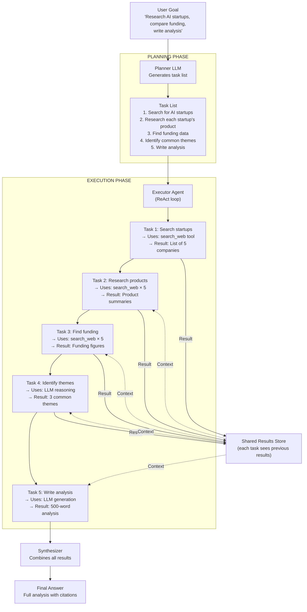
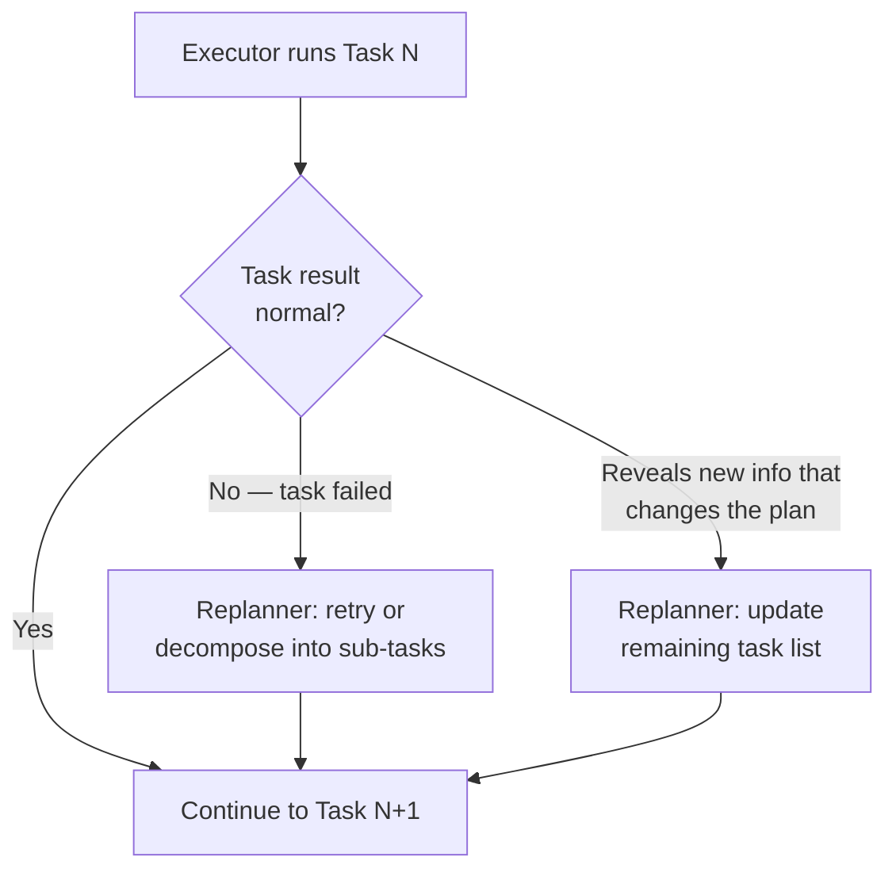

# Planning and Reasoning — Architecture Deep Dive

## Plan-and-Execute Architecture

The Plan-and-Execute pattern separates planning from execution into distinct roles. Here's the full flow.

---

## Full Architecture Diagram



---

## The Two LLMs Explained

### The Planner LLM

The planner's only job is to look at the goal and produce a good task list.

It doesn't use tools. It doesn't execute anything. It just thinks: "What are all the steps needed to achieve this goal?"

**Planner prompt template:**
```
You are a planning agent. Your job is to break down complex goals into
a numbered list of concrete, executable tasks.

Each task should:
- Be specific and actionable
- Take no more than 5 minutes to execute
- Have a clear completion criterion
- Be ordered correctly (earlier tasks should not depend on later ones)

Goal: {goal}

Output a numbered task list only. No other text.
```

**Example output:**
```
1. Search for the top 5 AI startups that received the most funding in 2024
2. For each startup, search for their main product or service
3. For each startup, find their latest funding round amount and investors
4. Analyze the 5 startups and identify 3 common themes or patterns
5. Write a 500-word analysis covering: overview, funding comparison, key themes, conclusion
```

### The Executor Agent

The executor takes one task at a time and completes it using tools.

It uses a ReAct-style loop within each task. It doesn't see the full task list — it just sees the current task and the results of previous tasks.

**Executor prompt template:**
```
You are an execution agent. Your job is to complete a single task.

Context from previous tasks:
{previous_results}

Your current task:
{current_task}

Use the available tools to complete this task. When done, output only the result.
```

---

## Replanning Flow

What happens when a task fails or reveals new information:



Example scenario for replanning:

```
Original plan:
  Task 3: Find funding for Startup X → FAILED (company went private, no public data)

Replan:
  Task 3 (revised): Find last known funding round for Startup X (may be historical)
  Task 3b (new): Note in the analysis that Startup X's current funding is undisclosed
```

---

## Data Flow Between Tasks

Each task's result is stored and passed forward:

```python
results = []

for i, task in enumerate(task_list):
    # Build context from all previous results
    context = {
        "previous_results": [
            {"task": t, "result": r}
            for t, r in zip(task_list[:i], results)
        ]
    }

    # Execute the current task with full context
    result = executor.run(task=task, context=context)
    results.append(result)
```

This is critical. Task 5 ("write the analysis") needs the outputs of tasks 1-4. Without the shared results store, each task would execute in isolation with no connection to what came before.

---

## When Plan-and-Execute Beats Standard ReAct

| Scenario | Standard ReAct | Plan-and-Execute |
|---|---|---|
| Research + write 5-section report | Drifts off, forgets sections | Systematic, all sections covered |
| Multi-source comparison (5+ items) | Loses track of which items already covered | Clear task per item |
| Long-running task (30+ steps) | Loses goal after ~15 steps | Always has the task list as anchor |
| Task with data dependencies | May get confused about what data is needed when | Planner orders dependencies correctly |

---

## LangChain Implementation

LangChain has a built-in Plan-and-Execute agent:

```python
from langchain_experimental.plan_and_execute import (
    PlanAndExecute,
    load_agent_executor,
    load_chat_planner,
)
from langchain_openai import ChatOpenAI
from langchain.tools import DuckDuckGoSearchRun

# Setup
llm = ChatOpenAI(model="gpt-4o", temperature=0)
tools = [DuckDuckGoSearchRun()]

# Create the two components
planner = load_chat_planner(llm)
executor = load_agent_executor(llm, tools, verbose=True)

# Create the combined agent
agent = PlanAndExecute(planner=planner, executor=executor, verbose=True)

# Run it
result = agent.invoke({
    "input": "Research the top 3 Python web frameworks and compare them"
})
print(result["output"])
```

The framework handles:
- Calling the planner first
- Iterating through each task
- Passing results forward
- Collecting the final output

---

## The Key Takeaway

Plan-and-Execute is fundamentally about **separation of concerns**:

- The **planner** has the global view — it sees the goal and thinks about the complete path
- The **executor** has the local view — it focuses entirely on one task at a time

This separation is what makes it reliable on complex tasks. Each component only has to do one job, and it does that job well.

---

## 📂 Navigation

**In this folder:**
| File | |
|---|---|
| [📄 Theory.md](./Theory.md) | Core concepts |
| [📄 Cheatsheet.md](./Cheatsheet.md) | Quick reference |
| [📄 Interview_QA.md](./Interview_QA.md) | Interview prep |
| 📄 **Architecture_Deep_Dive.md** | ← you are here |

⬅️ **Prev:** [04 Agent Memory](../04_Agent_Memory/Theory.md) &nbsp;&nbsp;&nbsp; ➡️ **Next:** [06 Reflection and Self-Correction](../06_Reflection_and_Self_Correction/Theory.md)
