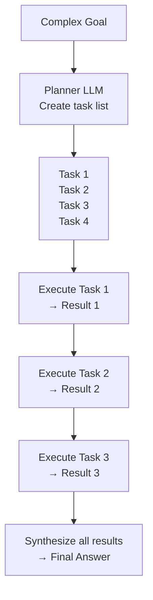

# Planning and Reasoning — Theory

You're going on a cross-country road trip from New York to Los Angeles.

You don't just get in the car and start driving, hoping to end up in LA. You plan. You pick checkpoints: Philadelphia, Pittsburgh, Columbus, St. Louis, Tulsa, Albuquerque, Flagstaff, LA. You estimate how long each leg takes. You book motels in advance. And you have a backup plan — if a road is closed, which route do you take? What if the car breaks down in the middle of Texas?

Planning turns a vague goal ("get to LA") into a concrete, manageable sequence of steps.

AI agents do exactly this when faced with complex tasks.

👉 This is why we need **Planning and Reasoning** — it breaks complex goals into manageable sub-tasks an agent can actually execute.

---

## Why Simple Agents Fail on Complex Tasks

A basic ReAct agent works well for 2-3 step tasks. But what about:

"Research the top 5 AI startups of 2024, summarize their products, compare their funding rounds, identify the common themes, and write a 500-word analysis."

A simple agent might:
- Get lost after step 2
- Run the same search multiple times
- Forget it hasn't done step 4 yet
- Give up too early

Complex tasks need explicit planning.

---

## Chain-of-Thought Planning

The simplest form of planning. Ask the LLM to think through the steps before acting.

```
User: Research AI startups and write an analysis.

LLM Thought:
To complete this task, I need to:
1. Search for top AI startups of 2024
2. For each startup, search for their product details
3. Search for each startup's funding information
4. Identify common themes across startups
5. Write the 500-word analysis

Let me start with step 1.
```

Just asking the model to plan before acting dramatically improves multi-step task performance.

---

## Plan-and-Execute

A more structured approach. Uses **two separate LLMs** (or two calls):

1. **Planner** — takes the goal, produces a full list of tasks
2. **Executor** — takes each task one at a time, executes it using tools



The planner sees the big picture. The executor focuses on one task at a time.

This is much more reliable than a single agent trying to track both the plan and the current step simultaneously.

---

## Tree of Thoughts

Instead of one linear plan, explore multiple paths simultaneously.

Think of it like a chess player considering different moves. For each step, generate 3 possible approaches. Evaluate which is most promising. Explore the best branch. Backtrack if needed.

```
                    Goal
                   /    \
            Plan A      Plan B
           /    \          \
        A.1    A.2        B.1
         |      |          |
      (dead   (best     (decent)
       end)   path)
```

Tree of Thoughts is slower but finds better solutions for complex reasoning problems.

---

## BabyAGI-Style Task Management

An autonomous planning loop:

1. Start with one goal
2. Complete the first task
3. Based on the result, generate new tasks automatically
4. Prioritize the task list
5. Execute the next highest-priority task
6. Repeat until the goal is reached

The agent doesn't just execute a fixed plan — it generates the plan dynamically, based on what it's learned so far.

This is closer to how humans actually work on complex projects.

---

## How Agents Handle Multi-Step Reasoning

The key insight across all planning approaches:

**Don't try to solve everything at once. Decompose.**

| Approach | How it decomposes | Best for |
|---|---|---|
| Chain-of-Thought | Think through steps before acting | Moderate complexity |
| Plan-and-Execute | Separate planner from executor | Tasks with known structure |
| Tree of Thoughts | Explore multiple plan branches | Problems needing creative solutions |
| BabyAGI-style | Dynamically generate next tasks | Open-ended research and exploration |

---

## A Planning Failure and Its Fix

**Failure:** "Write me a full business plan for a coffee shop."

Without planning, the agent might just start writing and produce a disorganized wall of text.

**With planning:**
```
Step 1: Research the coffee shop market in the target location
Step 2: Define the concept and unique value proposition
Step 3: Write the executive summary
Step 4: Write the market analysis section
Step 5: Write the financial projections section
Step 6: Write the operations plan
Step 7: Review and ensure all sections are consistent
Step 8: Format the final document
```

Each step is small enough to execute reliably. The final result is structured and complete.

---

✅ **What you just learned:** Planning breaks complex goals into manageable sub-tasks — approaches include chain-of-thought, plan-and-execute (separate planner + executor), Tree of Thoughts (multiple branches), and BabyAGI-style dynamic task generation.

🔨 **Build this now:** Take a complex task: "Create a one-week study plan for learning machine learning from scratch." Write out the full task list a planner LLM should generate — aim for 8-12 specific, executable sub-tasks.

➡️ **Next step:** Reflection and Self-Correction → `/Users/1065696/Github/AI/10_AI_Agents/06_Reflection_and_Self_Correction/Theory.md`

---

## 📂 Navigation

**In this folder:**
| File | |
|---|---|
| 📄 **Theory.md** | ← you are here |
| [📄 Cheatsheet.md](./Cheatsheet.md) | Quick reference |
| [📄 Interview_QA.md](./Interview_QA.md) | Interview prep |
| [📄 Architecture_Deep_Dive.md](./Architecture_Deep_Dive.md) | Planning architectures deep dive |

⬅️ **Prev:** [04 Agent Memory](../04_Agent_Memory/Theory.md) &nbsp;&nbsp;&nbsp; ➡️ **Next:** [06 Reflection and Self-Correction](../06_Reflection_and_Self_Correction/Theory.md)
