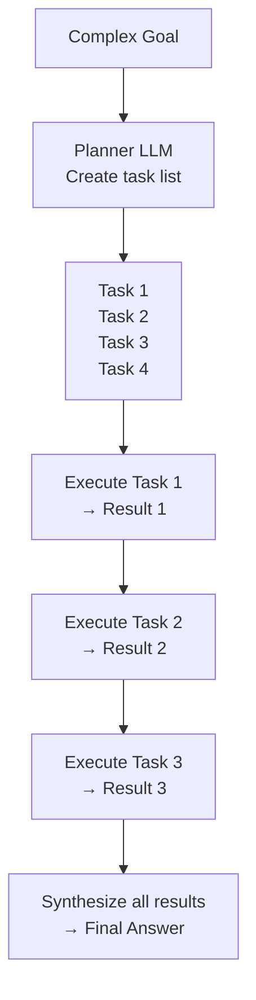
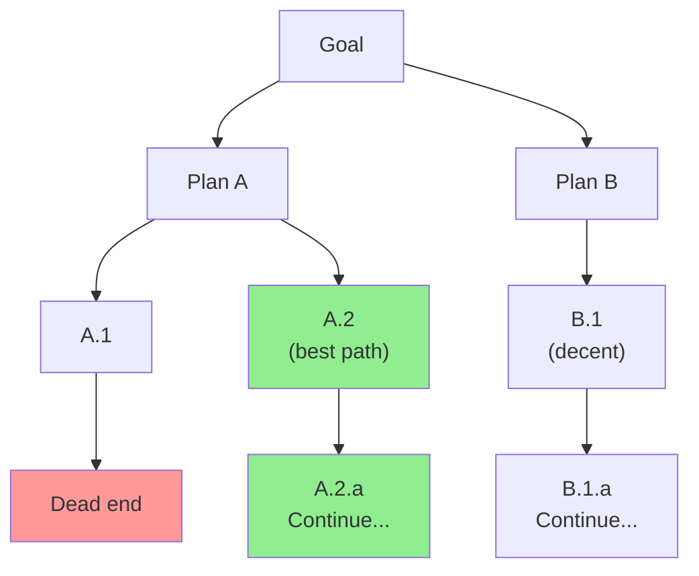
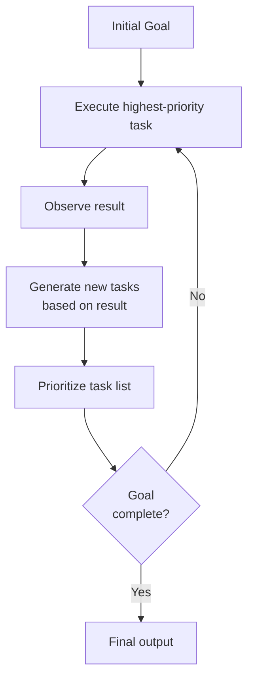

# Planning and Reasoning — Theory

You're driving cross-country from New York to Los Angeles. You don't just start driving and hope you end up in LA. You pick checkpoints, estimate leg times, book motels in advance, and plan backup routes. Planning turns a vague goal into a concrete, manageable sequence of steps.

AI agents do exactly this when faced with complex tasks.

👉 This is why we need **Planning and Reasoning** — it breaks complex goals into manageable sub-tasks an agent can actually execute.

---

## Why Simple Agents Fail on Complex Tasks

A basic ReAct agent works well for 2-3 step tasks. But for something like "Research the top 5 AI startups, summarize their products, compare funding rounds, identify common themes, and write a 500-word analysis" — a simple agent might:
- Get lost after step 2
- Run the same search multiple times
- Forget it hasn't done step 4 yet

Complex tasks need explicit planning.

---

## Chain-of-Thought Planning

The simplest form: ask the LLM to think through the steps before acting.

```
LLM Thought:
To complete this task, I need to:
1. Search for top AI startups of 2024
2. For each startup, search for their product details
3. Search for each startup's funding information
4. Identify common themes across startups
5. Write the 500-word analysis

Let me start with step 1.
```

Just asking the model to plan before acting dramatically improves multi-step task performance.

---

## Plan-and-Execute

Uses **two separate LLMs** (or two calls):
1. **Planner** — takes the goal, produces a full task list
2. **Executor** — takes each task one at a time, executes it using tools



The planner sees the big picture. The executor focuses on one task at a time. Much more reliable than a single agent tracking both the plan and current step simultaneously.

---

## Tree of Thoughts

Instead of one linear plan, explore multiple paths simultaneously — like a chess player considering different moves.



Slower but finds better solutions for complex reasoning problems.

---

## BabyAGI-Style Task Management

An autonomous planning loop:
1. Start with one goal
2. Complete the first task
3. Based on the result, generate new tasks automatically
4. Prioritize the task list
5. Execute the next highest-priority task
6. Repeat until the goal is reached



The agent doesn't execute a fixed plan — it generates the plan dynamically based on what it's learned.

---

## Approach Comparison

| Approach | How it decomposes | Best for |
|---|---|---|
| Chain-of-Thought | Think through steps before acting | Moderate complexity |
| Plan-and-Execute | Separate planner from executor | Tasks with known structure |
| Tree of Thoughts | Explore multiple plan branches | Problems needing creative solutions |
| BabyAGI-style | Dynamically generate next tasks | Open-ended research and exploration |

**The key insight:** Don't try to solve everything at once. Decompose.

---

✅ **What you just learned:** Planning breaks complex goals into manageable sub-tasks — approaches include chain-of-thought, plan-and-execute (separate planner + executor), Tree of Thoughts (multiple branches), and BabyAGI-style dynamic task generation.

🔨 **Build this now:** Take a complex task: "Create a one-week study plan for learning machine learning from scratch." Write out the full task list a planner LLM should generate — aim for 8-12 specific, executable sub-tasks.

➡️ **Next step:** Reflection and Self-Correction → `/Users/1065696/Github/AI/10_AI_Agents/06_Reflection_and_Self_Correction/Theory.md`

---

## 🛠️ Practice Project

Apply what you just learned → **[A4: Multi-Agent Research System](../../20_Projects/02_Advanced_Projects/04_Multi_Agent_Research_System/Project_Guide.md)**
> This project uses: supervisor decomposes research question into sub-tasks, plans which specialist to use for each

---

## 📂 Navigation

**In this folder:**
| File | |
|---|---|
| 📄 **Theory.md** | ← you are here |
| [📄 Cheatsheet.md](./Cheatsheet.md) | Quick reference |
| [📄 Interview_QA.md](./Interview_QA.md) | Interview prep |
| [📄 Architecture_Deep_Dive.md](./Architecture_Deep_Dive.md) | Planning architectures deep dive |

⬅️ **Prev:** [04 Agent Memory](../04_Agent_Memory/Theory.md) &nbsp;&nbsp;&nbsp; ➡️ **Next:** [06 Reflection and Self-Correction](../06_Reflection_and_Self_Correction/Theory.md)
