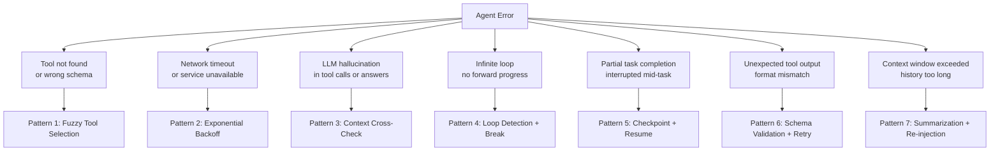

# Error Recovery Patterns

A surgeon doesn't stop operating the moment something unexpected happens. They have trained responses for every failure mode: a vessel that bleeds more than expected, an instrument that slips, a patient whose vitals shift. The response is not panic. It's a procedure: stop, assess, apply the trained recovery, continue.

AI agents fail constantly — tools break, LLMs hallucinate, networks timeout, context windows fill. An agent without error recovery is like a surgeon who freezes at the first complication. An agent with structured recovery patterns keeps working toward the goal.

👉 This is why we need **Error Recovery Patterns** — a catalog of named, implementable responses to the specific failure modes agents encounter in production.

---

## ## The Failure Taxonomy

Before recovery, classification. Agent failures cluster into 7 types, each requiring a different response:



Each pattern below: problem, detection, recovery code, and when to give up.

---

## ## Pattern 1: Tool Not Found / Wrong Schema → Fuzzy Tool Selection

**The problem**

An agent generates a tool call for `search_web` but the available tool is named `web_search`. Or it generates arguments with the field `query` but the tool expects `search_query`. The call fails. A naive agent errors out. A recovering agent finds the closest match and retries.

This happens more than you'd expect. LLMs are trained on tool-use examples that may not match your exact schema. On first deployment of a new tool, schema mismatch failures are common.

**Detection strategy**

Catch `ToolNotFoundError` and schema validation errors (missing required fields, wrong field names, wrong types). These are deterministic — they always fail the same way, which makes them easy to detect and handle.

**Recovery: fuzzy tool matching**

```python
from difflib import SequenceMatcher
from typing import Optional
import json

def fuzzy_match_tool(
    requested_name: str,
    available_tools: list[dict],
    threshold: float = 0.7
) -> Optional[dict]:
    """Find the closest matching tool by name similarity."""
    best_match = None
    best_ratio = 0.0

    for tool in available_tools:
        ratio = SequenceMatcher(
            None,
            requested_name.lower(),
            tool["name"].lower()
        ).ratio()
        if ratio > best_ratio:
            best_ratio = ratio
            best_match = tool

    if best_ratio >= threshold:
        return best_match
    return None


def recover_tool_call(
    failed_call: dict,
    available_tools: list[dict],
    llm_client,
) -> Optional[dict]:
    """Attempt to recover a failed tool call via fuzzy matching + schema correction."""
    requested_name = failed_call.get("name", "")

    # Step 1: Find the closest tool by name
    matched_tool = fuzzy_match_tool(requested_name, available_tools)
    if matched_tool is None:
        return None  # Give up — no plausible match

    # Step 2: Ask the LLM to reformat the arguments for the correct schema
    schema = json.dumps(matched_tool["input_schema"], indent=2)
    original_args = json.dumps(failed_call.get("input", {}), indent=2)

    correction_prompt = f"""A tool call failed because the tool name or arguments were wrong.

Original call (failed):
Tool name: {requested_name}
Arguments: {original_args}

Correct tool to use: {matched_tool['name']}
Correct schema: {schema}

Rewrite the arguments to match the correct schema exactly.
Return JSON only: the corrected arguments object."""

    response = llm_client.messages.create(
        model="claude-haiku-4-5",
        max_tokens=512,
        messages=[{"role": "user", "content": correction_prompt}]
    )

    try:
        corrected_args = json.loads(response.content[0].text)
        return {"name": matched_tool["name"], "input": corrected_args}
    except json.JSONDecodeError:
        return None
```

**When to give up**

If fuzzy match ratio is below 0.7, no plausible tool exists for this call. Surface the error to the user or the orchestrating agent. Don't guess wildly — a wrong tool call with plausible-looking output is worse than a clean failure.

---

## ## Pattern 2: Network Timeout → Exponential Backoff with Jitter

**The problem**

A tool call hits an external API that's slow, rate-limited, or temporarily down. A naive agent fails immediately. A recovering agent retries, but not blindly — repeated instant retries under load make things worse, not better (the "thundering herd" problem).

**Detection strategy**

Catch `TimeoutError`, `ConnectionError`, HTTP 429 (rate limit), HTTP 503 (service unavailable), and HTTP 502/504 (gateway errors). These are transient failures — the service will likely recover. Permanent failures (HTTP 404, 400) should not be retried.

**Recovery: exponential backoff with jitter**

Think of it like backing out of a crowded intersection. You wait a bit, try again. If there's still congestion, wait longer. But don't wait at exactly the same interval as everyone else — add randomness (jitter) so simultaneous retriers don't all hammer the service at once.

```python
import time
import random
import functools
from typing import Callable, TypeVar, Any

T = TypeVar("T")

RETRYABLE_STATUS_CODES = {429, 500, 502, 503, 504}

def with_backoff(
    max_retries: int = 5,
    base_delay: float = 1.0,
    max_delay: float = 60.0,
    jitter: bool = True,
    retryable_exceptions: tuple = (TimeoutError, ConnectionError),
):
    """Decorator: retry with exponential backoff and optional jitter."""
    def decorator(func: Callable[..., T]) -> Callable[..., T]:
        @functools.wraps(func)
        def wrapper(*args, **kwargs) -> T:
            last_exception = None

            for attempt in range(max_retries + 1):
                try:
                    return func(*args, **kwargs)

                except retryable_exceptions as e:
                    last_exception = e
                    if attempt == max_retries:
                        break  # Give up after max retries

                    # Exponential delay: 1s, 2s, 4s, 8s, 16s ...
                    delay = min(base_delay * (2 ** attempt), max_delay)

                    # Add full jitter: random value in [0, delay]
                    if jitter:
                        delay = random.uniform(0, delay)

                    print(f"Attempt {attempt + 1} failed: {e}. Retrying in {delay:.1f}s")
                    time.sleep(delay)

            raise last_exception

        return wrapper
    return decorator


# Usage on any tool function
@with_backoff(max_retries=5, base_delay=1.0, max_delay=30.0)
def call_external_api(url: str, payload: dict) -> dict:
    import httpx
    response = httpx.post(url, json=payload, timeout=10.0)
    if response.status_code in RETRYABLE_STATUS_CODES:
        raise ConnectionError(f"HTTP {response.status_code}")
    response.raise_for_status()
    return response.json()
```

**When to give up**

After `max_retries` exhausted, the service is likely down for a meaningful period. Record the failure in the agent's working memory, mark the subtask as blocked, and continue with other subtasks if possible. Surface a clear error to the user: "The external API is unavailable. Task X is blocked until it recovers."

---

## ## Pattern 3: LLM Hallucination → Cross-Check Against Retrieved Context

**The problem**

The agent generates a tool call or a factual claim that contradicts the retrieved context. Classic example: the LLM generates `{"date": "2023-04-15"}` in a tool argument when the retrieved document says the date is 2024-04-15. Or it states "the policy allows 30 days" when the retrieved policy says 14 days.

**Detection strategy**

For factual claims in generated answers: use the faithfulness scoring approach from RAG evaluation — ask a judge LLM to check each claim against the retrieved context. For tool arguments containing extracted facts: validate extracted values against the source chunk before calling the tool.

**Recovery: context cross-check before tool execution**

```python
import json
import anthropic

client = anthropic.Anthropic()

def validate_extracted_facts(
    tool_call_args: dict,
    source_context: list[str],
    critical_fields: list[str],
) -> tuple[bool, list[str]]:
    """
    Before executing a tool call, verify that values in critical_fields
    can be traced back to the source_context.

    Returns (is_valid, list_of_issues).
    """
    context_text = "\n\n".join(source_context)

    fields_to_check = {
        k: v for k, v in tool_call_args.items()
        if k in critical_fields
    }

    if not fields_to_check:
        return True, []

    prompt = f"""You are a fact-checker. Verify that each value in the "extracted values" 
section can be directly found in or clearly inferred from the "source context".

Source context:
{context_text}

Extracted values to verify:
{json.dumps(fields_to_check, indent=2)}

For each field, check: is this value supported by the source context?

Return JSON:
{{
  "all_valid": true/false,
  "issues": [
    {{"field": "field_name", "extracted": "value", "issue": "what's wrong"}}
  ]
}}"""

    response = client.messages.create(
        model="claude-haiku-4-5",
        max_tokens=512,
        messages=[{"role": "user", "content": prompt}]
    )

    try:
        result = json.loads(response.content[0].text)
        return result["all_valid"], result.get("issues", [])
    except json.JSONDecodeError:
        return True, []  # Fail open if checker itself errors


def execute_tool_with_hallucination_check(
    tool_name: str,
    tool_args: dict,
    source_context: list[str],
    critical_fields: list[str],
    tool_registry: dict,
    max_correction_attempts: int = 2,
):
    """Execute a tool call, validating extracted facts against context first."""
    for attempt in range(max_correction_attempts + 1):
        is_valid, issues = validate_extracted_facts(
            tool_args, source_context, critical_fields
        )

        if is_valid:
            return tool_registry[tool_name](**tool_args)

        if attempt == max_correction_attempts:
            raise ValueError(
                f"Tool call {tool_name} failed fact validation after "
                f"{max_correction_attempts} correction attempts. Issues: {issues}"
            )

        # Ask LLM to correct the specific fields that failed
        correction_prompt = f"""These fields in a tool call were not supported by the source context:

{json.dumps(issues, indent=2)}

Source context:
{chr(10).join(source_context)}

Current tool arguments:
{json.dumps(tool_args, indent=2)}

Correct the flagged fields to match the source context exactly.
Return the full corrected arguments as JSON."""

        response = client.messages.create(
            model="claude-sonnet-4-6",
            max_tokens=512,
            messages=[{"role": "user", "content": correction_prompt}]
        )

        try:
            tool_args = json.loads(response.content[0].text)
        except json.JSONDecodeError:
            break  # Correction itself failed — give up

    raise ValueError(f"Could not produce valid tool call for {tool_name}")
```

**When to give up**

After 2 correction attempts, if the agent keeps generating hallucinated field values, the problem is likely a missing or ambiguous source document, not a correctable generation error. Record the issue and surface it — do not silently use incorrect values.

---

## ## Pattern 4: Infinite Loop Detection → Step Counter + Similarity Check

**The problem**

An agent gets stuck. It calls `search_web("best Python libraries")`, reads the result, decides it needs to `search_web("top Python packages")`, reads that, decides it needs to `search_web("popular Python tools")` — forever. Or a ReAct agent keeps generating the same Thought/Action cycle without making progress.

This is one of the hardest failures to detect because each individual step looks reasonable. The loop only becomes visible across multiple steps.

**Detection strategy**

Two complementary signals:

1. **Step counter** — hard limit on total steps. Simple and reliable.
2. **Output similarity check** — if recent outputs are semantically near-identical, forward progress has stalled.

**Recovery: loop detection with similarity check**

```python
from collections import deque
import hashlib

def compute_similarity(text_a: str, text_b: str) -> float:
    """Fast token-overlap similarity (no embedding needed)."""
    tokens_a = set(text_a.lower().split())
    tokens_b = set(text_b.lower().split())
    if not tokens_a or not tokens_b:
        return 0.0
    intersection = tokens_a & tokens_b
    union = tokens_a | tokens_b
    return len(intersection) / len(union)  # Jaccard similarity


class LoopDetector:
    def __init__(
        self,
        max_steps: int = 25,
        similarity_threshold: float = 0.85,
        similarity_window: int = 4,
    ):
        self.max_steps = max_steps
        self.similarity_threshold = similarity_threshold
        self.similarity_window = similarity_window
        self.step_count = 0
        self.recent_outputs: deque = deque(maxlen=similarity_window)
        self.seen_hashes: set = set()

    def check(self, current_output: str) -> tuple[bool, str]:
        """
        Returns (is_looping, reason).
        Call this after each agent step.
        """
        self.step_count += 1

        # Hard step limit
        if self.step_count >= self.max_steps:
            return True, f"Max steps reached ({self.max_steps})"

        # Exact duplicate detection (hash check)
        output_hash = hashlib.md5(current_output.encode()).hexdigest()
        if output_hash in self.seen_hashes:
            return True, "Exact duplicate output detected — agent is in an exact loop"
        self.seen_hashes.add(output_hash)

        # Semantic similarity check across recent window
        for recent in self.recent_outputs:
            similarity = compute_similarity(current_output, recent)
            if similarity >= self.similarity_threshold:
                return True, (
                    f"Output similarity {similarity:.2f} >= threshold {self.similarity_threshold} "
                    "— agent is making no meaningful progress"
                )

        self.recent_outputs.append(current_output)
        return False, ""


# Integration with agent loop
def run_agent_with_loop_detection(initial_task: str, agent, tools):
    detector = LoopDetector(max_steps=25, similarity_threshold=0.85)
    messages = [{"role": "user", "content": initial_task}]

    while True:
        response = agent.step(messages, tools)
        output_text = response.content[0].text if response.content else ""

        is_looping, reason = detector.check(output_text)
        if is_looping:
            # Break the loop: inject a meta-instruction
            messages.append({"role": "assistant", "content": output_text})
            messages.append({
                "role": "user",
                "content": (
                    f"SYSTEM: Loop detected — {reason}. "
                    "You are repeating yourself. Stop your current approach. "
                    "Summarize what you have found so far and either produce a final answer "
                    "with what you have, or try a fundamentally different approach."
                )
            })
            continue

        if response.stop_reason == "end_turn":
            return output_text

        messages.append({"role": "assistant", "content": output_text})
```

**When to give up**

If the loop-breaking meta-instruction doesn't unstick the agent within 3 more steps, terminate and return a partial result with a clear message: "Agent reached maximum steps. Here is the best answer found so far: [partial result]."

---

## ## Pattern 5: Partial Task Completion → Checkpoint + Resume

**The problem**

A multi-step agent task fails halfway through. It's processed documents 1–847 of 2,000, then a rate limit hit kills the run. Without checkpointing, you restart from zero. For expensive, long-running tasks, this is unacceptable.

**Detection strategy**

Every step that produces durable work should be checkpointed. Detect partial completion by checking the checkpoint store at startup — if a checkpoint exists for this task ID, resume rather than restart.

**Recovery: checkpoint + resume strategy**

```python
import json
import os
from pathlib import Path
from dataclasses import dataclass, asdict
from typing import Any, Optional
from datetime import datetime

@dataclass
class TaskCheckpoint:
    task_id: str
    status: str           # "in_progress" | "completed" | "failed"
    completed_steps: list[str]
    pending_steps: list[str]
    partial_results: dict[str, Any]
    last_updated: str
    error: Optional[str] = None


class CheckpointStore:
    def __init__(self, checkpoint_dir: str = "/tmp/agent_checkpoints"):
        self.checkpoint_dir = Path(checkpoint_dir)
        self.checkpoint_dir.mkdir(parents=True, exist_ok=True)

    def _path(self, task_id: str) -> Path:
        return self.checkpoint_dir / f"{task_id}.json"

    def save(self, checkpoint: TaskCheckpoint) -> None:
        checkpoint.last_updated = datetime.utcnow().isoformat()
        with open(self._path(checkpoint.task_id), "w") as f:
            json.dump(asdict(checkpoint), f, indent=2)

    def load(self, task_id: str) -> Optional[TaskCheckpoint]:
        path = self._path(task_id)
        if not path.exists():
            return None
        with open(path) as f:
            data = json.load(f)
        return TaskCheckpoint(**data)

    def delete(self, task_id: str) -> None:
        path = self._path(task_id)
        if path.exists():
            os.remove(path)


class CheckpointedAgent:
    def __init__(self, task_id: str, steps: list[str], store: CheckpointStore):
        self.task_id = task_id
        self.store = store

        # Load existing checkpoint or start fresh
        existing = store.load(task_id)
        if existing and existing.status == "in_progress":
            print(f"Resuming task {task_id} from step {len(existing.completed_steps)}")
            self.checkpoint = existing
        else:
            self.checkpoint = TaskCheckpoint(
                task_id=task_id,
                status="in_progress",
                completed_steps=[],
                pending_steps=steps.copy(),
                partial_results={},
                last_updated="",
            )
            self.store.save(self.checkpoint)

    def is_step_done(self, step_name: str) -> bool:
        return step_name in self.checkpoint.completed_steps

    def complete_step(self, step_name: str, result: Any) -> None:
        self.checkpoint.completed_steps.append(step_name)
        if step_name in self.checkpoint.pending_steps:
            self.checkpoint.pending_steps.remove(step_name)
        self.checkpoint.partial_results[step_name] = result
        self.store.save(self.checkpoint)

    def fail_step(self, step_name: str, error: str) -> None:
        self.checkpoint.status = "failed"
        self.checkpoint.error = f"Failed at step '{step_name}': {error}"
        self.store.save(self.checkpoint)

    def finish(self) -> dict:
        self.checkpoint.status = "completed"
        self.store.save(self.checkpoint)
        return self.checkpoint.partial_results
```

**When to give up**

If a step fails on resume (same step that failed before), it's likely a persistent error, not a transient one. After 3 failed attempts on the same step, mark the task as `failed` with a descriptive error and return whatever partial results exist. Don't retry indefinitely.

---

## ## Pattern 6: Tool Returns Unexpected Format → Schema Validation + Retry with Corrected Prompt

**The problem**

You call a tool expecting `{"status": "success", "data": [...]}` and get back `{"result": "ok", "items": [...]}`. Or you call an LLM-based tool expecting JSON and get back markdown-wrapped JSON. The agent's downstream logic breaks on the unexpected structure.

**Detection strategy**

Validate all tool outputs against an expected schema immediately after execution. Use `pydantic` or `jsonschema`. Catch `ValidationError` before the output propagates into the agent's reasoning.

**Recovery: schema validation + corrected retry**

```python
from pydantic import BaseModel, ValidationError
from typing import Any
import json
import re

def extract_json_from_text(text: str) -> Any:
    """Strip markdown code fences and extract raw JSON."""
    # Remove ```json ... ``` wrappers
    text = re.sub(r"```(?:json)?\s*", "", text)
    text = re.sub(r"```", "", text)
    text = text.strip()
    return json.loads(text)


def validate_and_recover_tool_output(
    raw_output: str,
    expected_schema: type[BaseModel],
    llm_client,
    max_attempts: int = 2,
) -> BaseModel:
    """
    Attempt to parse and validate tool output against expected_schema.
    If validation fails, ask the LLM to reformat it.
    """
    for attempt in range(max_attempts + 1):
        try:
            # Try direct parse
            data = json.loads(raw_output) if isinstance(raw_output, str) else raw_output
            return expected_schema.model_validate(data)

        except (json.JSONDecodeError, ValidationError) as parse_error:
            if attempt == max_attempts:
                raise ValueError(
                    f"Could not coerce tool output to {expected_schema.__name__} "
                    f"after {max_attempts} attempts. Last error: {parse_error}"
                )

            # Ask LLM to reformat
            schema_json = json.dumps(expected_schema.model_json_schema(), indent=2)
            correction_prompt = f"""This tool output has the wrong format. Reformat it to match the target schema.

Raw output:
{raw_output}

Target schema (JSON Schema):
{schema_json}

Return only the correctly-formatted JSON. No explanation, no markdown."""

            response = llm_client.messages.create(
                model="claude-haiku-4-5",
                max_tokens=1024,
                messages=[{"role": "user", "content": correction_prompt}]
            )

            try:
                raw_output = extract_json_from_text(response.content[0].text)
            except json.JSONDecodeError:
                raw_output = response.content[0].text  # Try on next loop iteration


# Example usage with a pydantic model
class SearchResult(BaseModel):
    results: list[str]
    total_count: int
    query: str

# If a search tool returns {"items": [...], "count": 5, "q": "..."}
# validate_and_recover_tool_output will reformat it to match SearchResult
```

**When to give up**

If the LLM corrector produces invalid JSON or the schema is genuinely incompatible with the tool output (e.g., the tool returned an error object, not a data object), raise a clean error. Don't silently use a partially-filled schema — this produces bugs that are hard to trace.

---

## ## Pattern 7: Out of Context Window → Summarization + Re-injection

**The problem**

A long-running agent accumulates conversation history, tool call results, and retrieved documents until it exceeds the model's context window. The naive fix — truncate from the front — loses important early context. The structured fix compresses while preserving key information.

**Detection strategy**

Count tokens after each step. When you approach 80% of the model's context window, trigger compression before you hit the wall. Don't wait for an error.

**Recovery: summarization + re-injection**

Think of it like taking meeting notes. You can't replay the entire 3-hour meeting before the follow-up call. But you can read the summary — 5 bullet points that capture the decisions made, questions resolved, and open items. The summary re-injects the essential context at 5% of the original token cost.

```python
import anthropic
from typing import List

client = anthropic.Anthropic()

# Approximate token counts (rough estimate: 1 token ≈ 4 chars)
def estimate_tokens(text: str) -> int:
    return len(text) // 4

def count_message_tokens(messages: list[dict]) -> int:
    total = 0
    for msg in messages:
        content = msg.get("content", "")
        if isinstance(content, str):
            total += estimate_tokens(content)
        elif isinstance(content, list):
            for block in content:
                if isinstance(block, dict) and "text" in block:
                    total += estimate_tokens(block["text"])
    return total


def compress_history(
    messages: list[dict],
    system_prompt: str,
    current_task: str,
    context_window_limit: int = 180_000,
    target_after_compression: int = 40_000,
) -> list[dict]:
    """
    When message history approaches the context window, compress old messages
    into a structured summary while preserving recent messages verbatim.
    """
    total_tokens = count_message_tokens(messages)

    if total_tokens < context_window_limit * 0.80:
        return messages  # No compression needed yet

    print(f"Context window at {total_tokens} tokens — compressing history")

    # Keep the last 8 messages verbatim (recent context is most relevant)
    recent_messages = messages[-8:] if len(messages) > 8 else messages
    old_messages = messages[:-8] if len(messages) > 8 else []

    if not old_messages:
        return messages  # Nothing to compress

    # Build a summary of the old context
    old_context_text = "\n\n".join([
        f"[{m['role'].upper()}]: {m['content'] if isinstance(m['content'], str) else str(m['content'])}"
        for m in old_messages
    ])

    summary_prompt = f"""You are summarizing the history of an AI agent working on a task.

Current task: {current_task}

Conversation history to summarize:
{old_context_text}

Write a concise summary (300–500 words) covering:
1. What the agent has already done (completed steps, tools called)
2. Key facts discovered (important data, retrieved information)
3. Decisions made and why
4. What is still pending or unresolved

This summary will replace the full history — be thorough but concise."""

    response = client.messages.create(
        model="claude-haiku-4-5",
        max_tokens=1024,
        messages=[{"role": "user", "content": summary_prompt}]
    )

    summary_text = response.content[0].text

    # Re-inject as a synthetic system message at the start of history
    compressed_messages = [
        {
            "role": "user",
            "content": f"[CONTEXT SUMMARY — earlier conversation compressed]\n\n{summary_text}"
        },
        {
            "role": "assistant",
            "content": "Understood. I have the summary of our prior work. Continuing from here."
        }
    ] + recent_messages

    new_token_count = count_message_tokens(compressed_messages)
    print(f"Compressed from {total_tokens} to {new_token_count} tokens")

    return compressed_messages
```

**When to give up**

If the task itself requires reasoning over a document corpus that exceeds the context window, compression is not the solution — the architecture is wrong. Switch to a RAG retrieval approach: store documents in a vector database, retrieve on demand, and never load the full corpus into context. Compression handles conversation history, not fundamental architectural mismatches.

---

## ## Composing the Patterns: A Resilient Agent Loop

Production agents don't use one recovery pattern — they use all of them, composed around the core loop:

```mermaid
flowchart TD
    TASK[Receive task] --> CHECKPOINT[Load checkpoint\nif partial run exists]
    CHECKPOINT --> LOOP[Agent step]
    LOOP --> TOKENCHECK{Tokens > 80%\nof context?}
    TOKENCHECK -->|Yes| COMPRESS[Pattern 7:\nCompress history]
    TOKENCHECK -->|No| LOOPCHECK{Loop detected?}
    COMPRESS --> LOOPCHECK
    LOOPCHECK -->|Yes| BREAK[Pattern 4:\nBreak + redirect]
    LOOPCHECK -->|No| TOOL[Execute tool call]
    TOOL --> TOOLERR{Tool error?}
    TOOLERR -->|Not found| P1[Pattern 1: Fuzzy match]
    TOOLERR -->|Timeout| P2[Pattern 2: Backoff retry]
    TOOLERR -->|Bad output| P6[Pattern 6: Schema fix]
    TOOLERR -->|None| FACTCHECK{Extracted facts\nneed validation?]
    FACTCHECK -->|Yes| P3[Pattern 3: Context cross-check]
    FACTCHECK -->|No| SAVE[Pattern 5: Save checkpoint]
    P1 --> SAVE
    P2 --> SAVE
    P6 --> SAVE
    P3 --> SAVE
    BREAK --> SAVE
    SAVE --> DONE{Task complete?}
    DONE -->|No| LOOP
    DONE -->|Yes| RESULT[Return result]
```

The key principle: **fail loudly, recover gracefully, give up cleanly.** An agent that fails silently and returns wrong results is worse than one that fails loudly with a clear error message.

---

✅ **What you just learned:** Seven named error recovery patterns cover the full spectrum of agent failures — tool schema mismatches, network timeouts, hallucinated facts, infinite loops, partial completions, format mismatches, and context window overflow. Each pattern has a detection strategy, a structured recovery implementation, and a defined surrender condition.

🔨 **Build this now:** Take any agent you've built and add the `LoopDetector` class to its main loop. Set `max_steps=20` and `similarity_threshold=0.85`. Observe how many queries trigger the loop detector in normal operation. That number tells you how often your agent is silently spinning without it.

➡️ **Next step:** Multi-Agent Systems → `10_AI_Agents/07_Multi_Agent_Systems/Theory.md`

---

## 📂 Navigation

**In this folder:**
| File | |
|---|---|
| [📄 Theory.md](./Theory.md) | Core concepts: reflection, Reflexion framework, self-critique |
| 📄 **Error_Recovery_Patterns.md** | ← you are here |
| [📄 Cheatsheet.md](./Cheatsheet.md) | Quick reference |
| [📄 Interview_QA.md](./Interview_QA.md) | Interview prep |
| [📄 Code_Example.md](./Code_Example.md) | Python code examples |

⬅️ **Prev:** [05 Planning and Reasoning](../05_Planning_and_Reasoning/Theory.md) &nbsp;&nbsp;&nbsp; ➡️ **Next:** [07 Multi-Agent Systems](../07_Multi_Agent_Systems/Theory.md)
