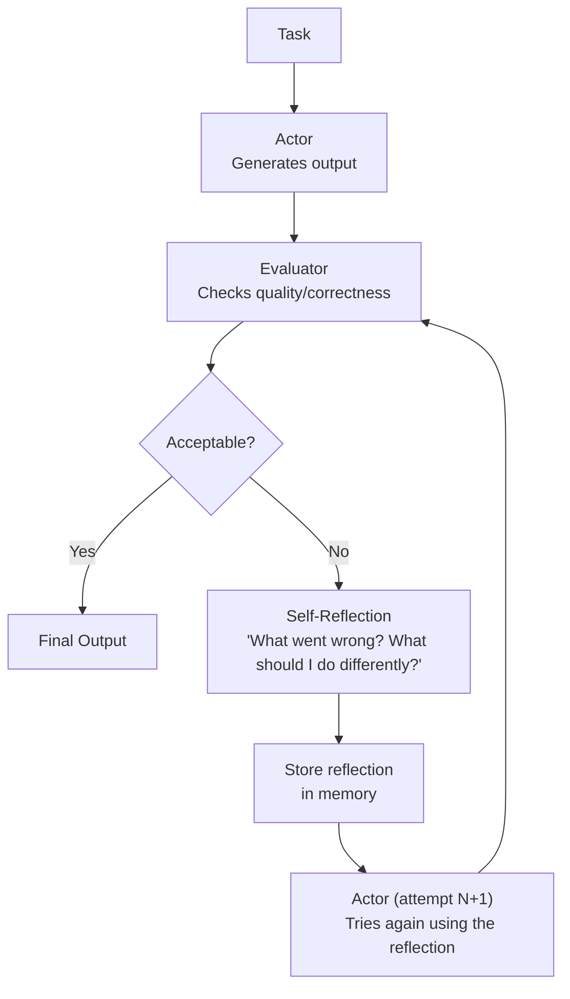

# Reflection and Self-Correction — Theory

You've just written a 5-paragraph essay for your English class.

You read it back and something feels off. "Wait — this paragraph doesn't actually support my thesis. It's going in a completely different direction." You rewrite it. Better. You read it again. "The introduction is weak. Let me make it stronger." You fix that too.

You didn't just write and submit. You wrote, then critiqued your own work, then improved it. That self-correction loop is what separates a good essay from a great one.

AI agents can do the same thing. They generate output, evaluate it, find the problems, and fix them — automatically.

👉 This is why we need **Reflection and Self-Correction** — it lets agents improve their own outputs through iterative critique, just like a thoughtful human would.

---

## What Is Reflection?

Reflection is when the agent steps back from its own output and asks: "Is this correct? Is this the best I can do?"

It's a second LLM call (or a second pass) that acts as a **critic**. The critic reads the output and identifies problems. Then the agent fixes those problems.

The loop:
1. **Generate** — produce an initial output
2. **Critique** — evaluate the output for errors, gaps, or quality issues
3. **Revise** — fix the identified problems
4. **Repeat** — run until the output meets a quality bar or a max iteration limit

---

## Self-Critique Prompting

The simplest form. Ask the same model to critique its own output:

```
[Original output]

Now review your response above. Identify:
1. Any factual errors
2. Any logical gaps
3. Any parts that could be improved

Then rewrite an improved version.
```

This single-prompt technique surprisingly works well. The model often catches its own mistakes when explicitly asked to look for them.

---

## The Reflexion Framework

Reflexion (from a 2023 paper) formalizes this into three components:

1. **Actor** — the agent that produces actions and outputs
2. **Evaluator** — judges the quality of the actor's output (could be another LLM, a function, or a test runner)
3. **Self-Reflection** — based on the evaluator's feedback, the actor generates a verbal self-critique that gets stored in memory

The key insight: the self-reflection is stored and used in the next attempt. The agent doesn't just "try again" — it tries again with its own analysis of what went wrong.



---

## Why Iterative Refinement Improves Quality

One LLM pass is good. Three passes with self-correction are better.

Here's why: generating output and evaluating output are different skills. Even for humans, writing and editing are separate modes of thinking. A first draft uses generative thinking. Editing uses critical thinking.

By explicitly separating these phases — generate, then critique — you get both modes working on the problem.

The evaluator can be:
- **The same LLM** asked to critique (zero-shot reflection)
- **A different LLM** with a specific critic persona
- **A code test runner** — run the code and use test failures as the evaluation signal
- **A human** — human-in-the-loop for high-stakes outputs

---

## The "Check Your Work" Loop for Code

Code generation is where reflection really shines. The evaluator is objective: does the code run? Do the tests pass?

```
Agent writes code → Run the code → Tests fail → Agent reads error →
Agent reflects: "I forgot to handle the None case" → Agent rewrites code →
Tests pass → Done
```

The test failures are automatic, precise feedback. No vague critique needed. The agent either passes the tests or it doesn't.

---

## A Concrete Example: Essay Writing with Reflection

**Without reflection:**
```
Prompt: Write a short argument for remote work.
Output: [First draft, possibly weak thesis, some unsupported claims]
```

**With reflection:**
```
Prompt: Write a short argument for remote work.
Draft 1: [First draft]

Critique: "The thesis is vague. The second paragraph doesn't cite any evidence.
The conclusion just repeats the introduction."

Draft 2: [Stronger thesis, statistics added, new conclusion written]

Critique: "Much better. The structure is clear. Minor: the transition between
paragraphs 2 and 3 is abrupt."

Draft 3: [Improved transitions, polished]

Critique: "This is strong. No significant issues."
Final: [Draft 3]
```

Three passes. Each better than the last.

---

## When Self-Correction Helps Most

| Task Type | Benefit of Reflection | Why |
|---|---|---|
| Code generation | Very high | Tests provide exact, objective feedback |
| Factual writing | High | Catches hallucinations and unsupported claims |
| Structured output (JSON, SQL) | High | Validates format, fixes syntax errors |
| Creative writing | Medium | Subjective — quality depends on criteria |
| Simple Q&A | Low | Not worth the extra cost for simple tasks |

---

✅ **What you just learned:** Reflection lets agents critique and improve their own outputs — generate → critique → revise → repeat — making outputs more accurate, better structured, and less error-prone.

🔨 **Build this now:** Write a paragraph explaining a technical topic you know. Then write 3 specific critique questions about it. Answer those critiques and write an improved paragraph. That's the reflection loop — you just ran it manually.

➡️ **Next step:** Multi-Agent Systems → `/Users/1065696/Github/AI/10_AI_Agents/07_Multi_Agent_Systems/Theory.md`

---

## 📂 Navigation

**In this folder:**
| File | |
|---|---|
| 📄 **Theory.md** | ← you are here |
| [📄 Cheatsheet.md](./Cheatsheet.md) | Quick reference |
| [📄 Interview_QA.md](./Interview_QA.md) | Interview prep |
| [📄 Code_Example.md](./Code_Example.md) | Python code examples |

⬅️ **Prev:** [05 Planning and Reasoning](../05_Planning_and_Reasoning/Theory.md) &nbsp;&nbsp;&nbsp; ➡️ **Next:** [07 Multi-Agent Systems](../07_Multi_Agent_Systems/Theory.md)
