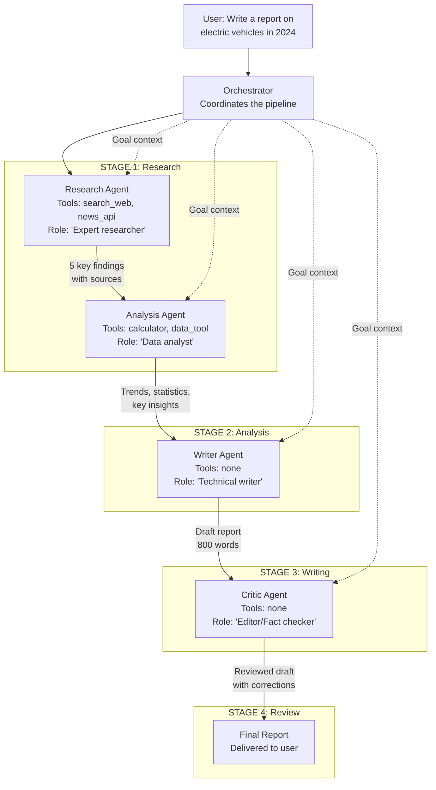
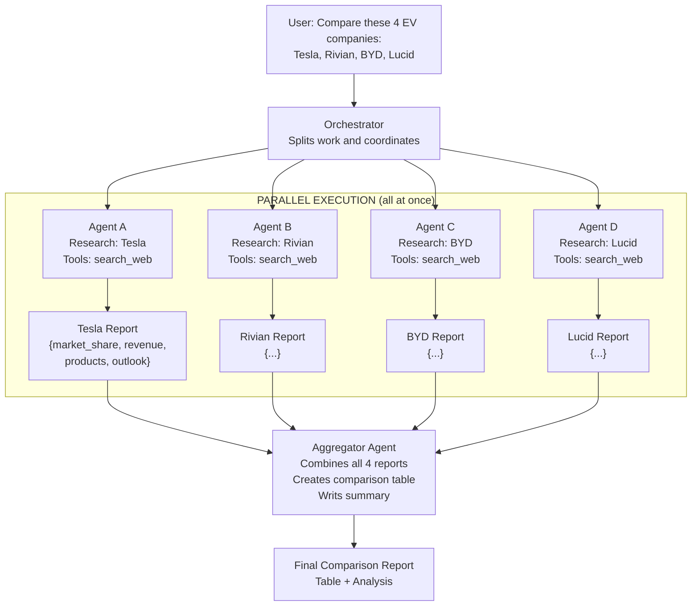
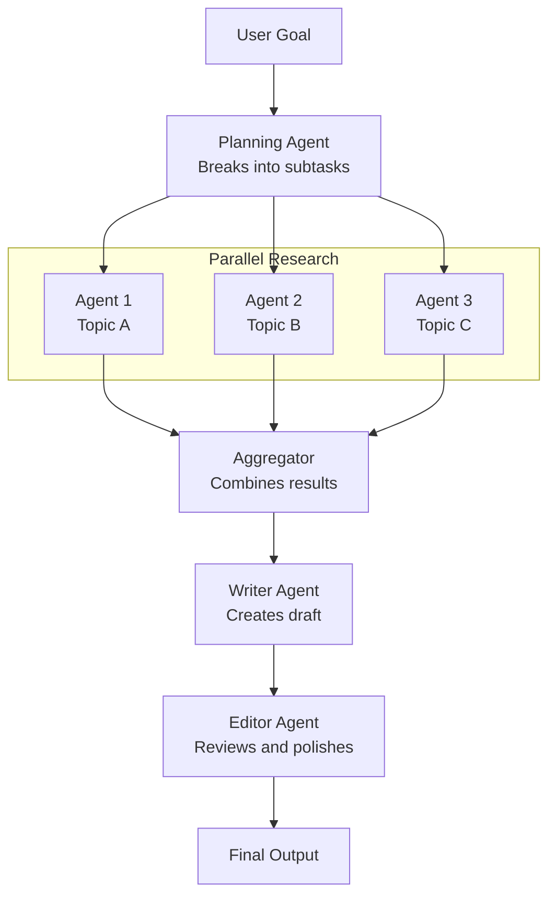

# Multi-Agent Systems — Architecture Deep Dive

Two architecture patterns: sequential (pipeline) and parallel. Both with full Mermaid diagrams.

---

## Pattern 1: Sequential Multi-Agent Pipeline

Agents work in stages. Each agent's output feeds the next agent's input.

### Example: Research Report Pipeline



### How It Works

Each agent receives:
1. Its own role and instructions (system prompt)
2. The outputs from all previous stages (context)
3. Its specific task for this stage

```python
# CrewAI sequential pipeline
from crewai import Agent, Task, Crew, Process

# Define specialist agents
researcher = Agent(
    role="Senior Research Analyst",
    goal="Find accurate, up-to-date information on the assigned topic",
    backstory="Expert at sourcing credible data and synthesizing research findings",
    tools=[search_tool, news_api_tool],
    verbose=True
)

analyst = Agent(
    role="Data Analyst",
    goal="Extract key trends and insights from research data",
    backstory="Specialist in identifying patterns and quantifying trends",
    tools=[calculator_tool],
    verbose=True
)

writer = Agent(
    role="Technical Writer",
    goal="Transform research and analysis into clear, engaging reports",
    backstory="Expert at making complex topics accessible to general audiences",
    verbose=True
)

critic = Agent(
    role="Editor",
    goal="Review for accuracy, clarity, and completeness",
    backstory="Senior editor with expertise in fact-checking and improving writing",
    verbose=True
)

# Define tasks with context chaining
research_task = Task(
    description="Research the current state of electric vehicles in 2024. Find: market share, top manufacturers, key trends, and adoption statistics.",
    expected_output="A list of 5-7 key findings with supporting data and source URLs.",
    agent=researcher
)

analysis_task = Task(
    description="Analyze the research findings. Identify the top 3 trends, calculate growth rates where possible, and highlight the most significant data points.",
    expected_output="A structured analysis with 3 trends, key statistics, and a brief conclusion.",
    agent=analyst,
    context=[research_task]  # This agent sees research_task's output
)

writing_task = Task(
    description="Write an 800-word report on electric vehicles in 2024 based on the research and analysis. Include: introduction, market overview, key trends, future outlook, conclusion.",
    expected_output="A complete 800-word report in markdown format.",
    agent=writer,
    context=[research_task, analysis_task]  # Sees both previous outputs
)

review_task = Task(
    description="Review the draft report. Check for: factual accuracy, logical flow, clarity, and completeness. Make specific corrections.",
    expected_output="The corrected and improved final report.",
    agent=critic,
    context=[writing_task]
)

# Assemble the crew
crew = Crew(
    agents=[researcher, analyst, writer, critic],
    tasks=[research_task, analysis_task, writing_task, review_task],
    process=Process.sequential,
    verbose=True
)

result = crew.kickoff()
print(result)
```

---

## Pattern 2: Parallel Multi-Agent System

Multiple agents work simultaneously on independent sub-tasks. An aggregator combines the results.

### Example: Market Research — 4 Companies in Parallel



### How It Works

```python
import asyncio
from langchain_openai import ChatOpenAI
from langchain.schema import HumanMessage, SystemMessage

llm = ChatOpenAI(model="gpt-4o", temperature=0)

async def research_company(company_name: str) -> dict:
    """One async agent researching one company."""
    # In production: use actual search tools
    response = await llm.ainvoke([
        SystemMessage(content="You are a financial research analyst. Be factual and concise."),
        HumanMessage(content=f"""Research {company_name} as an electric vehicle company.
        Provide a structured report with these exact fields:
        - Company: {company_name}
        - Founded: [year]
        - Market Position: [1-2 sentences]
        - Key Products: [list of 2-3 main products]
        - 2024 Revenue Estimate: [figure or 'private']
        - Key Strength: [1 sentence]
        - Key Risk: [1 sentence]
        """)
    ])
    return {"company": company_name, "report": response.content}


async def run_parallel_research(companies: list[str]) -> list[dict]:
    """Run all company research agents simultaneously."""
    tasks = [research_company(company) for company in companies]
    results = await asyncio.gather(*tasks)
    return list(results)


def aggregate_results(company_reports: list[dict]) -> str:
    """Combine all company reports into a comparison."""
    combined = "\n\n---\n\n".join(
        f"### {r['company']}\n{r['report']}"
        for r in company_reports
    )

    response = llm.invoke([
        SystemMessage(content="You are an industry analyst. Write clear, structured comparisons."),
        HumanMessage(content=f"""Based on these research reports:

{combined}

Create:
1. A comparison table (company, market position, key product, main strength, main risk)
2. A 200-word summary highlighting the most important differences and trends
""")
    ])
    return response.content


# Run the parallel system
async def main():
    companies = ["Tesla", "Rivian", "BYD", "Lucid Motors"]

    print("Running parallel research on all companies simultaneously...")
    # All 4 agents run at the same time
    reports = await run_parallel_research(companies)
    print(f"Collected {len(reports)} company reports")

    print("\nAggregating results...")
    final_report = aggregate_results(reports)
    print("\nFINAL COMPARISON REPORT:")
    print(final_report)


asyncio.run(main())
```

### Timing Comparison

```
Sequential approach (one agent, 4 companies):
  Tesla research:  ~8 seconds
  Rivian research: ~8 seconds
  BYD research:    ~8 seconds
  Lucid research:  ~8 seconds
  Total:           ~32 seconds

Parallel approach (4 agents, all at once):
  All 4 companies: ~8 seconds (they run simultaneously)
  Aggregation:     ~5 seconds
  Total:           ~13 seconds

4x faster for the research phase.
```

---

## Choosing Between Sequential and Parallel

| Situation | Pattern | Reason |
|---|---|---|
| Step B requires Step A's output | Sequential | Data dependency |
| 5 independent research topics | Parallel | No dependency, 5x speedup |
| Write after researching | Sequential | Writing needs the research |
| Compare multiple options | Parallel (research) + Sequential (comparison) | Independent data gathering, then synthesis |
| Complex multi-stage workflow | Hybrid | Different stages use different patterns |

---

## Hybrid Architecture (Most Common in Production)

Real systems combine both:



Parallel where independent. Sequential where dependent. This is how production multi-agent systems are actually built.

---

## 📂 Navigation

**In this folder:**
| File | |
|---|---|
| [📄 Theory.md](./Theory.md) | Core concepts |
| [📄 Cheatsheet.md](./Cheatsheet.md) | Quick reference |
| [📄 Interview_QA.md](./Interview_QA.md) | Interview prep |
| [📄 Code_Example.md](./Code_Example.md) | Python code examples |
| 📄 **Architecture_Deep_Dive.md** | ← you are here |

⬅️ **Prev:** [06 Reflection and Self-Correction](../06_Reflection_and_Self_Correction/Theory.md) &nbsp;&nbsp;&nbsp; ➡️ **Next:** [08 Agent Frameworks](../08_Agent_Frameworks/Theory.md)
