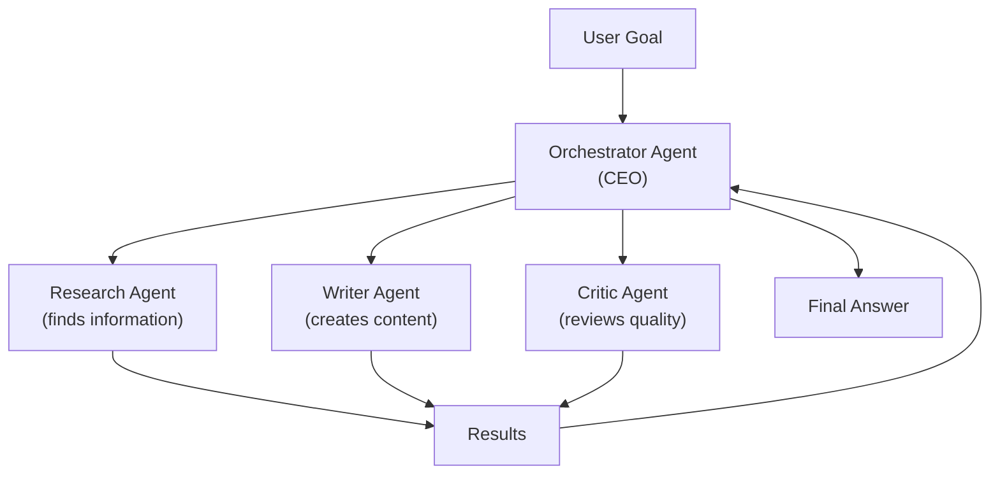
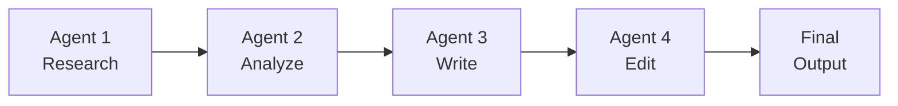
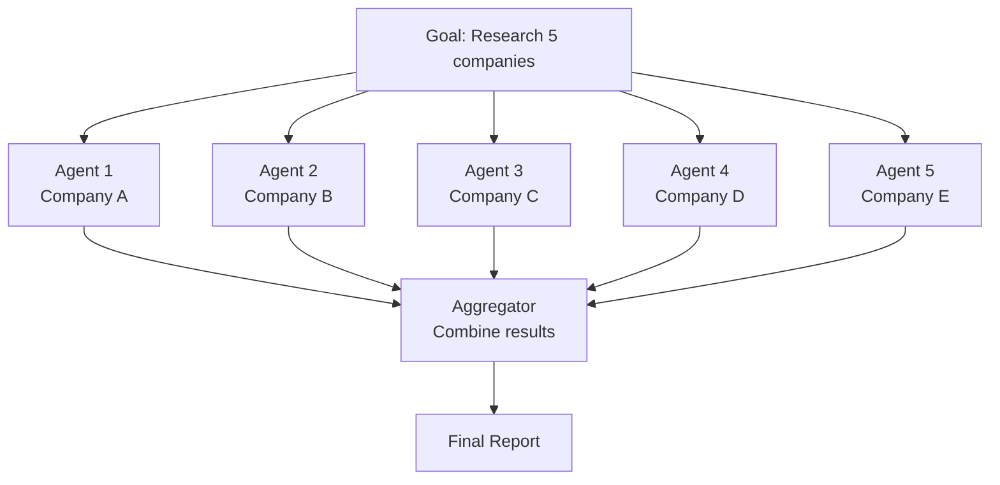

# Multi-Agent Systems — Theory

A fast-growing startup founder can't do everything alone. So they hire people: a developer, a designer, a marketer, an analyst. The CEO (orchestrator) breaks down goals, delegates to the right person, reviews results, and synthesizes everything. Each specialist focuses on what they're best at. The whole team accomplishes more than any single person could.

AI multi-agent systems work exactly the same way.

👉 This is why we need **Multi-Agent Systems** — they let specialized agents work in parallel, each excelling at their role, while an orchestrator coordinates the whole operation.

---

## 📌 Learning Priority

**Must Learn** — core concepts, needed to understand the rest of this file:
[The Three Patterns](#the-three-patterns) · [Why One Agent Fails](#why-one-agent-isnt-always-enough)

**Should Learn** — important for real projects and interviews:
[Inter-Agent Communication](#inter-agent-communication) · [CrewAI and AutoGen](#crewai-and-autogen)

**Good to Know** — useful in specific situations, not needed daily:
[Parallel Agents Pattern](#pattern-3-parallel-agents)

---

## Why One Agent Isn't Always Enough

A single agent faces fundamental limitations:
1. **Context overload** — handling a long complex task fills up its context window
2. **Role confusion** — trying to be a researcher, writer, and critic simultaneously does all three worse
3. **No parallelism** — must do everything sequentially
4. **No specialization** — can't optimize simultaneously for different skills

---

## The Three Patterns

### Pattern 1: Orchestrator + Specialists

One orchestrator manages multiple specialists. The orchestrator understands the overall goal, decides which specialist to call for each sub-task, passes results between agents, and synthesizes the final output. Each specialist has a focused role with matching tools.

### Pattern 2: Pipeline (Sequential)

Agents work in a chain. Each passes its output to the next.

Use when: the work naturally flows in stages where each stage builds on the previous.

### Pattern 3: Parallel Agents

Multiple agents work simultaneously on different parts of the task.

5x faster than one agent doing them sequentially.

---

## Inter-Agent Communication

Agents communicate through:
1. **Shared memory** — a common store all agents can read/write
2. **Message passing** — agents send structured messages to each other
3. **Tool calls** — one agent calls another agent as a "tool"
4. **Shared queue** — a task queue that agents pull from

In CrewAI, this is handled automatically. In AutoGen, agents communicate through a managed conversation loop.

---

## CrewAI and AutoGen

**CrewAI** — define agents with roles, tools, and goals; define tasks; the framework handles who does what. Best for role-based workflows.

**AutoGen** — Microsoft's framework. Agents are "conversable" — they talk to each other through a group chat. Great for code generation and execution workflows.

---

✅ **What you just learned:** Multi-agent systems use an orchestrator to coordinate specialist agents — each focused on one role — working in sequence, parallel, or a mix, to accomplish complex tasks faster and better than a single agent.

🔨 **Build this now:** Design a multi-agent system to produce a research report. List: the agents you'd create (names + roles + tools), which pattern you'd use (orchestrator? pipeline?), and how results would flow from one agent to the next.

➡️ **Next step:** Agent Frameworks → `/Users/1065696/Github/AI/10_AI_Agents/08_Agent_Frameworks/Theory.md`

---

## 🛠️ Practice Project

Apply what you just learned → **[A4: Multi-Agent Research System](../../22_Capstone_Projects/14_Multi_Agent_Research_System/03_GUIDE.md)**
> This project uses: supervisor + 4 specialist workers (WebResearcher, DataAnalyst, Writer, FactChecker) running in parallel via LangGraph

---

## 📝 Practice Questions

- 📝 [Q66 · multi-agent-systems](../../ai_practice_questions_100.md#q66--design--multi-agent-systems)

---

## 📂 Navigation

**In this folder:**
| File | |
|---|---|
| 📄 **Theory.md** | ← you are here |
| [📄 Cheatsheet.md](./Cheatsheet.md) | Quick reference |
| [📄 Interview_QA.md](./Interview_QA.md) | Interview prep |
| [📄 Code_Example.md](./Code_Example.md) | Python code examples |
| [📄 Architecture_Deep_Dive.md](./Architecture_Deep_Dive.md) | Multi-agent architecture deep dive |

⬅️ **Prev:** [06 Reflection and Self-Correction](../06_Reflection_and_Self_Correction/Theory.md) &nbsp;&nbsp;&nbsp; ➡️ **Next:** [08 Agent Frameworks](../08_Agent_Frameworks/Theory.md)
