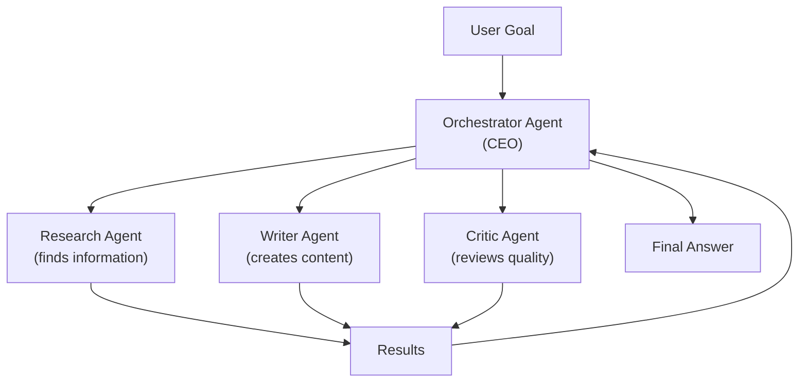

# Multi-Agent Systems — Theory

Picture a fast-growing startup.

The founder can't do everything alone. They're brilliant but there's only one of them. So they hire people. A developer who writes code all day. A designer who lives in Figma. A marketer who creates content. An analyst who lives in spreadsheets.

The CEO (orchestrator) doesn't do the actual work. They break down goals into pieces, delegate to the right person, review what comes back, and synthesize it all into results.

Each specialist focuses on what they're best at. The whole team accomplishes more than any single person could alone.

AI multi-agent systems work exactly the same way.

👉 This is why we need **Multi-Agent Systems** — they let specialized agents work in parallel, each excelling at their role, while an orchestrator coordinates the whole operation.

---

## Why One Agent Isn't Always Enough

A single agent faces fundamental limitations:

1. **Context overload** — one agent handling a long, complex task fills up its context window
2. **Role confusion** — an agent trying to be a researcher, writer, and critic simultaneously does all three worse
3. **No parallelism** — one agent must do everything sequentially
4. **No specialization** — you can't optimize one agent for coding and another for creative writing simultaneously

Multi-agent systems solve all of these.

---

## The Three Patterns

### Pattern 1: Orchestrator + Specialists

One orchestrator agent manages multiple specialist agents.

The orchestrator:
- Understands the overall goal
- Decides which specialist to call for each sub-task
- Passes results between agents
- Synthesizes the final output

Specialists each have:
- A focused role ("you are a Python expert" or "you are a research agent")
- Specific tools matching their role
- A narrow, well-defined job



---

### Pattern 2: Pipeline (Sequential)

Agents work in a chain. Each passes its output to the next.

```
Agent 1 (Research) → Agent 2 (Analyze) → Agent 3 (Write) → Agent 4 (Edit) → Final
```

Clean and predictable. Each agent handles one stage of a larger workflow.

Use when: the work naturally flows in stages where each stage builds on the previous.

---

### Pattern 3: Parallel Agents

Multiple agents work simultaneously on different parts of the task.

```
Goal: Research 5 AI companies
Agent 1 → Research Company A ─────────────────────┐
Agent 2 → Research Company B ─────────────────────┤
Agent 3 → Research Company C ─────────────────────┼──► Aggregator → Final report
Agent 4 → Research Company D ─────────────────────┤
Agent 5 → Research Company E ─────────────────────┘
```

5x faster than one agent doing them sequentially. Crucial for tasks that can be parallelized.

---

## The Startup Analogy in Detail

| Startup Role | Multi-Agent Equivalent |
|---|---|
| CEO | Orchestrator agent |
| Developer | Code-writing specialist agent |
| Designer | Visual/UI specialist agent |
| Marketer | Content/copy specialist agent |
| Analyst | Data analysis specialist agent |
| Project Manager | Task tracker component |
| Slack/Email | Inter-agent communication |

Each specialist has their own context, tools, and role. The CEO coordinates without doing every task.

---

## Inter-Agent Communication

Agents communicate through:

1. **Shared memory** — a common store that all agents can read from and write to
2. **Message passing** — agents send structured messages to each other
3. **Tool calls** — one agent calls another agent as a "tool"
4. **Shared queue** — a task queue that agents pull from

In frameworks like CrewAI, this is handled automatically. In AutoGen, agents communicate through a managed conversation loop.

---

## CrewAI and AutoGen

**CrewAI** — think of it as a crew of specialized workers. You define agents with roles, tools, and goals. You define tasks. The framework handles who does what.

**AutoGen** — Microsoft's framework. Agents are "conversable" — they can talk to each other through a group chat. Great for code generation and execution workflows.

---

✅ **What you just learned:** Multi-agent systems use an orchestrator to coordinate specialist agents — each focused on one role — working in sequence, parallel, or a mix, to accomplish complex tasks faster and better than a single agent.

🔨 **Build this now:** Design a multi-agent system to produce a research report. List: the agents you'd create (names + roles + tools), which pattern you'd use (orchestrator? pipeline?), and how results would flow from one agent to the next.

➡️ **Next step:** Agent Frameworks → `/Users/1065696/Github/AI/10_AI_Agents/08_Agent_Frameworks/Theory.md`

---

## 📂 Navigation

**In this folder:**
| File | |
|---|---|
| 📄 **Theory.md** | ← you are here |
| [📄 Cheatsheet.md](./Cheatsheet.md) | Quick reference |
| [📄 Interview_QA.md](./Interview_QA.md) | Interview prep |
| [📄 Code_Example.md](./Code_Example.md) | Python code examples |
| [📄 Architecture_Deep_Dive.md](./Architecture_Deep_Dive.md) | Multi-agent architecture deep dive |

⬅️ **Prev:** [06 Reflection and Self-Correction](../06_Reflection_and_Self_Correction/Theory.md) &nbsp;&nbsp;&nbsp; ➡️ **Next:** [08 Agent Frameworks](../08_Agent_Frameworks/Theory.md)
