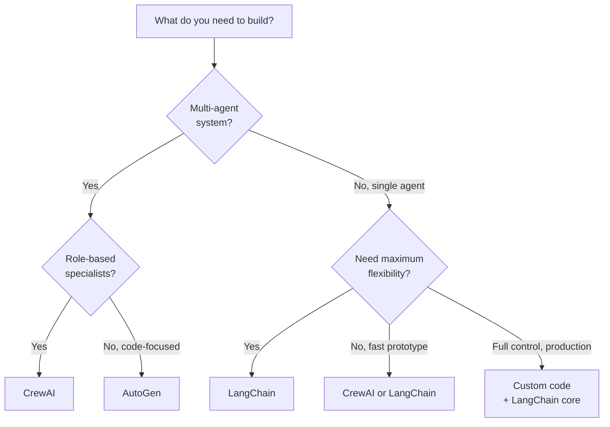

# Agent Frameworks — Theory

Building a house: you could mix cement by hand and hammer every nail one at a time — or use a cement mixer, a miter saw, and a nail gun. Same work, but the power tools handle the repetitive error-prone parts so you can focus on the design and structure.

Agent frameworks are the power tools for building AI agents — they handle the agent loop, tool routing, memory management, prompt formatting, and error handling.

👉 This is why we need **Agent Frameworks** — they abstract away the plumbing so you can build faster, with fewer bugs, and focus on your agent's actual purpose.

---

## Why Frameworks Exist

Without a framework, building an agent means:
- Writing the prompt template for the agent loop manually
- Parsing the LLM output to detect tool calls
- Calling the tools yourself
- Appending tool output back to the prompt
- Looping until "Final Answer"
- Handling errors when the LLM outputs malformed tool calls
- Managing conversation history

That's hundreds of lines of boilerplate. Frameworks do it for you.

---

## The Tradeoffs: Convenience vs Control

```
More convenient ────────────────────── More control

CrewAI          LangChain      Custom code
(highest        (balanced)     (full control
 convenience)                   most work)
```

- **High convenience (CrewAI):** works in minutes, less flexible, abstractions hide what's happening
- **Balanced (LangChain):** more verbose but more flexible, can see and modify most of what happens, huge ecosystem
- **Custom code:** full control, weeks to build properly, only for production systems with very specific requirements

---

## The Three Major Frameworks

### LangChain

The most widely used framework. Covers everything: chains, agents, memory, tools, RAG.

Core concepts:
- **Chains** — sequences of LLM calls
- **Agents** — LLMs with tool access and a reasoning loop
- **Memory** — conversation history management
- **Tools** — searchable, pluggable functions
- **LCEL** — LangChain Expression Language for composing chains

Best for: learning, prototyping, production systems that need maximum flexibility.

### CrewAI

Built specifically for multi-agent systems. Simpler and more opinionated than LangChain.

Core concepts:
- **Agent** — a role-based specialist with a goal and tools
- **Task** — a specific piece of work with a description and expected output
- **Crew** — a team of agents with a set of tasks
- **Process** — sequential or hierarchical execution order

Best for: multi-agent workflows, content production, research pipelines.

### AutoGen (Microsoft)

Built around conversational agents that can execute code.

Core concepts:
- **ConversableAgent** — any agent that can send and receive messages
- **UserProxyAgent** — represents the user, can execute code
- **AssistantAgent** — the LLM-powered agent
- **GroupChat** — manages multi-agent conversations

Best for: code generation and debugging workflows, iterative agent conversations.

---

## Choosing a Framework

| If you need... | Use |
|---|---|
| Learning or prototyping | LangChain or CrewAI |
| Role-based multi-agent pipelines | CrewAI |
| Code generation + execution | AutoGen |
| Maximum flexibility | LangChain |
| Simple single agent with tools | LangChain |
| Custom workflow logic | LangChain + custom code |



---

✅ **What you just learned:** Agent frameworks handle the agent loop, tool routing, and memory management so you can focus on what your agent does — LangChain is the most flexible, CrewAI is best for role-based multi-agent, and AutoGen excels at code execution workflows.

🔨 **Build this now:** Look at the framework comparison table. For the project idea you have in mind (or pick one: customer support bot, research assistant, code helper), which framework would you choose? Write 3 reasons why.

➡️ **Next step:** Build an Agent → `/Users/1065696/Github/AI/10_AI_Agents/09_Build_an_Agent/Project_Guide.md`

---

## 📂 Navigation

**In this folder:**
| File | |
|---|---|
| 📄 **Theory.md** | ← you are here |
| [📄 Cheatsheet.md](./Cheatsheet.md) | Quick reference |
| [📄 Interview_QA.md](./Interview_QA.md) | Interview prep |
| [📄 Comparison.md](./Comparison.md) | Framework comparison |
| [📄 LangChain_Guide.md](./LangChain_Guide.md) | LangChain guide |
| [📄 AutoGen_Guide.md](./AutoGen_Guide.md) | AutoGen guide |
| [📄 CrewAI_Guide.md](./CrewAI_Guide.md) | CrewAI guide |

⬅️ **Prev:** [07 Multi-Agent Systems](../07_Multi_Agent_Systems/Theory.md) &nbsp;&nbsp;&nbsp; ➡️ **Next:** [09 Build an Agent](../09_Build_an_Agent/Project_Guide.md)
