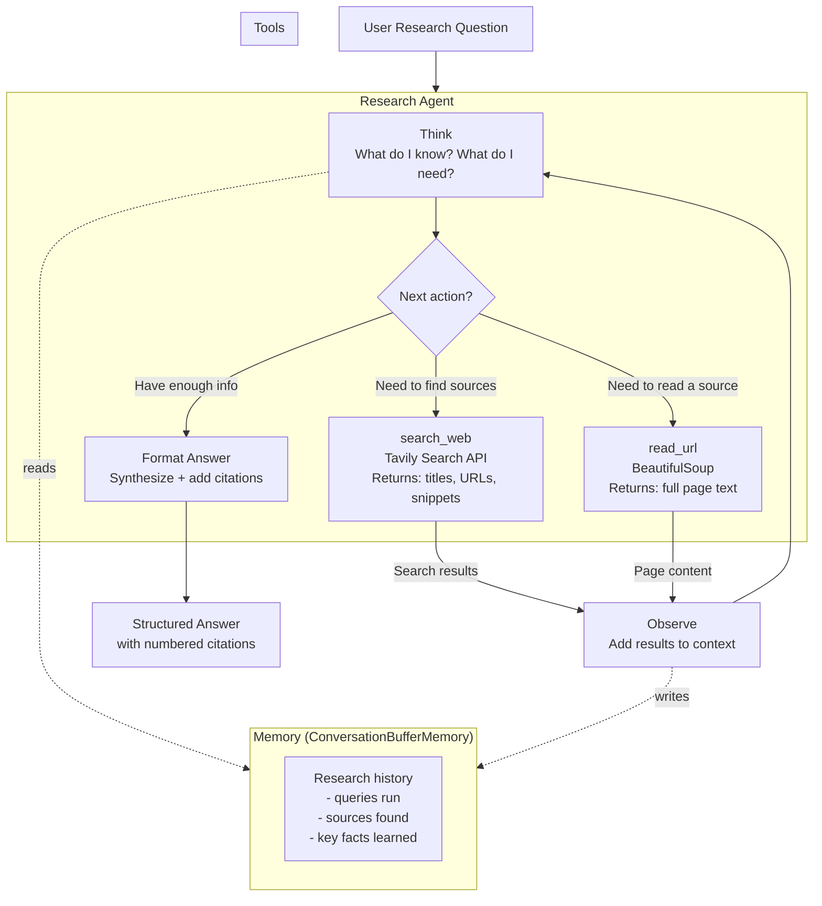

# Research Agent — Architecture Blueprint

Full system diagram and component breakdown.

---

## System Overview Diagram



---

## Component Breakdown

### 1. The User Query

Input: any research question.

```python
question = "What are the main differences between LangChain and LlamaIndex?"
```

The agent receives this and begins its research loop.

---

### 2. The Agent Loop (ReAct)

The core loop follows the ReAct pattern:

```
Thought: I need to understand the question and plan my research.
Thought: I'll start by searching for a comparison of LangChain vs LlamaIndex.
Action: search_web("LangChain vs LlamaIndex comparison 2024")
Observation: [search results with titles, URLs, snippets]

Thought: I see some results. Let me also look for specific use cases.
Action: search_web("when to use LangChain vs LlamaIndex")
Observation: [more results]

Thought: The snippet for [URL] seems detailed. Let me read the full article.
Action: read_url("https://example.com/langchain-vs-llamaindex")
Observation: [full article text]

Thought: I now have enough information to write a comprehensive comparison.
Action: [format and return the final answer]
```

---

### 3. The Search Tool

Uses Tavily's search API, which is designed for agent use (returns clean, structured results).

```python
# Returns: list of {title, url, content snippet} for top N results
search_results = tavily.search("LangChain vs LlamaIndex", max_results=5)
```

Input: search query string
Output: formatted string with titles, URLs, and key snippets

---

### 4. The Read URL Tool

Fetches a webpage and extracts the main text content.

```python
# Returns: clean text content of the page (no HTML noise)
page_text = read_url("https://example.com/article")
```

Input: URL string
Output: plain text content (truncated to fit context window)

---

### 5. Memory

Conversation buffer memory keeps all the research context in the prompt.

This lets the agent:
- See all previous search queries (won't repeat the same search)
- Reference facts found in earlier tool calls
- Build a coherent synthesis at the end

---

### 6. Output Formatter

After the research phase, the agent produces a structured answer:

```
# [Topic Title]

## Summary
[2-3 sentence overview]

## Key Points
1. [Finding 1]
2. [Finding 2]
3. [Finding 3]

## Detailed Comparison
[More detailed explanation]

## Sources
[1] Title of Source — URL
[2] Title of Source — URL
```

---

## Data Flow

```
User Question
     ↓
[Agent reads question + memory]
     ↓
[Thinks: what do I need to know?]
     ↓
[Calls search_web] → [Gets 5 search results with snippets]
     ↓
[Thinks: which result is most useful to read fully?]
     ↓
[Calls read_url on the best result] → [Gets full article text]
     ↓
[Thinks: do I need more information?]
     ↓
[Maybe: calls search_web again with more specific query]
     ↓
[Thinks: I have enough information to answer]
     ↓
[Formats answer with citations]
     ↓
Structured Answer → User
```

---

## What Goes Into the Agent's Context Each Loop

```
[System Prompt]
You are a research assistant. Your job is to answer research questions
accurately using web search and URL reading tools.

Available tools:
- search_web(query): search for information
- read_url(url): read the full content of a webpage

[Memory: conversation so far]
User: What are the differences between LangChain and LlamaIndex?
Thought: I'll search for a comparison.
Action: search_web("LangChain vs LlamaIndex")
Observation: [search results]
Thought: Let me read the most relevant article.
Action: read_url("...")
Observation: [article content]

[Current question to the LLM]
What should I do next to best answer the user's question?
```

The LLM sees all of this on every iteration. This is the agent's "working memory."

---

## Error Handling

The agent handles failures at each layer:

| Failure | Handling |
|---|---|
| Search returns no results | Try a different, broader search term |
| URL reading fails (403, timeout) | Skip this URL, try the next one from search results |
| Answer is too vague | Run one more targeted search before formatting |
| Context too long | Memory uses buffer window — drops oldest turns |

---

## 📂 Navigation

**In this folder:**
| File | |
|---|---|
| 📄 **Architecture_Blueprint.md** | ← you are here |
| [📄 Project_Guide.md](./Project_Guide.md) | Project overview |
| [📄 Step_by_Step.md](./Step_by_Step.md) | Step-by-step build guide |
| [📄 Troubleshooting.md](./Troubleshooting.md) | Common issues and fixes |

⬅️ **Prev:** [08 Agent Frameworks](../08_Agent_Frameworks/Theory.md) &nbsp;&nbsp;&nbsp; ➡️ **Next:** [01 MCP Fundamentals](../../11_MCP_Model_Context_Protocol/01_MCP_Fundamentals/Theory.md)
