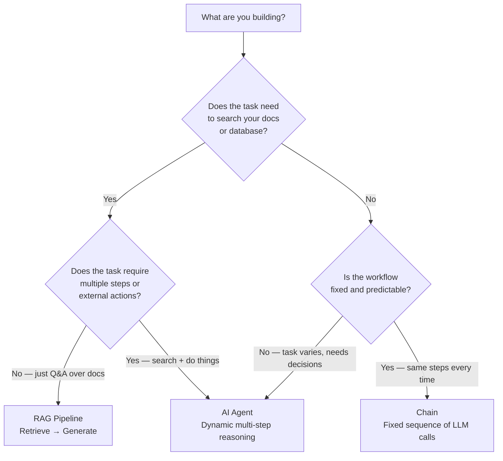

# Agent vs Chain vs RAG — When to Use What

You're building something with an LLM. But which pattern do you actually need?

This page helps you decide fast.

---

## Plain English Explanation

### What is a Chain?

A **chain** is a fixed sequence of LLM calls.

You design the steps ahead of time. The LLM follows them in order. No detours. No decisions.

> User asks a question → Step 1: clean the question → Step 2: call LLM → Step 3: format the answer → Done.

Think of it like an assembly line. Every product goes through the same steps in the same order.

**Use it when:** the process is predictable and you control every step.

---

### What is a RAG Pipeline?

**RAG** (Retrieval-Augmented Generation) is a chain with a retrieval step built in.

> User asks a question → search your documents for relevant chunks → stuff them into the prompt → LLM answers using that context.

The LLM is still passive. It doesn't choose what to search. It doesn't decide to look again. You do the retrieval, you hand it the context.

**Use it when:** the LLM needs access to your private knowledge base (docs, PDFs, databases) to answer accurately.

---

### What is an Agent?

An **agent** is an LLM that decides what to do next.

It has access to tools (search, code execution, APIs). It reasons about which tool to use, uses it, sees the result, and decides what to do next. It loops until the goal is complete.

> User asks "book me a flight to Paris on Friday" → Agent checks calendar → Agent searches flights → Agent compares prices → Agent confirms booking → Agent reports back.

The LLM is now the decision-maker, not just the responder.

**Use it when:** the task requires multiple steps, external actions, or decisions you can't predict in advance.

---

## The Comparison Table

| Feature | Chain | RAG Pipeline | Agent |
|---|---|---|---|
| **What it does** | Fixed sequence of steps | Retrieve → Generate | Dynamic: think → act → observe → repeat |
| **LLM role** | Follows your script | Generates from retrieved context | Decides what to do next |
| **Can use tools?** | No (just LLM calls) | One tool: retrieval | Yes — many tools, chosen dynamically |
| **Can change direction?** | No | No | Yes |
| **Memory** | None (unless you add it) | None (unless you add it) | Built into the loop |
| **Predictability** | High | High | Lower — it makes its own choices |
| **Complexity** | Low | Medium | High |
| **Cost** | Low | Medium | Higher (more LLM calls) |
| **Best for** | Structured workflows | Q&A over documents | Open-ended tasks, research, automation |
| **Example** | Summarize this document | "What does our policy say about refunds?" | "Research and book a flight" |

---

## Decision Flowchart

Use this to pick the right pattern for your use case:



---

## Quick Decision Guide

**Use a Chain when:**
- You know every step upfront
- The process is the same every time
- You want maximum predictability and speed
- Example: document classification pipeline, email formatter

**Use a RAG Pipeline when:**
- You have a knowledge base (docs, PDFs, wiki)
- Users ask questions that need your private information
- You don't need the LLM to take actions
- Example: internal FAQ bot, policy assistant, customer support

**Use an Agent when:**
- The task has multiple steps you can't fully predict
- The LLM needs to use tools (search, code, APIs, databases)
- The task requires decisions along the way
- You need real-world actions (booking, sending, creating)
- Example: research assistant, coding agent, workflow automation

---

## The Spectrum

These patterns exist on a spectrum from simple to powerful:

```
Chain ─────────────── RAG ─────────────── Agent
(predictable)    (knowledge-aware)     (autonomous)
(fast, cheap)    (moderate cost)       (powerful, costlier)
(low risk)       (low-medium risk)     (needs guardrails)
```

You don't always need an agent. Chains and RAG pipelines are often the right answer.

Only reach for agents when you genuinely need dynamic decision-making and tool use.

---

## 📂 Navigation

**In this folder:**
| File | |
|---|---|
| [📄 Readme.md](./Readme.md) | Section overview |
| 📄 **Agent_vs_Chain_vs_RAG.md** | ← you are here |

⬅️ **Prev:** [09 Build a RAG App](../09_RAG_Systems/09_Build_a_RAG_App/Project_Guide.md) &nbsp;&nbsp;&nbsp; ➡️ **Next:** [01 Agent Fundamentals](./01_Agent_Fundamentals/Theory.md)

---

## Real Examples

| Scenario | Best Pattern | Why |
|---|---|---|
| Summarize customer reviews | Chain | Fixed steps, no tools needed |
| Answer questions about your product manual | RAG | Needs your docs, no actions needed |
| Book a meeting based on email request | Agent | Needs calendar API, email parsing, decision-making |
| Generate SQL from natural language | Chain | Predictable input → output |
| Answer "what's our refund rate this month?" | RAG + Agent | Needs docs AND database query tool |
| Write, test, and fix code automatically | Agent | Multi-step, needs code execution tool |
| Translate a document | Chain | Simple, fixed, no tools needed |
| Research a topic and write a report | Agent | Needs web search, multi-step, adaptive |

---

## The Rule of Thumb

> Start with the simplest pattern that works.
> Chains are fastest and cheapest. RAG adds knowledge. Agents add autonomy.
> Only add complexity when you need it.
