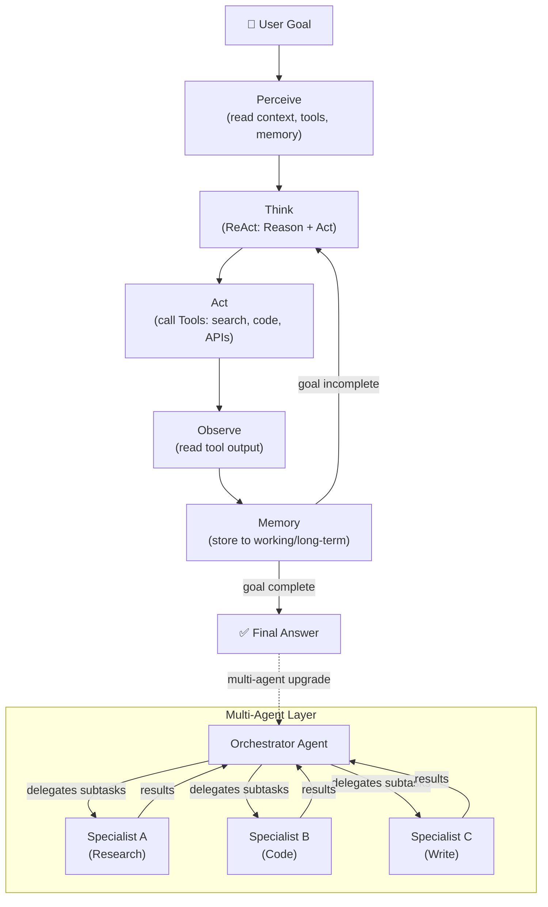

# 🤖 10 — AI Agents

⬅️ [09 RAG Systems](../09_RAG_Systems/Readme.md) &nbsp;|&nbsp; [🏠 Home](../00_Learning_Guide/Readme.md) &nbsp;|&nbsp; [11 MCP Protocol ➡️](../11_MCP_Model_Context_Protocol/Readme.md)

> Agents don't just answer — they act, observe, and loop until the job is done.

**[▶ Start here → Agent Fundamentals Theory](./01_Agent_Fundamentals/Theory.md)**

---

## At a Glance

| | |
|---|---|
| 📚 Topics | 9 topics |
| ⏱️ Est. Time | 8–10 hours |
| 📋 Prerequisites | [09 RAG Systems](../09_RAG_Systems/Readme.md) |
| 🔓 Unlocks | [11 MCP Protocol](../11_MCP_Model_Context_Protocol/Readme.md) |

---

## What's in This Section

---

## Topics

| # | Topic | What You'll Learn | Files |
|---|---|---|---|
| 01 | [Agent Fundamentals](./01_Agent_Fundamentals/) | What makes something an agent vs a chain vs a chatbot — the loop, the goal, the autonomy | [📖 Theory](./01_Agent_Fundamentals/Theory.md) · [⚡ Cheatsheet](./01_Agent_Fundamentals/Cheatsheet.md) · [🎯 Interview Q&A](./01_Agent_Fundamentals/Interview_QA.md) · [🧠 Mental Model](./01_Agent_Fundamentals/Mental_Model.md) |
| 02 | [ReAct Pattern](./02_ReAct_Pattern/) | The core reasoning loop — Reason, Act, Observe — that drives every modern agent | [📖 Theory](./02_ReAct_Pattern/Theory.md) · [⚡ Cheatsheet](./02_ReAct_Pattern/Cheatsheet.md) · [🎯 Interview Q&A](./02_ReAct_Pattern/Interview_QA.md) · [💻 Code](./02_ReAct_Pattern/Code_Example.md) |
| 03 | [Tool Use](./03_Tool_Use/) | How agents call functions, APIs, and external services — and how to build custom tools | [📖 Theory](./03_Tool_Use/Theory.md) · [⚡ Cheatsheet](./03_Tool_Use/Cheatsheet.md) · [🎯 Interview Q&A](./03_Tool_Use/Interview_QA.md) · [💻 Code](./03_Tool_Use/Code_Example.md) · [🔧 Building Tools](./03_Tool_Use/Building_Custom_Tools.md) |
| 04 | [Agent Memory](./04_Agent_Memory/) | Working memory, episodic memory, semantic memory — and when to use each | [📖 Theory](./04_Agent_Memory/Theory.md) · [⚡ Cheatsheet](./04_Agent_Memory/Cheatsheet.md) · [🎯 Interview Q&A](./04_Agent_Memory/Interview_QA.md) · [💻 Code](./04_Agent_Memory/Code_Example.md) · [⚖️ Comparison](./04_Agent_Memory/Comparison.md) |
| 05 | [Planning & Reasoning](./05_Planning_and_Reasoning/) | Task decomposition, chain-of-thought, tree-of-thought — how agents break big goals into steps | [📖 Theory](./05_Planning_and_Reasoning/Theory.md) · [⚡ Cheatsheet](./05_Planning_and_Reasoning/Cheatsheet.md) · [🎯 Interview Q&A](./05_Planning_and_Reasoning/Interview_QA.md) · [🏗️ Deep Dive](./05_Planning_and_Reasoning/Architecture_Deep_Dive.md) |
| 06 | [Reflection & Self-Correction](./06_Reflection_and_Self_Correction/) | Agents that critique and revise their own outputs before returning an answer | [📖 Theory](./06_Reflection_and_Self_Correction/Theory.md) · [⚡ Cheatsheet](./06_Reflection_and_Self_Correction/Cheatsheet.md) · [🎯 Interview Q&A](./06_Reflection_and_Self_Correction/Interview_QA.md) · [💻 Code](./06_Reflection_and_Self_Correction/Code_Example.md) |
| 07 | [Multi-Agent Systems](./07_Multi_Agent_Systems/) | Orchestrators, specialists, shared state — how teams of agents divide and conquer | [📖 Theory](./07_Multi_Agent_Systems/Theory.md) · [⚡ Cheatsheet](./07_Multi_Agent_Systems/Cheatsheet.md) · [🎯 Interview Q&A](./07_Multi_Agent_Systems/Interview_QA.md) · [💻 Code](./07_Multi_Agent_Systems/Code_Example.md) · [🏗️ Deep Dive](./07_Multi_Agent_Systems/Architecture_Deep_Dive.md) |
| 08 | [Agent Frameworks](./08_Agent_Frameworks/) | LangChain, CrewAI, AutoGen side-by-side — which to reach for and when | [📖 Theory](./08_Agent_Frameworks/Theory.md) · [⚡ Cheatsheet](./08_Agent_Frameworks/Cheatsheet.md) · [🎯 Interview Q&A](./08_Agent_Frameworks/Interview_QA.md) · [⚖️ Comparison](./08_Agent_Frameworks/Comparison.md) · [🦜 LangChain](./08_Agent_Frameworks/LangChain_Guide.md) · [👥 CrewAI](./08_Agent_Frameworks/CrewAI_Guide.md) · [🤝 AutoGen](./08_Agent_Frameworks/AutoGen_Guide.md) |
| 09 | [Build an Agent](./09_Build_an_Agent/) | Capstone: build a working research agent with tools, memory, and reflection from scratch | [🗺️ Architecture](./09_Build_an_Agent/Architecture_Blueprint.md) · [📋 Project Guide](./09_Build_an_Agent/Project_Guide.md) · [👣 Step by Step](./09_Build_an_Agent/Step_by_Step.md) · [🔧 Troubleshooting](./09_Build_an_Agent/Troubleshooting.md) |

---

## Key Concepts at a Glance

| Concept | Why It Matters |
|---|---|
| **The agent loop** | The fundamental unit: perceive → reason (ReAct) → act (tool call) → observe → repeat until done |
| **Tools are the hands** | Without them, an agent can only think; with them, it can search the web, run code, query databases, send emails |
| **Memory comes in layers** | In-context (fast, limited), episodic (past conversations), semantic (facts in a vector store) |
| **Multi-agent systems** | Solve the context window problem — each specialist handles its own subtask, the orchestrator coordinates results |
| **Reflection** | What separates good agents from great ones — an agent that checks its own work catches errors a single-pass chain never would |

---

## Also in This Section

[🔀 Agent vs Chain vs RAG](./Agent_vs_Chain_vs_RAG.md) — not sure which pattern you need? Start here before picking an architecture.

---

## 📂 Navigation

⬅️ **Prev:** [09 RAG Systems](../09_RAG_Systems/Readme.md) &nbsp;&nbsp; ➡️ **Next:** [11 MCP — Model Context Protocol](../11_MCP_Model_Context_Protocol/Readme.md)
