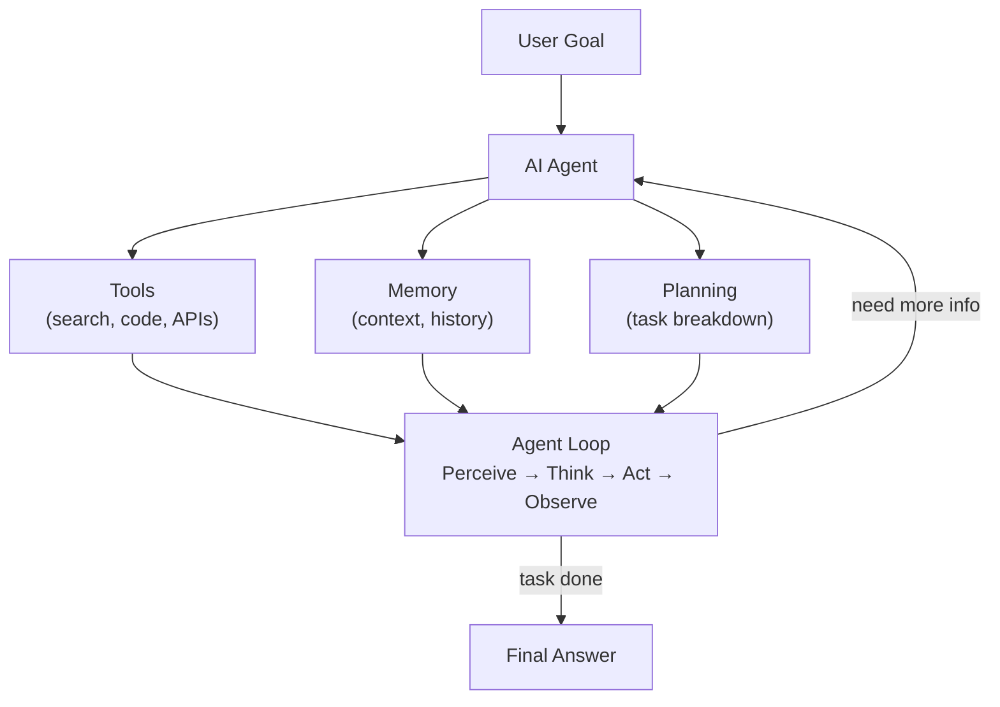

# 10 — AI Agents

This section is about building AI agents — systems that don't just answer questions, but actually **do things** in the world.

A chatbot answers. An agent acts.

---

## What You'll Learn

By the end of this section you'll be able to:

- Explain what an AI agent is and how it differs from a chatbot or a RAG pipeline
- Understand the agent loop: perceive → think → act → observe → repeat
- Build agents with tools, memory, and planning
- Use frameworks like LangChain, CrewAI, and AutoGen
- Build a working research agent from scratch

---

## Section Map

```
10_AI_Agents/
├── Readme.md                        ← You are here
├── Agent_vs_Chain_vs_RAG.md         ← When to use what (start here)
│
├── 01_Agent_Fundamentals/           ← What is an agent?
├── 02_ReAct_Pattern/                ← How agents reason and act
├── 03_Tool_Use/                     ← Giving agents capabilities
├── 04_Agent_Memory/                 ← How agents remember things
├── 05_Planning_and_Reasoning/       ← Breaking big goals into steps
├── 06_Reflection_and_Self_Correction/ ← Agents that check their own work
├── 07_Multi_Agent_Systems/          ← Teams of AI agents
├── 08_Agent_Frameworks/             ← LangChain, CrewAI, AutoGen
└── 09_Build_an_Agent/               ← Capstone: build a research agent
```

---

## Recommended Order

**If you're new to agents:**
1. Read `Agent_vs_Chain_vs_RAG.md` first — this sets the stage
2. Work through `01` → `02` → `03` → `04` in order
3. Then `05`, `06`, `07` as you get comfortable
4. Pick a framework in `08` and build with `09`

**If you already know LLMs/RAG:**
- Start at `01_Agent_Fundamentals/Theory.md` for the mental model
- Jump to `02_ReAct_Pattern` and `03_Tool_Use` for the core patterns
- Go straight to `09_Build_an_Agent` for the hands-on project

---

## Prerequisites

Before this section, make sure you're comfortable with:

- How LLMs work (see `06_Transformers/`)
- Prompt engineering basics (see `07_Large_Language_Models/`)
- RAG systems (see `09_RAG_Systems/`)

---

## The Big Picture

Here's how all the pieces fit together:



---

## Key Insight

The difference between a chatbot and an agent is simple:

- A **chatbot** takes input and produces output. One step. Done.
- An **agent** takes a goal and keeps working — using tools, checking results, adjusting — until the goal is complete.

Agents are closer to how humans work. You don't just think of an answer. You research, try things, see what happens, and adjust.

---

## What's Next

Start with [Agent vs Chain vs RAG](./Agent_vs_Chain_vs_RAG.md) to understand when you need an agent at all.

Then dive into [01 — Agent Fundamentals](./01_Agent_Fundamentals/Theory.md).

---

## 📂 Navigation

**In this folder:**
| File | |
|---|---|
| 📄 **Readme.md** | ← you are here |
| [📄 Agent_vs_Chain_vs_RAG.md](./Agent_vs_Chain_vs_RAG.md) | When to use what |

⬅️ **Prev:** [09 Build a RAG App](../09_RAG_Systems/09_Build_a_RAG_App/Project_Guide.md) &nbsp;&nbsp;&nbsp; ➡️ **Next:** [01 Agent Fundamentals](./01_Agent_Fundamentals/Theory.md)
