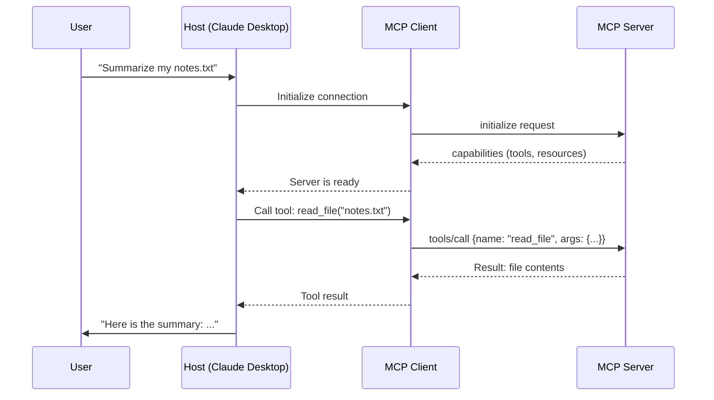

# Theory — MCP Fundamentals

## The Story 📖

Computers in the 1990s had a connector problem. Your printer used a fat parallel port. Your mouse used a round PS/2 plug. Your modem used a serial port. Then came **USB** — one standardized connector. Suddenly keyboards, mice, printers, cameras, and phones all used the same plug. The result: an explosion of devices, because making something USB-compatible meant it worked everywhere.

AI tools in 2023 were stuck in the "pre-USB era." Every AI app had custom code to connect to each tool — one integration for GitHub, a different one for Slack, another for databases. Switching AI models meant rewriting everything.

👉 This is **MCP (Model Context Protocol)** — the USB standard for AI tools. One protocol that lets any AI application connect to any data source or tool through a standardized interface.

---

## What is MCP? 🤔

**MCP** is an open protocol created by Anthropic that standardizes how AI applications connect to external tools, data sources, and services. Just like HTTP standardized how browsers talk to web servers, MCP standardizes how AI models talk to tools.

**Key facts:**
- Open source — anyone can build MCP servers or clients
- Released by Anthropic in late 2024
- Works with Claude and any other AI that implements the client side

**The three MCP primitives:**
- **Tools** — Actions the AI can perform. "Create a file", "search the web", "run a SQL query". The AI calls these like function calls.
- **Resources** — Data the AI can read. Files, database records, API responses. Think of these like a read-only filesystem.
- **Prompts** — Reusable prompt templates with parameters. Pre-built workflows like "code review template" or "summarize this document".

**Before MCP vs. After MCP:**

| Before MCP | After MCP |
|---|---|
| Custom integration for every tool | One standard protocol |
| Switching AI = rewrite everything | Any client works with any server |
| Tools tied to specific AI models | Tools are AI-model agnostic |
| Developers maintain N integrations | Developers maintain 1 MCP server |

---

## How It Works — Step by Step 🔧

1. **Setup**: A developer creates an **MCP server** that exposes specific tools (e.g., a filesystem server)
2. **Connection**: The AI application (the **MCP host**, like Claude Desktop) starts the server and connects via an embedded **MCP client**
3. **Discovery**: The host asks the server "what can you do?" — the server replies with its tools, resources, and prompts
4. **Request**: The user asks the AI something ("read my config file and summarize it")
5. **Tool selection**: The AI model decides to call `read_file` from the filesystem server
6. **Tool call**: The host sends the request to the server via MCP protocol
7. **Execution**: The server reads the file and returns the result
8. **Response**: The AI model receives the result and generates the final answer

---

## Real-World Examples 🌍

- **Claude Desktop + filesystem server**: Ask Claude to "organize my Downloads folder" — Claude uses the MCP filesystem server to list, read, move, and rename files on your computer
- **VS Code + GitHub MCP server**: Your IDE's AI assistant can create branches, review PRs, and post comments directly on GitHub
- **Custom app + database MCP server**: A customer service AI queries your PostgreSQL database for order history — without any custom database code
- **Claude + Slack MCP server**: Claude reads messages from Slack and sends replies as part of an automated workflow

---

## Common Mistakes to Avoid ⚠️

**Mistake 1: Confusing MCP with function calling**
Function calling is a feature inside one AI model — you hardcode which functions a specific model can use. MCP is a protocol at the application layer — the same MCP server works with any AI that supports MCP. MCP is portable across models and platforms.

**Mistake 2: Thinking MCP is only for Claude**
MCP is an open protocol. Any AI company or developer can build MCP-compatible clients.

**Mistake 3: Building custom tool integrations instead of an MCP server**
A custom `search_web()` function in your Claude integration only works for Claude. An MCP server wrapping that function works with Claude Desktop, VS Code Copilot, or any future AI client.

**Mistake 4: Thinking Resources and Tools are the same thing**
Tools perform actions and can change state. Resources are read-only data. Mixing them up leads to confusing server designs.

---

## Connection to Other Concepts 🔗

- **[MCP Architecture](../02_MCP_Architecture/Theory.md)** — Understand the Host/Client/Server structure in detail
- **[Tools, Resources, Prompts](../04_Tools_Resources_Prompts/Theory.md)** — Deep dive into the three MCP primitives
- **[Building an MCP Server](../06_Building_an_MCP_Server/Theory.md)** — How to actually create your own MCP server
- **[MCP vs REST API](./MCP_vs_REST_API.md)** — When to choose MCP vs a traditional REST API
- **[AI Agents](../09_Connect_MCP_to_Agents/Theory.md)** — How MCP supercharges AI agents with real-world capabilities

---

✅ **What you just learned:** MCP is an open protocol that standardizes how AI applications connect to tools and data sources — like USB for AI. It has three primitives: Tools (actions), Resources (data), and Prompts (templates). It replaces custom, one-off integrations with a universal standard.

🔨 **Build this now:** Install Claude Desktop, add the filesystem MCP server to its config, and ask Claude to list the files in a folder on your computer. You will see MCP in action in under 10 minutes.

➡️ **Next step:** [MCP Architecture](../02_MCP_Architecture/Theory.md) — Learn how the Host, Client, and Server components fit together.

---

## 📝 Practice Questions

- 📝 [Q68 · mcp-fundamentals](../../ai_practice_questions_100.md#q68--normal--mcp-fundamentals)

---

## 📂 Navigation

**In this folder:**
| File | |
|---|---|
| 📄 **Theory.md** | ← you are here |
| [📄 Cheatsheet.md](./Cheatsheet.md) | Quick reference |
| [📄 Interview_QA.md](./Interview_QA.md) | Interview prep |
| [📄 MCP_vs_REST_API.md](./MCP_vs_REST_API.md) | MCP vs REST API comparison |

⬅️ **Prev:** [09 Build an Agent](../../10_AI_Agents/09_Build_an_Agent/Project_Guide.md) &nbsp;&nbsp;&nbsp; ➡️ **Next:** [02 MCP Architecture](../02_MCP_Architecture/Theory.md)
