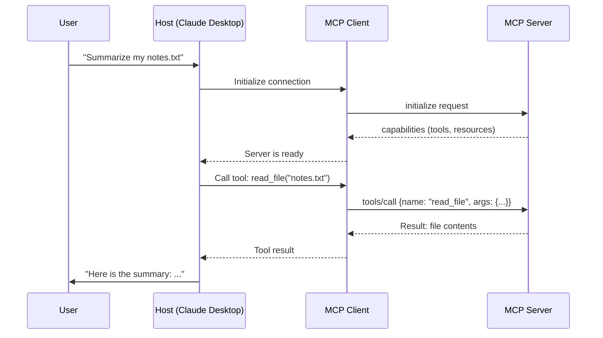

# Theory — MCP Fundamentals

## The Story 📖

Think back to computers in the 1990s. Every device had its own special connector. Your printer used a fat parallel port. Your mouse used a round PS/2 plug. Your modem used a serial port. If you wanted to add a new keyboard, you needed to check which port it used — and pray your computer had one free. Manufacturers built their own connectors. Users suffered.

Then came **USB** — Universal Serial Bus. One standardized connector. One protocol. Suddenly your keyboard, mouse, printer, camera, and phone all used the same plug. You didn't need to know the internal details of how each device worked. The USB standard handled it. The result? An explosion of devices, because making something USB-compatible meant it worked everywhere.

AI tools in 2023 were stuck in the "pre-USB era." Every AI app had custom code to connect to each tool — one custom integration for GitHub, a different one for Slack, another one for databases. If you wanted Claude to read your files AND search the web AND query your database, you needed to write three separate bespoke integrations. Switching AI models meant rewriting everything. It was a mess.

👉 This is **MCP (Model Context Protocol)** — the USB standard for AI tools. One protocol that lets any AI application connect to any data source or tool through a standardized interface.

---

## What is MCP? 🤔

**MCP (Model Context Protocol)** is an open protocol created by Anthropic that standardizes how AI applications connect to external tools, data sources, and services. Just like HTTP standardized how web browsers talk to web servers, MCP standardizes how AI models talk to tools.

Think of it as a universal translator between AI and the real world.

**Key facts:**
- MCP is **open source** — anyone can build MCP servers or clients
- It was released by Anthropic in late 2024
- It works with Claude, and any other AI that implements the client side
- It replaces ad-hoc custom integrations with a single standard

**The three things MCP provides (called "primitives"):**

- **Tools** — Actions the AI can perform. "Create a file", "search the web", "run a SQL query". The AI calls these like function calls.
- **Resources** — Data the AI can read. Files, database records, API responses. Think of these like a read-only filesystem.
- **Prompts** — Reusable prompt templates with parameters. Pre-built workflows like "code review template" or "summarize this document".

**Before MCP vs. After MCP:**

| Before MCP | After MCP |
|---|---|
| Custom integration for every tool | One standard protocol |
| Switching AI = rewrite everything | Any client works with any server |
| Tools tied to specific AI models | Tools are AI-model agnostic |
| Developers maintain N integrations | Developers maintain 1 MCP server |

---

## How It Works — Step by Step 🔧

Here is the basic flow of how MCP works when an AI assistant wants to use a tool:

1. **Setup**: A developer creates an **MCP server** that exposes specific tools (e.g., a filesystem server that can read/write files)
2. **Connection**: The AI application (the **MCP host**, like Claude Desktop) starts the server and connects to it via an **MCP client** embedded in the host
3. **Discovery**: The host asks the server "what can you do?" — the server replies with a list of tools, resources, and prompts it offers
4. **Request**: The user asks the AI something ("read my config file and summarize it")
5. **Tool selection**: The AI model decides it needs to call the `read_file` tool from the filesystem server
6. **Tool call**: The host sends the tool call request to the server via MCP protocol
7. **Execution**: The server executes the action (reads the file) and returns the result
8. **Response**: The AI model receives the result and generates the final answer for the user

---

## Real-World Examples 🌍

- **Claude Desktop + filesystem server**: You ask Claude to "organize my Downloads folder" — Claude uses the MCP filesystem server to list, read, move, and rename files on your actual computer
- **VS Code + GitHub MCP server**: Your IDE's AI assistant can create branches, review pull requests, and post comments directly on GitHub without leaving VS Code
- **Custom app + database MCP server**: A customer service AI can query your PostgreSQL database to look up order history — without the developer writing any custom database code
- **Claude + Slack MCP server**: Claude can read messages from a Slack channel and send replies as part of an automated workflow
- **AI assistant + web search MCP server**: The AI calls a search tool to find up-to-date information before answering, even though its training data is months old

---

## Common Mistakes to Avoid ⚠️

**Mistake 1: Confusing MCP with function calling**
Function calling is a feature inside one AI model — you hardcode which functions a specific model can use. MCP is a protocol at the application layer — the same MCP server works with any AI that supports MCP. MCP is portable across models and platforms.

**Mistake 2: Thinking MCP is only for Claude**
MCP is an open protocol. While Anthropic created it, any AI company or developer can build MCP-compatible clients. The goal is for MCP to become an industry standard like HTTP.

**Mistake 3: Building custom tool integrations instead of an MCP server**
If you write a custom `search_web()` function directly in your Claude API integration, that code only works for Claude. If you wrap it in an MCP server instead, it works with Claude Desktop, VS Code Copilot, or any future AI client.

**Mistake 4: Thinking Resources and Tools are the same thing**
Tools perform actions and can change state (write to database, send email). Resources are read-only data (read a file, fetch a record). Mixing them up leads to confusing server designs.

---

## Connection to Other Concepts 🔗

- **[MCP Architecture](../02_MCP_Architecture/Theory.md)** — Understand the Host/Client/Server structure in detail
- **[Tools, Resources, Prompts](../04_Tools_Resources_Prompts/Theory.md)** — Deep dive into the three MCP primitives
- **[Building an MCP Server](../06_Building_an_MCP_Server/Theory.md)** — How to actually create your own MCP server
- **[MCP vs REST API](./MCP_vs_REST_API.md)** — When to choose MCP vs a traditional REST API
- **[AI Agents](../09_Connect_MCP_to_Agents/Theory.md)** — How MCP supercharges AI agents with real-world capabilities

---

✅ **What you just learned:** MCP is an open protocol that standardizes how AI applications connect to tools and data sources — like USB for AI. It has three primitives: Tools (actions), Resources (data), and Prompts (templates). It replaces custom, one-off integrations with a universal standard.

🔨 **Build this now:** Install Claude Desktop, add the filesystem MCP server to its config, and ask Claude to list the files in a folder on your computer. You will see MCP in action in under 10 minutes.

➡️ **Next step:** [MCP Architecture](../02_MCP_Architecture/Theory.md) — Learn how the Host, Client, and Server components fit together.

---

## 📂 Navigation

**In this folder:**
| File | |
|---|---|
| 📄 **Theory.md** | ← you are here |
| [📄 Cheatsheet.md](./Cheatsheet.md) | Quick reference |
| [📄 Interview_QA.md](./Interview_QA.md) | Interview prep |
| [📄 MCP_vs_REST_API.md](./MCP_vs_REST_API.md) | MCP vs REST API comparison |

⬅️ **Prev:** [09 Build an Agent](../../10_AI_Agents/09_Build_an_Agent/Project_Guide.md) &nbsp;&nbsp;&nbsp; ➡️ **Next:** [02 MCP Architecture](../02_MCP_Architecture/Theory.md)