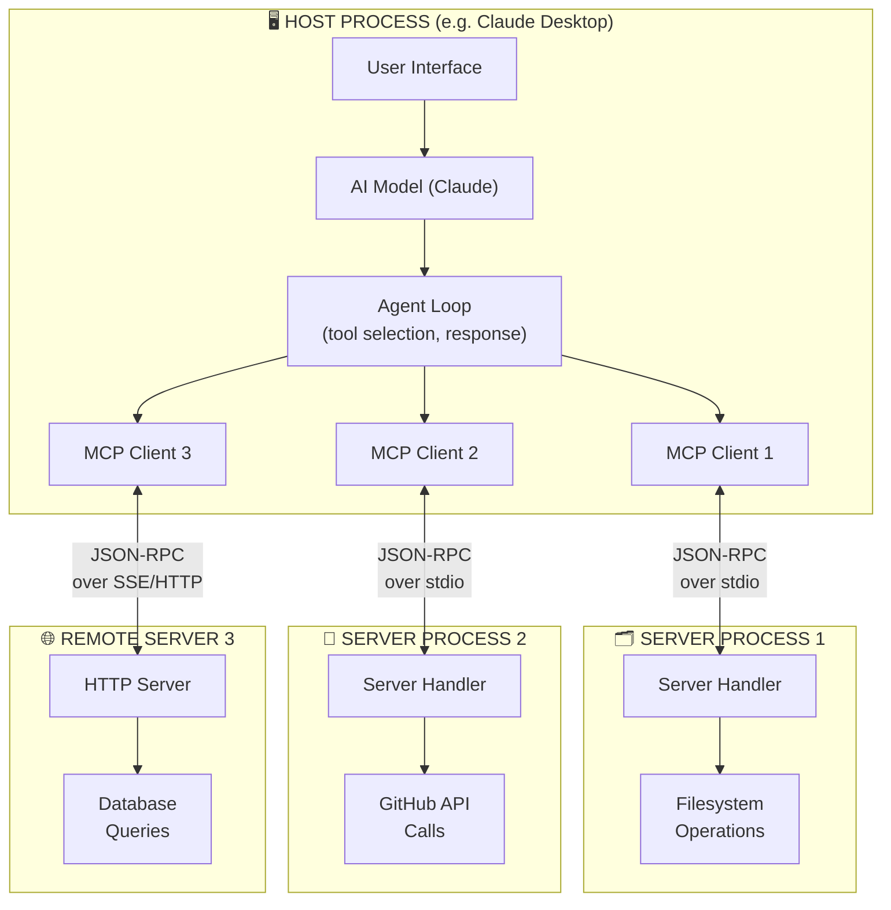
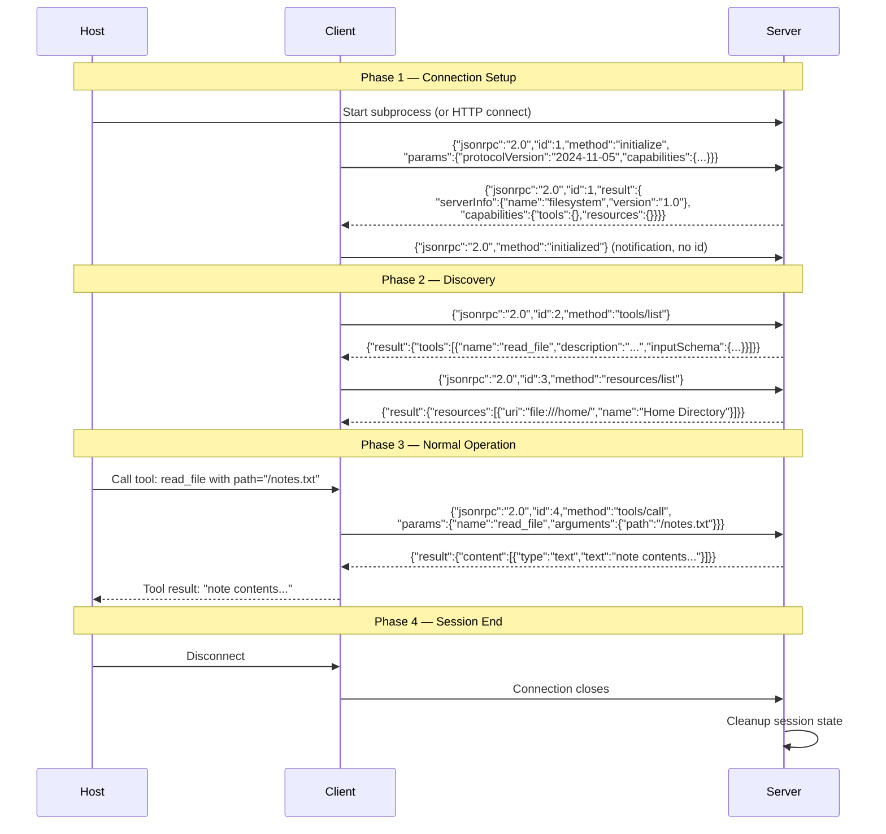
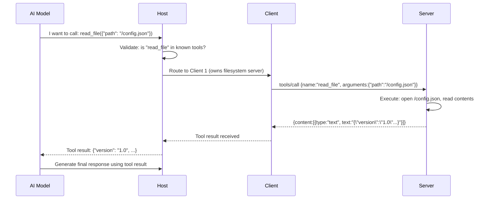

# Architecture Deep Dive — MCP

This document provides a detailed technical look at MCP's architecture — the full message flow, session lifecycle, capabilities negotiation, and transport options.

---

## Full System Architecture Diagram



---

## Session Lifecycle — Full Detail



---

## Capabilities Negotiation

During `initialize`, both sides declare what they support. This allows gradual protocol evolution.

**Client capabilities (what the host supports):**
```json
{
  "capabilities": {
    "sampling": {},
    "roots": { "listChanged": true }
  }
}
```

**Server capabilities (what the server offers):**
```json
{
  "capabilities": {
    "tools": { "listChanged": false },
    "resources": { "listChanged": true, "subscribe": true },
    "prompts": { "listChanged": false },
    "logging": {}
  }
}
```

**Capability meaning:**
| Capability | Meaning |
|---|---|
| `tools` | Server exposes callable tools |
| `tools.listChanged` | Server will notify if tool list changes |
| `resources` | Server exposes readable resources |
| `resources.subscribe` | Client can subscribe to resource change events |
| `prompts` | Server exposes prompt templates |
| `logging` | Server can send log notifications |
| `sampling` | Client supports being asked to run AI completions |
| `roots` | Client exposes filesystem roots (for servers that browse local files) |

---

## Transport Comparison

### stdio Transport

```
Host Process
│
├── spawns: python filesystem_server.py
│                    │
│   stdin  ─────────►│  (JSON-RPC requests from client)
│   stdout ◄─────────│  (JSON-RPC responses from server)
```

- Server runs as a subprocess
- Communication via OS pipes (stdin/stdout)
- One client = one subprocess
- Best for: local tools, CLI tools, development

### SSE Transport (Server-Sent Events)

```
Host Process                        Remote/Local HTTP Server
│                                   │
├── MCP Client  ──HTTP POST──────►  │  /message endpoint (client sends)
│               ◄──SSE stream────   │  /sse endpoint (server sends events)
```

- Server runs as an HTTP server
- Client sends requests via HTTP POST
- Server sends responses + notifications via SSE stream
- Best for: remote servers, multi-tenant servers, web services

---

## Tool Call Flow — Detailed



---

## Error Handling in Architecture

MCP defines standard JSON-RPC error codes plus MCP-specific ones:

| Code | Meaning |
|---|---|
| `-32700` | Parse error — invalid JSON |
| `-32600` | Invalid Request — malformed JSON-RPC |
| `-32601` | Method not found |
| `-32602` | Invalid params |
| `-32603` | Internal error |
| `-32001` | MCP: Resource not found |
| `-32002` | MCP: Tool execution error |

Errors return as:
```json
{
  "jsonrpc": "2.0",
  "id": 5,
  "error": {
    "code": -32002,
    "message": "Tool execution failed: file not found"
  }
}
```

---

## 📂 Navigation

**In this folder:**
| File | |
|---|---|
| [📄 Theory.md](./Theory.md) | Core concepts |
| [📄 Cheatsheet.md](./Cheatsheet.md) | Quick reference |
| [📄 Interview_QA.md](./Interview_QA.md) | Interview prep |
| 📄 **Architecture_Deep_Dive.md** | ← you are here |
| [📄 Component_Breakdown.md](./Component_Breakdown.md) | Component breakdown |

⬅️ **Prev:** [01 MCP Fundamentals](../01_MCP_Fundamentals/Theory.md) &nbsp;&nbsp;&nbsp; ➡️ **Next:** [03 Hosts Clients Servers](../03_Hosts_Clients_Servers/Theory.md)