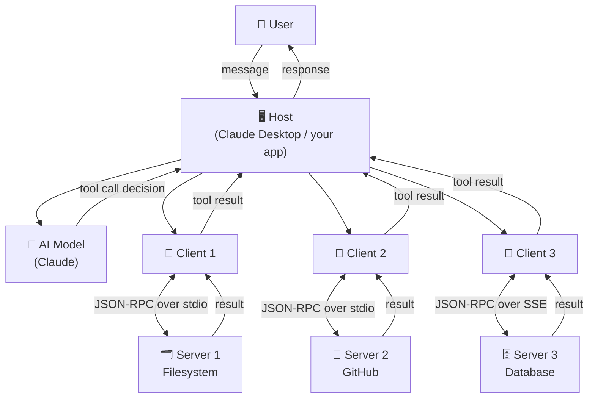

# Theory — MCP Architecture

## The Story 📖

A company manager needs specialized contractors — accounting work, legal review, database queries. But the manager doesn't have time to learn how each specialist works or how to find them. So the company hires **staffing agencies**. Each agency handles logistics for one type of specialist — IT contractors, legal firms, financial analysts. The manager talks only to the agencies; agencies talk to their contractors.

👉 This is the **MCP Architecture** — the **Host** is the company (your AI app), the **Clients** are the staffing agencies (one per server), and the **Servers** are the specialist contractors (filesystem, GitHub, database). Each client manages exactly one server relationship.

---

## What is MCP Architecture? 🤔

MCP Architecture is the three-layer design pattern that defines how an AI application connects to external tools and services.

**The three layers:**
- **Host** — The AI application users interact with. It owns the AI model, the UI, and the conversation. Examples: Claude Desktop, VS Code with Copilot, your custom Python app.
- **Client** — A component living inside the host. Each client manages one connection to one MCP server. Three servers = three clients.
- **Server** — An external process that exposes tools, resources, and prompts. Examples: a filesystem server, a GitHub server, a Slack server.

**The message format:** All communication uses **JSON-RPC 2.0** — a simple, standard format for remote procedure calls using JSON.

---

## How It Works — Step by Step 🔧

1. **Host starts up** — reads configuration to find which MCP servers to connect to
2. **Clients initialize** — for each server, the host creates a Client and starts the server process
3. **Handshake** — each client sends `initialize`; the server responds with its capabilities
4. **Registration** — the host injects available tool info into the AI model's context
5. **User sends a message** — "List the files in my project folder"
6. **Model decides** — the AI sees available tools and decides to call `list_directory`
7. **Client routes** — the host finds the right client and sends the tool call
8. **Server executes** — the filesystem server runs the directory listing
9. **Result flows back** — Server → Client → Host → AI model → User

---

## Real-World Examples 🌍

- **Claude Desktop** reads `claude_desktop_config.json`, starts several server processes, creates one client per server, and gives the Claude model access to all their tools
- **VS Code Copilot** creates MCP clients connecting to a GitHub server and terminal execution server
- **A custom Python app** can be a host — write code that starts MCP clients, connects them to servers, and uses the Anthropic Python SDK to run Claude with those tools

---

## Common Mistakes to Avoid ⚠️

**Mistake 1: Thinking Client and Server are in the same process**
The server is almost always a separate process. The client is a component inside the host process. They communicate via stdin/stdout pipes (stdio) or HTTP (SSE).

**Mistake 2: Confusing Host and Client**
The host is your app. The client is the MCP protocol handler inside your app. Saying "the client connects to the server" means the whole AI app — but technically, the host contains the client.

**Mistake 3: One server handling everything**
A monolithic MCP server that does file operations AND database queries AND web search is an anti-pattern. Build focused, single-purpose servers. The host can connect to many servers simultaneously.

**Mistake 4: Not handling the initialize lifecycle**
You cannot call tools before the initialize handshake completes. Skipping or racing this step causes unpredictable failures.

---

## Connection to Other Concepts 🔗

- **[MCP Fundamentals](../01_MCP_Fundamentals/Theory.md)** — What MCP is and why it exists
- **[Hosts, Clients, Servers](../03_Hosts_Clients_Servers/Theory.md)** — Deep dive into each component's role
- **[Transport Layer](../05_Transport_Layer/Theory.md)** — How stdio and SSE transports work
- **[Architecture Deep Dive](./Architecture_Deep_Dive.md)** — Full message flow diagrams and lifecycle details
- **[Component Breakdown](./Component_Breakdown.md)** — Table-by-table breakdown of every component

---

✅ **What you just learned:** MCP Architecture has three layers — Host (the AI app), Client (the protocol handler inside the host), and Server (the tool provider). Each client manages one server. All messages use JSON-RPC 2.0. The host can connect to many servers simultaneously through separate clients.

🔨 **Build this now:** Draw out the MCP architecture for a hypothetical "AI coding assistant" that can read files, search the web, and query a database. Identify the host, list three clients, and name three servers.

➡️ **Next step:** [Hosts, Clients, Servers](../03_Hosts_Clients_Servers/Theory.md) — Understand each component's responsibilities in detail.

---

## 📂 Navigation

**In this folder:**
| File | |
|---|---|
| 📄 **Theory.md** | ← you are here |
| [📄 Cheatsheet.md](./Cheatsheet.md) | Quick reference |
| [📄 Interview_QA.md](./Interview_QA.md) | Interview prep |
| [📄 Architecture_Deep_Dive.md](./Architecture_Deep_Dive.md) | MCP architecture deep dive |
| [📄 Component_Breakdown.md](./Component_Breakdown.md) | Component breakdown |

⬅️ **Prev:** [01 MCP Fundamentals](../01_MCP_Fundamentals/Theory.md) &nbsp;&nbsp;&nbsp; ➡️ **Next:** [03 Hosts Clients Servers](../03_Hosts_Clients_Servers/Theory.md)
