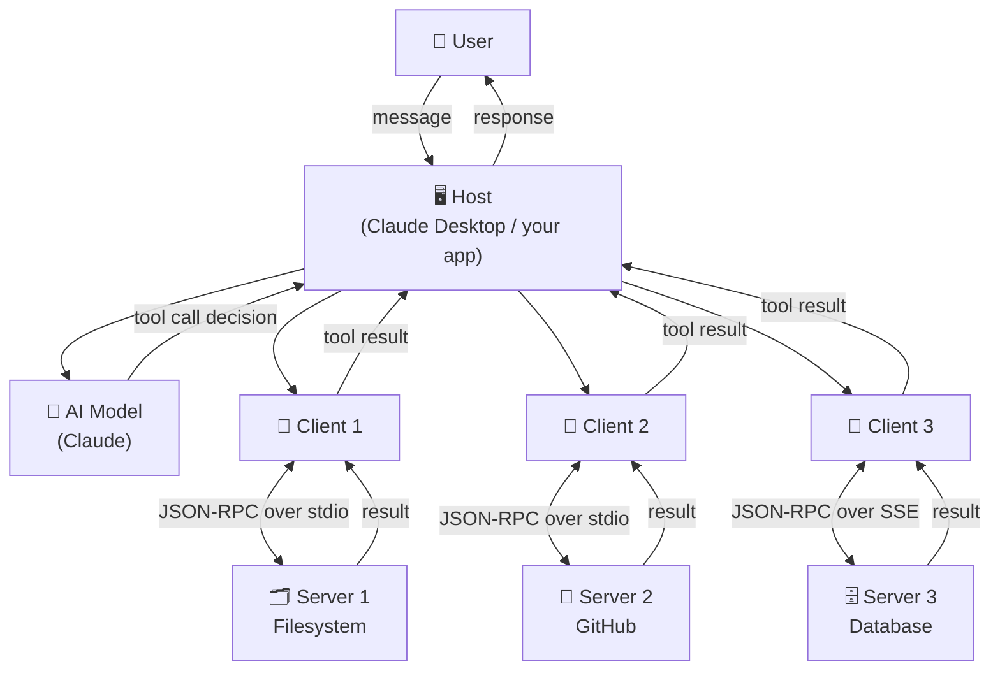

# Theory — MCP Architecture

## The Story 📖

Imagine a large company that needs specialized contractors. The company's manager (the AI model) needs various things done — accounting work, legal review, database queries. But the manager does not have time to learn the details of how each specialist works, or how to find them, or how to formally communicate with them.

So the company hires a **staffing agency**. The staffing agency handles all the logistics — it knows which contractors are available, how to reach them, how to onboard them, and how to relay requests and responses back to the manager. The manager just says "I need someone to do X" and the agency handles everything else.

Now add one more layer: the company has multiple staffing agencies for different types of work. One agency handles IT contractors, another handles legal firms, another handles financial analysts. Each agency manages its own relationships with its own contractors. The manager still only talks to the agencies — never directly to the contractors.

👉 This is the **MCP Architecture** — the **Host** is the company (your AI app), the **Clients** are the staffing agencies (one per server), and the **Servers** are the specialist contractors (filesystem, GitHub, database). Each client manages exactly one server relationship, and the host coordinates all the clients.

---

## What is MCP Architecture? 🤔

**MCP Architecture** is the three-layer design pattern that defines how an AI application connects to external tools and services using the Model Context Protocol.

Think of it as the blueprint for how all the pieces fit together.

**The three layers:**

- **Host** — The AI application users interact with. It owns the AI model, the UI, and the conversation. Examples: Claude Desktop, VS Code with Copilot, your custom Python app.
- **Client** — A component that lives inside the host. Each client manages one connection to one MCP server. If the host connects to three servers, it has three clients.
- **Server** — An external process (often a separate program) that exposes tools, resources, and prompts. Examples: a filesystem server, a GitHub server, a Slack server.

**The message format:** All communication uses **JSON-RPC 2.0** — a simple, standard format for remote procedure calls using JSON.

---

## How It Works — Step by Step 🔧

1. **Host starts up** — Claude Desktop launches, reads its configuration to find which MCP servers to connect to
2. **Clients initialize** — For each server in the config, the host creates a Client instance and starts the server process
3. **Handshake** — Each client sends an `initialize` request to its server; the server responds with its capabilities (what tools/resources/prompts it has)
4. **Registration** — The host now knows everything available; it injects this information into the AI model's context
5. **User sends a message** — "List the files in my project folder"
6. **Model decides** — The AI model sees the available tools and decides to call `list_directory`
7. **Client routes** — The host finds the right client (the one connected to the filesystem server) and sends the tool call
8. **Server executes** — The filesystem server runs the directory listing on the actual filesystem
9. **Result flows back** — Server → Client → Host → AI model → User

---

## Real-World Examples 🌍

- **Claude Desktop** is a host. It reads `claude_desktop_config.json`, starts several server processes, creates one client per server, and gives the Claude model access to all their tools
- **VS Code Copilot** is a host. Its MCP clients connect to a GitHub server and a terminal execution server, giving Copilot the ability to create branches and run commands
- **A filesystem MCP server** runs as a separate OS process (launched via subprocess by the host). It exposes tools like `read_file`, `write_file`, `list_directory`
- **A custom Python app** can be a host — you write code that starts MCP clients, connects them to servers, and uses the Anthropic Python SDK to run Claude with those tools available
- **Multiple servers in one host** — Claude Desktop can simultaneously connect to a filesystem server, a web search server, and a Slack server — three clients managing three servers

---

## Common Mistakes to Avoid ⚠️

**Mistake 1: Thinking Client and Server are in the same process**
The server is almost always a separate process. The client is a component inside the host process. They communicate via stdin/stdout pipes (stdio transport) or HTTP (SSE transport) — not by direct function calls.

**Mistake 2: Confusing Host and Client**
Beginners often say "the client connects to the server" meaning the whole AI app. Technically, the host contains the client. The host is your app; the client is the MCP protocol handler inside your app.

**Mistake 3: One server handling everything**
A single monolithic MCP server that does file operations AND database queries AND web search is an anti-pattern. Build focused, single-purpose servers. The host can connect to many servers simultaneously.

**Mistake 4: Not handling the initialize lifecycle**
You cannot call tools before the initialize handshake completes. The server must confirm its capabilities before any tool calls. Skipping or racing this step causes unpredictable failures.

---

## Connection to Other Concepts 🔗

- **[MCP Fundamentals](../01_MCP_Fundamentals/Theory.md)** — What MCP is and why it exists
- **[Hosts, Clients, Servers](../03_Hosts_Clients_Servers/Theory.md)** — Deep dive into each component's role
- **[Transport Layer](../05_Transport_Layer/Theory.md)** — How stdio and SSE transports work
- **[Architecture Deep Dive](./Architecture_Deep_Dive.md)** — Full message flow diagrams and lifecycle details
- **[Component Breakdown](./Component_Breakdown.md)** — Table-by-table breakdown of every component

---

✅ **What you just learned:** MCP Architecture has three layers — Host (the AI app), Client (the protocol handler inside the host), and Server (the tool provider). Each client manages one server. All messages use JSON-RPC 2.0. The host can connect to many servers simultaneously through separate clients.

🔨 **Build this now:** Draw out the MCP architecture for a hypothetical "AI coding assistant" that can read files, search the web, and query a database. Identify the host, list three clients, and name three servers. This mental model is the foundation for everything else in MCP.

➡️ **Next step:** [Hosts, Clients, Servers](../03_Hosts_Clients_Servers/Theory.md) — Understand each component's responsibilities in detail.

---

## 📂 Navigation

**In this folder:**
| File | |
|---|---|
| 📄 **Theory.md** | ← you are here |
| [📄 Cheatsheet.md](./Cheatsheet.md) | Quick reference |
| [📄 Interview_QA.md](./Interview_QA.md) | Interview prep |
| [📄 Architecture_Deep_Dive.md](./Architecture_Deep_Dive.md) | MCP architecture deep dive |
| [📄 Component_Breakdown.md](./Component_Breakdown.md) | Component breakdown |

⬅️ **Prev:** [01 MCP Fundamentals](../01_MCP_Fundamentals/Theory.md) &nbsp;&nbsp;&nbsp; ➡️ **Next:** [03 Hosts Clients Servers](../03_Hosts_Clients_Servers/Theory.md)