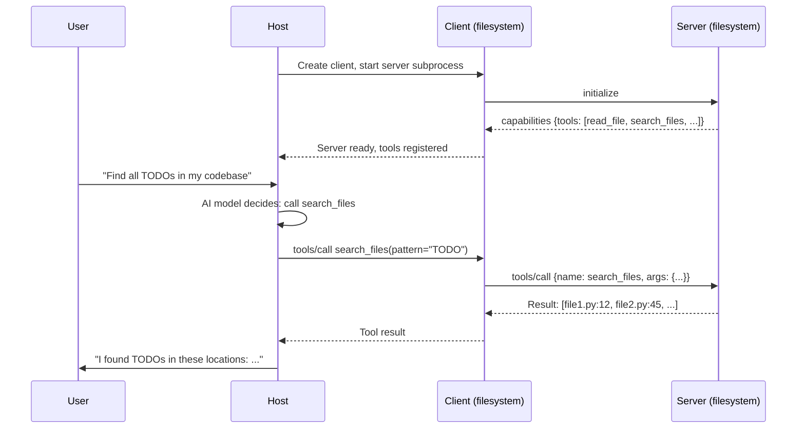
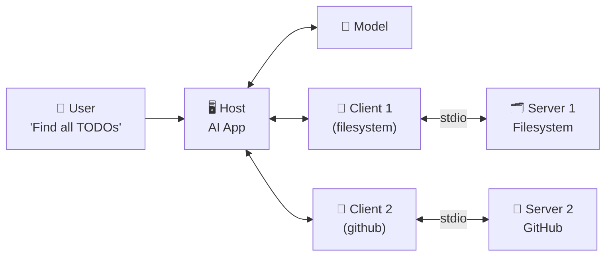

# Theory — Hosts, Clients, and Servers

## The Story 📖

A restaurant has front of house (the customer-facing area), a kitchen (where food is prepared), and waiters who run between the two. The customer says "I'd like the salmon." The waiter knows which kitchen station handles which food — sushi to the sushi bar, steaks to the grill. The customer doesn't need to know any of this. Each waiter is dedicated to one kitchen station, handles their specialty, and doesn't overlap with others.

👉 This is **Hosts, Clients, and Servers** in MCP — the **Host** is the restaurant (the AI app serving the user), the **Clients** are the dedicated waiters (one per server), and the **Servers** are the specialty kitchens (filesystem, GitHub, database).

---

## What Are Hosts, Clients, and Servers? 🤔

**Host** — The application the user directly interacts with. It runs the AI model, manages conversation history, and decides which MCP servers to connect to.
- Examples: Claude Desktop, VS Code Copilot, a custom Python web app
- Creates and manages all clients
- Injects available tool descriptions into the model's context

**Client** — A component living inside the host. The protocol specialist — knows how to speak MCP and manages one connection to one server.
- Not a separate program — code running inside the host process
- Responsible for: opening connections, doing handshakes, serializing/deserializing messages
- Stateful — maintains the session with its server
- If a client's server crashes, only that client is affected; others continue working

**Server** — Usually a separate program (subprocess or remote HTTP service) that provides specific capabilities.
- Single-purpose: filesystem handles files, GitHub handles GitHub
- Declares capabilities once during initialization then responds to requests
- The same server can serve multiple simultaneous clients (especially with SSE transport)

---

## How It Works — Step by Step 🔧

---

## Real-World Examples 🌍

- **Claude Desktop as host**: Reads `~/Library/Application Support/Claude/claude_desktop_config.json`, finds two servers (filesystem and GitHub), creates two clients, and Claude can access both
- **Custom FastAPI app as host**: A Python web app creates MCP clients for a database server and a web search server — Claude can answer questions using live data
- **Filesystem server**: A Node.js or Python process exposing `read_file`, `write_file`, `list_directory`, `search_files` — wraps the OS filesystem
- **GitHub MCP server**: Wraps GitHub's REST API, exposing `create_branch`, `list_pull_requests`, `post_comment` as MCP tools

---

## Common Mistakes to Avoid ⚠️

**Mistake 1: Building the server logic inside the host**
If your "MCP server" is actually just functions inside your AI app, you've lost the whole benefit — portability. Put tool logic in a separate server process so it can be reused by other hosts.

**Mistake 2: One giant server for everything**
A server handling files AND database queries AND web search AND email is hard to test, maintain, and exposes too many capabilities at once.

**Mistake 3: Forgetting that the host controls what the user sees**
The host decides which tools to show the AI model, how to present results, and whether to ask for confirmation before running dangerous tools.

**Mistake 4: Treating the client as optional**
The client manages the session lifecycle, handles errors, and provides the protocol translation layer. Bypassing it by manually writing JSON-RPC is fragile and breaks on protocol updates.

---

## Connection to Other Concepts 🔗

- **[MCP Architecture](../02_MCP_Architecture/Theory.md)** — The overall design pattern
- **[Tools, Resources, Prompts](../04_Tools_Resources_Prompts/Theory.md)** — What servers expose to clients
- **[Transport Layer](../05_Transport_Layer/Theory.md)** — How clients and servers actually communicate (stdio vs SSE)
- **[Building an MCP Server](../06_Building_an_MCP_Server/Theory.md)** — How to build the server side
- **[MCP Ecosystem](../08_MCP_Ecosystem/Theory.md)** — Pre-built servers you can use today

---

✅ **What you just learned:** The Host is the AI application (owns the model and UI). The Client is a protocol handler living inside the host, managing one connection to one server. The Server is an external process that exposes tools/resources/prompts. One host can have many clients; each client has exactly one server.

🔨 **Build this now:** Look at the Claude Desktop config file. For each entry in the `mcpServers` section, identify: which entry is the "server" definition, and understand that Claude Desktop (the host) creates one client for each entry.

➡️ **Next step:** [Tools, Resources, Prompts](../04_Tools_Resources_Prompts/Theory.md) — Learn what servers actually expose and how the AI uses it.

---

## 📂 Navigation

**In this folder:**
| File | |
|---|---|
| 📄 **Theory.md** | ← you are here |
| [📄 Cheatsheet.md](./Cheatsheet.md) | Quick reference |
| [📄 Interview_QA.md](./Interview_QA.md) | Interview prep |

⬅️ **Prev:** [02 MCP Architecture](../02_MCP_Architecture/Theory.md) &nbsp;&nbsp;&nbsp; ➡️ **Next:** [04 Tools Resources Prompts](../04_Tools_Resources_Prompts/Theory.md)
